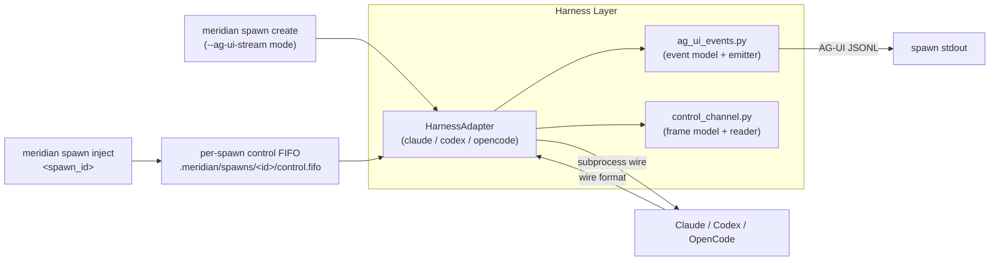

# Harness Layer Overview

> What this is: a one-page orientation to meridian-channel's harness
> layer **after** the D36/D37 refactor.
>
> What this is not: the adapter interface, the per-harness translation
> rules, or the mid-turn control protocol — those are in the sibling
> docs linked below.

Up: [`../overview.md`](../overview.md).

## Role

The harness layer is the boundary between meridian-channel and the
three real harnesses we drive: **Claude Code**, **Codex app-server**,
and **OpenCode**. Today the layer launches subprocesses, captures
stdout/stderr, and post-hoc extracts a `report.md` plus token usage and
session ids. After the refactor, it does that **and** emits a normalized
**AG-UI event stream** that meridian-flow's frontend reducer can ingest
directly, **and** consumes a normalized **FIFO-based control protocol** that
lets a parent process steer a running spawn mid-turn. Stdin is reserved for
harness subprocess I/O only; the adapter does not use parent stdin as a
control channel.

The boundary stays exactly where it is — `src/meridian/lib/harness/`.
The refactor grows the existing surfaces (`adapter.py`, `common.py`,
`launch_types.py`) and adds two sibling modules. It does not introduce
a parallel abstraction.

## What The Layer Does After The Refactor

Three things flow through the layer at runtime:

1. **Outbound wire to the harness** — built by each adapter from a
   `SpawnParams` plus `PermissionResolver`. Unchanged in shape; only
   gains a "streaming mode" launch flavor (`launch_types.py`).
2. **Inbound wire from the harness** — read by each adapter, parsed
   into AG-UI events, written to the spawn's stdout AG-UI channel
   **and** persisted into `output.jsonl` for the existing dogfood
   workflow (`spawn show`, `spawn log`, `--from`, reaper liveness).
3. **Inbound control frames** — written by `meridian spawn inject` (or
   any other peer) to a per-spawn control FIFO, read by the adapter,
   translated into the harness-native injection mechanic.

## Where Things Live

| Concern | Module | Status |
|---|---|---|
| Adapter protocol + DTOs | `harness/adapter.py` | extends |
| Per-harness translation | `harness/claude.py`, `codex.py`, `opencode.py` | extends |
| Shared parsing helpers | `harness/common.py` | extends (carefully — do not let it become a dumping ground) |
| AG-UI event model + emitter | `harness/ag_ui_events.py` | **new sibling** |
| FIFO control frame model + reader | `harness/control_channel.py` | **new sibling** |
| Streaming launch metadata | `harness/launch_types.py` | extends |
| In-process Anthropic adapter | `harness/direct.py` | **unchanged** — out of scope |
| Adapter registry | `harness/registry.py` | unchanged or trivial typing update |
| Subprocess execution + stdin/PTY routing | `lib/launch/process.py`, `lib/launch/runner.py`, `lib/launch/stream_capture.py` | extends — bridge for AG-UI emission and the streaming-mode launch path |
| Per-spawn anchor for the control FIFO | `lib/state/paths.py`, `lib/state/spawn_store.py` | extends |
| `meridian spawn inject` CLI | `cli/spawn.py`, `lib/ops/spawn/api.py` | new command + facade method |

The two new sibling modules are deliberate. The structural analysis in
[`../refactor-touchpoints.md`](../refactor-touchpoints.md) calls them
out as the right placement: AG-UI emission is wire-format concern, not
post-hoc text normalization, so it does **not** belong in `transcript.py`
or `common.py`. The control reader has different runtime semantics in
each adapter, so it does **not** belong inside `common.py` either; the
shared piece is the frame model and a thin reader over the FIFO, the
adapter-specific piece is the harness-native dispatch.

## Read Next

- [`abstraction.md`](abstraction.md) — the adapter interface in detail:
  what methods grow, what DTOs grow, what `HarnessCapabilities` becomes,
  what stays the same.
- [`adapters.md`](adapters.md) — Claude / Codex / OpenCode translation
  rules, tool naming coordination (no wire config), regression risks per adapter.
- [`mid-turn-steering.md`](mid-turn-steering.md) — the differentiating
  feature. FIFO control protocol, control frame model, per-harness
  injection mechanics, the `meridian spawn inject` CLI, ownership of
  the per-spawn control FIFO.
- [`../events/overview.md`](../events/overview.md) — the AG-UI event
  taxonomy itself is described in the events/ subtree (Architect B's
  output), anchored to meridian-flow's canonical docs.
