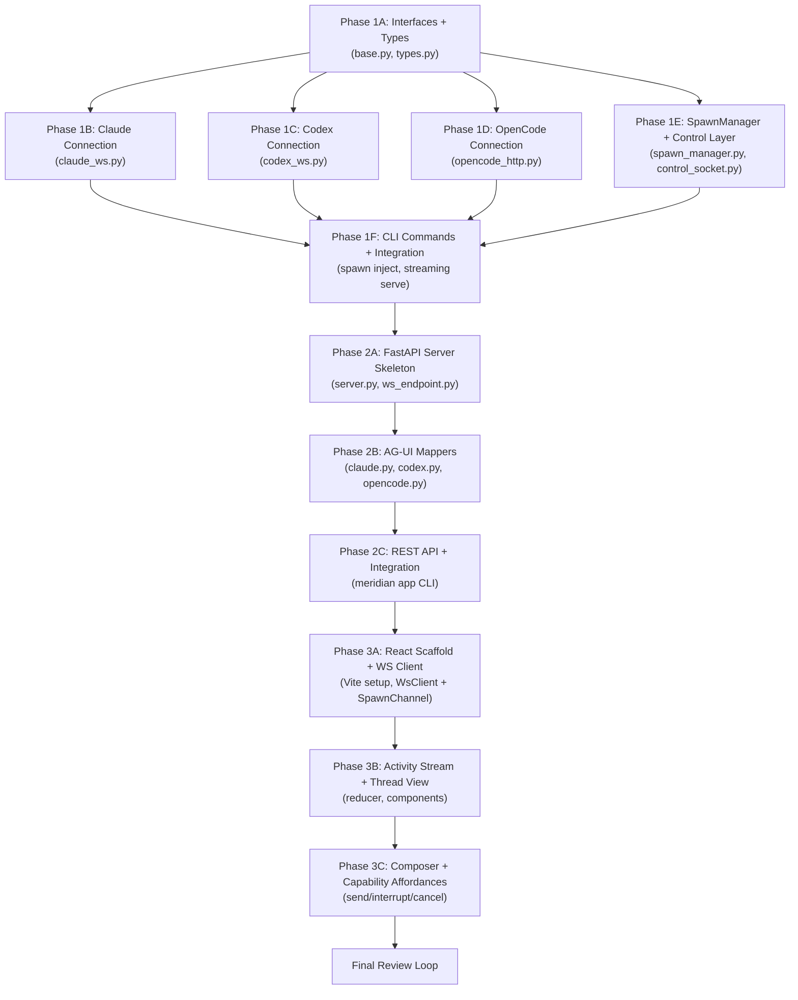

# Agent Shell MVP — Implementation Plan

This plan decomposes the approved design (`design/`) into executable implementation phases. Each phase has ordered sub-steps small enough for a single @coder spawn.

## Phase Dependency Graph



## Execution Rounds

```
Round 1: Phase 1A                        (foundation types — everything depends on it)
Round 2: Phase 1B, 1C, 1D, 1E           (independent — all need 1A, none need each other)
Round 3: Phase 1F                        (integration — needs 1B-1E)
Round 4: Phase 2A                        (server skeleton — needs Phase 1)
Round 5: Phase 2B                        (mappers — needs 2A for testing context)
Round 6: Phase 2C                        (CLI + REST — needs 2A + 2B)
Round 7: Phase 3A                        (React scaffold — needs Phase 2 endpoint)
Round 8: Phase 3B                        (activity stream — needs 3A)
Round 9: Phase 3C                        (composer + capabilities — needs 3B)
Round 10: Final Review Loop              (all phases complete)
```

### Parallelism Opportunities

**Round 2** is the main parallelism opportunity: four independent sub-phases can be staffed to separate @coders working in parallel. Phase 1B (Claude), 1C (Codex), 1D (OpenCode), and 1E (SpawnManager) have no file overlaps and depend only on the types defined in Phase 1A.

**Phases 2A-2C and 3A-3C** are strictly sequential within each major phase because each sub-step builds on the prior one's output.

## Staffing

### Phase 1 — Bidirectional Streaming Foundation

| Sub-phase | Agent | Model | Rationale |
|---|---|---|---|
| 1A: Interfaces + Types | 1 @coder | gpt-5.3-codex | Foundation types — get the interfaces right |
| 1B-1D: Connections (parallel) | 1 @coder each (3 total) | gpt-5.3-codex | Per-harness adapters are independent |
| 1E: SpawnManager | 1 @coder | gpt-5.3-codex | Core coordination logic |
| 1F: CLI + Integration | 1 @coder | gpt-5.3-codex | Wiring existing infra |
| Phase 1 testing | @verifier + @smoke-tester | default | Per-sub-phase verification |

### Phase 2 — FastAPI + AG-UI

| Sub-phase | Agent | Model | Rationale |
|---|---|---|---|
| 2A: Server Skeleton | 1 @coder | gpt-5.3-codex | FastAPI scaffolding |
| 2B: AG-UI Mappers | 1 @coder | gpt-5.3-codex | Heaviest logic in Phase 2 |
| 2C: REST + CLI | 1 @coder | gpt-5.3-codex | Integration wiring |
| Phase 2 testing | @verifier + @unit-tester + @smoke-tester | default | Mapper unit tests + e2e smoke |

### Phase 3 — React UI

| Sub-phase | Agent | Model | Rationale |
|---|---|---|---|
| 3A: React Scaffold | 1 @coder | gpt-5.3-codex | Vite + React setup |
| 3B: Activity Stream | 1 @coder | gpt-5.3-codex | Core rendering |
| 3C: Composer + Caps | 1 @coder | gpt-5.3-codex | Interactive features |
| Phase 3 testing | @verifier + @browser-tester | default | Visual verification |

### Final Review Loop

| Agent | Model | Focus Area |
|---|---|---|
| @reviewer | gpt-5.4 | Design alignment — verify implementation matches design docs |
| @reviewer | opus | Security + correctness — error handling, state transitions, edge cases |
| @reviewer | gpt-5.2 | API surface — interface consistency, DX quality |
| @refactor-reviewer | default | Structural hygiene — coupling, ISP compliance, code organization |

Review runs until convergence (no new substantive findings). @coder fixes, @verifier re-checks, then @reviewers re-run.

### Staffing Adjustments from Design-Orchestrator Recommendation

The design-orchestrator recommended 1 @coder per major phase. This plan splits Phase 1 into sub-phases with independent @coders for Round 2 parallelism — the 3 connection adapters and SpawnManager are genuinely independent work that can run concurrently. This is the biggest time savings in the plan.

Phase 2 and Phase 3 remain sequential within their sub-steps because each builds directly on the prior.

## Risk Areas

### High Risk

1. **Claude `--sdk-url` stability** — Reverse-engineered from companion project, not officially documented. Mitigation: D52's compatibility contract (version gating, protocol mismatch detection, hybrid fallback). Phase 1B must implement the fallback path.

2. **AG-UI SDK compatibility** — `ag-ui-protocol` PyPI package is young. Mitigation: pin version in pyproject.toml, test serialization round-trips in Phase 2B unit tests.

3. **Codex app-server WS protocol** — Experimental API. Mitigation: capture real wire fixtures early in Phase 1C for use in Phase 2B mapper tests.

### Medium Risk

4. **Frontend-v2 adaptation scope** — Design says "keep/cut/extend" but the actual delta depends on frontend-v2's current state. Mitigation: Phase 3A's first task is to copy and verify the build succeeds before any modifications.

5. **asyncio concurrency in SpawnManager** — Multiple concurrent connections, drain tasks, and control sockets. Mitigation: Phase 1E's verification criteria include concurrent spawn tests.

### Low Risk

6. **Port allocation** — Port 0 auto-assign is well-understood. Mitigation: standard pattern, tested in smoke tests.

7. **Unix domain socket cleanup** — Stale sockets after crashes. Mitigation: `unlink(missing_ok=True)` before bind (already in design).

## D56 Override Tracking

The design docs reference `THINKING_*` events (D48). Per D56 override:
- Phase 2B Claude mapper: emit `ReasoningMessageStartEvent`, `ReasoningMessageContentEvent`, `ReasoningMessageEndEvent` from `ag_ui.core`
- Phase 2B Codex mapper: `item/reasoning` maps to `REASONING_*` events
- Phase 3B: rename any frontend-v2 `THINKING_*` references to `REASONING_*`
- Phase 3C: update capability badge to show "reasoning" not "thinking"

This is called out in each phase blueprint where it applies.

## D57 — WsClient Layering

Phase 3 uses a two-layer WebSocket architecture (D57):
- `WsClient` — generic transport (connection lifecycle, JSON frames, state tracking). No spawn or AG-UI knowledge.
- `SpawnChannel` — spawn-specific layer on top of WsClient (URL construction, AG-UI event parsing, typed sends).

This keeps the transport extensible for future channels (cloud service, collaboration) without rewriting. Phase 3A creates both; Phase 3B/3C consume `SpawnChannel`.

## Phase 3 Frontend Strategy

Copy a subset of `frontend-v2` from `meridian-collab/`, not the full repo:
- **Copy**: UI atoms (`components/ui/`), theme/toast, activity-stream renderer, thread shell/composer, chat-scroll
- **Drop**: Editor stack (CM6/Yjs), document features, Go-backend-coupled providers
- **Build fresh**: `WsClient` + `SpawnChannel` (D57), spawn selector, status bar, capability affordances

The activity stream renderer (reducer, block components, progressive streaming) is the highest-leverage reuse — it's the hardest part to rebuild and already solves the streaming UX edge cases. If `meridian-collab/` is unavailable, scaffold from the design doc specs.

## File Index

| File | Phase | Description |
|---|---|---|
| `plan/phase-1.md` | Phase 1 | Bidirectional streaming foundation (6 sub-steps) |
| `plan/phase-2.md` | Phase 2 | FastAPI + AG-UI mapping (3 sub-steps) |
| `plan/phase-3.md` | Phase 3 | React UI (3 sub-steps) |
