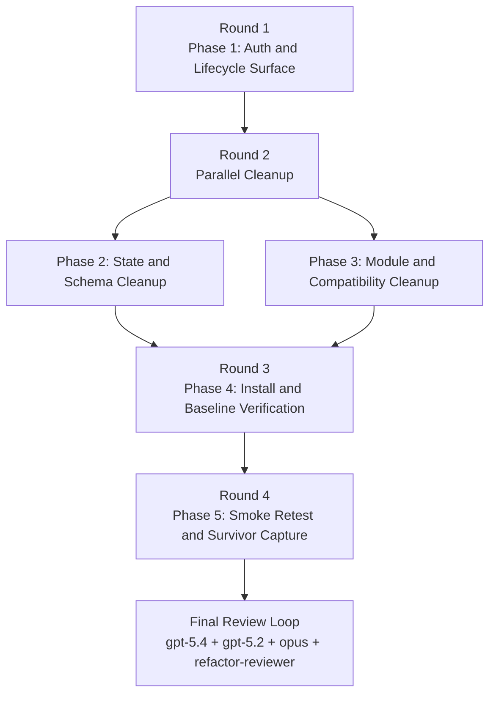

# Plan Overview — dead-code sweep

This work item has no `design/spec/` or `design/refactors.md`. The
authoritative contract is
`.meridian/work/dead-code-sweep/requirements.md`, so this plan derives:

- synthetic `S-*` leaf IDs for ownership and evidence tracking
- synthetic `R-0N` cleanup-agenda IDs for refactor handling

## Parallelism Posture

**Posture:** `limited`

**Cause:** Part A is a hard prerequisite for the rest of the cleanup. It owns
the highest-blast-radius deletions (`authorization.py`, caller-identity
plumbing, MCP lifecycle surface, control-socket cancel shims, and the
`ws_endpoint` fallback) and would otherwise collide with every later phase that
touches app, CLI, and control-plane boundaries. After that foundation lands,
the remaining cleanup splits safely into two mostly disjoint lanes: one for
state/schema ballast and one for module/compatibility ballast. The smoke retest
must wait until the global `meridian` binary has been reinstalled from current
source.

## Rounds

### Round 1 — foundational surface deletion

- **Phase 1 — auth-lifecycle-surface**
  Deletes the authorization feature, removes cancel/interrupt from the MCP
  agent-tool surface, removes the last live cancel control-plane shims, drops
  the `caller_from_env()` WebSocket fallback, and updates archived design /
  decision artifacts to reflect the reversion.

**Why this round exists:** it removes the central coupling point first. Every
later deletion gets simpler once authorization and lifecycle cancel exposure are
gone, and smoke expectations only make sense against the post-auth surface.

### Round 2 — parallel cleanup fanout

- **Phase 2 — state-schema-cleanup**
  Removes write-only schema, stale state helpers, finalize-origin backcompat
  shims, ignored compatibility parameters, and the stale
  `missing_worker_pid` label.
- **Phase 3 — module-compat-cleanup**
  Removes retired compatibility shims and the verified orphaned modules, with
  the required import redirect for `claude_preflight`.

**Why this round exists:** once Phase 1 is done, these write sets split cleanly
enough to parallelize. Phase 2 owns `spawn_store.py`, `reaper.py`,
`event_store.py`, `context.py`, and related tests; Phase 3 owns compatibility
wrappers, harness import paths, and dead standalone modules.

### Round 3 — verification and distribution closure

- **Phase 4 — install-baseline-verification**
  Runs the clean-baseline checks (`ruff`, `pyright`, `pytest-llm`), reinstalls
  the global `meridian` binary, and confirms the installed version matches the
  source version.

**Why this round exists:** smoke must run against the installed binary the user
actually invokes, not the stale one called out in the requirements and prior
smoke evidence.

### Round 4 — smoke confirmation and survivor capture

- **Phase 5 — smoke-retest-survivors**
  Re-runs the cancel/interrupt lane and the AF_UNIX/liveness lane, then records
  which blockers folded away and which remain as follow-up bug-fix scope.

**Why this round exists:** this work item is deletion/cleanup, not bug-fixing.
The closure step is to prove what deletion solved and to isolate the blockers
that still need a dedicated follow-up cycle.

## Refactor Handling

No standalone `design/refactors.md` exists for this cleanup item. The table
below assigns synthetic handles to the requirements agenda so execution can
track them explicitly.

| Refactor | Handling | Phase | Notes |
|---|---|---|---|
| `R-01` | complete | `Phase 1` | Delete authorization feature and all caller-identity plumbing. |
| `R-02` | complete | `Phase 1` | Revert the auth-era work-item artifacts: remove archived auth docs, add `D-25`, restate success criterion 5. |
| `R-03` | complete | `Phase 1` | Remove lifecycle cancel/interrupt exposure from MCP and delete cancel control-path leftovers (`CancelControl`, control-socket cancel shim, CLI cancel inject path, legacy delete route). |
| `R-04` | complete | `Phase 2` | Remove stale state/runtime ballast: `background.pid` fallback, `wrapper_pid`, finalize-origin shims, ignored `store_name`, parent-spawn drift, stale path exports, launch-spec scaffolding. |
| `R-05` | complete | `Phase 3` | Remove retired compatibility shims and verified orphaned modules after redirecting live imports. |
| `R-06` | complete | `Phase 2` | Rename stale lifecycle terminology from `missing_worker_pid` to `missing_runner_pid`. |
| `R-07` | complete | `Phase 4` | Refresh the installed binary and verify it matches source. |
| `R-08` | complete | `Phase 5` | Re-run smoke lanes and capture surviving blockers without expanding scope into fixes. |

## Mermaid Fanout

## Staffing Contract

### Per-phase teams

| Phase | Coder | Tester lanes | Intermediate-phase escalation reviewer policy |
|---|---|---|---|
| `Phase 1` | `@coder` on `gpt-5.3-codex` | `@verifier`, `@smoke-tester`, `@unit-tester` | If deletion boundaries around AF_UNIX, MCP tools, or archived redesign intent are disputed, add one `@reviewer` on `gpt-5.4` focused on design alignment and one `@reviewer` on `claude-opus-4-6` only if the disagreement crosses policy/mechanism boundaries. |
| `Phase 2` | `@coder` on `gpt-5.3-codex` | `@verifier`, `@smoke-tester`, `@unit-tester` | Escalate only when state-row semantics or reaper naming changes expose disagreement about live runtime meaning, not for mechanical delete fallout. Reviewer focus: lifecycle/state semantics. |
| `Phase 3` | `@coder` on `gpt-5.3-codex` | `@verifier`, `@unit-tester` | Escalate only if import redirection or wrapper removal reveals a real out-of-tree compatibility assumption the requirements did not authorize preserving. Reviewer focus: surface minimization. |
| `Phase 4` | `@coder` on `gpt-5.3-codex` | `@verifier` | Mechanical failures discovered here route back to the owning cleanup phase unless the fix is trivial and strictly mechanical. No broad review fanout. |
| `Phase 5` | `@coder` on `gpt-5.3-codex` | `@verifier`, `@smoke-tester` for cancel/interrupt lane, `@smoke-tester` for AF_UNIX/liveness lane | Escalate only if smoke evidence contradicts the requirements or archived redesign assumptions strongly enough that a follow-up work item cannot be scoped cleanly. Reviewer focus: evidence interpretation, not fix design. |

### Final review loop

- `@reviewer` on `gpt-5.4` — design alignment against `requirements.md`, archived redesign residue removal, and contract correctness of the reduced surface.
- `@reviewer` on `gpt-5.2` — deletion safety, regression hunting, and state-surface fallout from removing compatibility branches.
- `@reviewer` on `claude-opus-4-6` — architecture/policy coherence after removing auth while preserving AF_UNIX and cooperative inject.
- `@refactor-reviewer` — structural integrity of the deletion set, especially whether stale abstractions and wrappers were fully removed instead of partially bypassed.

### Escalation policy

- Tester findings return to the owning `@coder` first.
- Add a scoped `@reviewer` only when a finding is behavioral and cannot be resolved without reinterpreting the cleanup contract.
- Do not start a broad multi-reviewer fanout during intermediate phases.
- Re-run the owning tester lanes after each substantive fix.
- Start the final review loop only after Phases 1-5 are green and the smoke survivor report exists.
