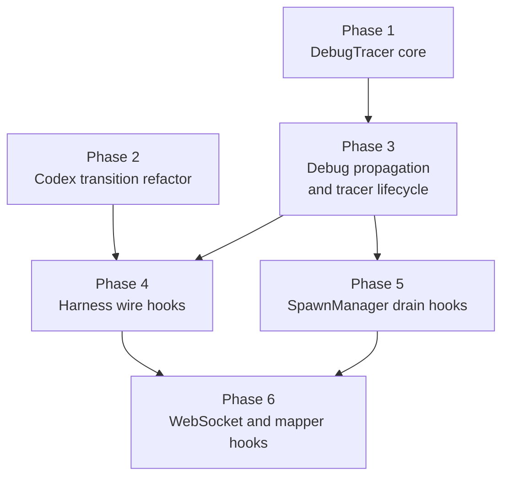

# Implementation Plan: --debug Observability Mode

## Phase Dependency Map

## Execution Rounds

| Round | Phases | Rationale |
|---|---|---|
| 1 | Phase 1, Phase 2 | Independent foundations. Phase 1 creates the observability package. Phase 2 is the one behavior-changing refactor needed before Codex can be instrumented cleanly. |
| 2 | Phase 3 | Single plumbing phase. It threads `--debug` through foreground spawn, background spawn, `streaming serve`, and `app`, and it establishes tracer ownership and cleanup semantics. |
| 3 | Phase 4, Phase 5 | Independent consumers of Phase 3. Adapter hooks and drain-loop hooks touch different files and can run in parallel once tracer plumbing exists. |
| 4 | Phase 6 | Final integration layer. It depends on adapter hooks for end-to-end input visibility and on SpawnManager tracer access for the WebSocket path. |

## Phase Summary

| Phase | Main delta | Key files |
|---|---|---|
| 1 | Add `DebugTracer` and shared helper functions | `src/meridian/lib/observability/*` |
| 2 | Centralize Codex state transitions behind `_transition()` | `src/meridian/lib/harness/connections/codex_ws.py` |
| 3 | Add `--debug` propagation, background persistence, `ConnectionConfig.debug_tracer`, and SpawnManager lifecycle ownership | `src/meridian/cli/spawn.py`, `src/meridian/lib/ops/spawn/*`, `src/meridian/lib/launch/streaming_runner.py`, `src/meridian/lib/streaming/spawn_manager.py`, `src/meridian/cli/main.py`, `src/meridian/cli/streaming_serve.py`, `src/meridian/cli/app_cmd.py` |
| 4 | Instrument Claude, Codex, and OpenCode wire/state boundaries | `src/meridian/lib/harness/connections/*.py` |
| 5 | Trace drain persistence and subscriber fan-out | `src/meridian/lib/streaming/spawn_manager.py` |
| 6 | Trace mapper translation and app WebSocket traffic | `src/meridian/lib/app/ws_endpoint.py` |

## Staffing

| Phase | Builder | Testing lanes | Notes |
|---|---|---|---|
| 1 | `@coder` on `gpt-5.3-codex` | `@verifier` on `gpt-5.4-mini`; `@unit-tester` on `gpt-5.4` | Pure library code with serialization and failure-mode logic. |
| 2 | `@coder` on `gpt-5.3-codex` | `@verifier` on `gpt-5.4-mini`; `@smoke-tester` on `gpt-5.4` | Refactor touches a live harness state machine, so real Codex startup/stop coverage is mandatory. |
| 3 | `@coder` on `gpt-5.3-codex` | `@verifier` on `gpt-5.4-mini`; `@smoke-tester` on `claude-sonnet-4-6` | CLI and background-worker propagation crosses process boundaries and needs fresh-state smoke coverage. |
| 4 | `@coder` on `gpt-5.3-codex` | `@verifier` on `gpt-5.4-mini`; `@smoke-tester` on `gpt-5.4` | Integration phase. Smoke tester must exercise Claude, Codex, and OpenCode explicitly. |
| 5 | `@coder` on `gpt-5.3-codex` | `@verifier` on `gpt-5.4-mini`; `@unit-tester` on `gpt-5.2` | Internal concurrency and backpressure behavior are easier to pin down with focused tests than with broad smoke coverage. |
| 6 | `@coder` on `gpt-5.3-codex` | `@verifier` on `gpt-5.4-mini`; `@smoke-tester` on `gpt-5.4` | Final end-to-end lane should run the app/WebSocket path and confirm all trace layers appear in one session. |

## Final Review Loop

- `@reviewer` on `gpt-5.4`: design alignment plus concurrency and cleanup ordering. Pass the design docs directly.
- `@reviewer` on `gpt-5.2`: contract completeness, retry behavior, disabled-path regressions, and state-machine edge cases.
- `@reviewer` on `claude-opus-4-6`: cross-harness integration coverage and diagnostic usability of the trace output.
- `@refactor-reviewer` on `claude-sonnet-4-6`: module boundaries, config flow clarity, and import hygiene.
- After each review round, hand fixes to `@coder` on `gpt-5.3-codex`, rerun the affected tester lanes, then rerun reviewers until convergence.

## Escalation Policy

- Intermediate phases stay tester-driven by default.
- Trigger a scoped `@reviewer` immediately when testers find an unresolved lifecycle bug, retry/finalization ambiguity, or a mismatch between the design doc and the current phase blueprint.
- Use `gpt-5.4` for concurrency or cleanup-order questions, `gpt-5.2` for contract/correctness questions, and `claude-opus-4-6` for harness-protocol or end-to-end observability questions.
