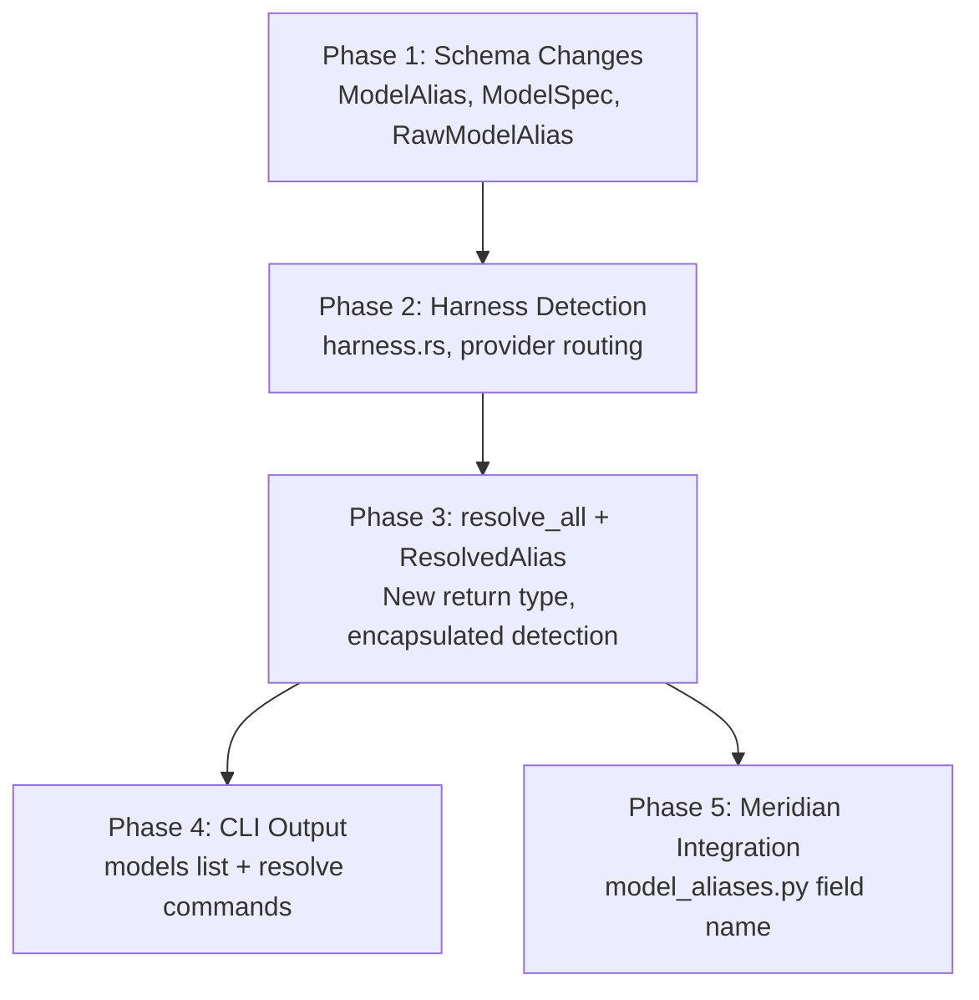

# Implementation Plan: Harness Auto-Detection

## Summary

5 phases decomposing the design into independently testable units. Phases 1-3 are sequential (each builds on the prior). Phases 4 and 5 are independent of each other and can run in parallel after Phase 3.

## Phase Dependency Graph



## Execution Rounds

| Round | Phases | Rationale |
|-------|--------|-----------|
| 1 | Phase 1 | Foundation — all downstream work depends on `Option<String>` harness and `provider` on Pinned |
| 2 | Phase 2 | Builds on schema — needs `Option<String>` harness to be meaningful |
| 3 | Phase 3 | Core integration — wires detection into resolve pipeline, produces `ResolvedAlias` |
| 4 | Phase 4, Phase 5 | Independent consumers of `ResolvedAlias` — CLI formatting and Python field name |

## Risk Assessment

**Highest risk:** Phase 1 (schema change). Touches the most code — every constructor, test helper, and serialization path that creates a `ModelAlias` must handle `Option<String>`. If the serde approach is wrong, everything downstream breaks. Front-loaded intentionally.

**Medium risk:** Phase 3 (resolve_all signature change). Changes the return type from `IndexMap<String, String>` to `IndexMap<String, ResolvedAlias>`, which breaks all callers. But callers are few (CLI commands) and updated in Phase 4.

**Low risk:** Phase 2 (new file, additive), Phase 4 (output formatting), Phase 5 (one-line Python change).

## Staffing

| Role | Agent | Model | Phases | Rationale |
|------|-------|-------|--------|-----------|
| Coder | coder | gpt-5.3-codex | 1–5 | Default backend implementer, faithful to instructions |
| Reviewer (correctness) | reviewer | gpt-5.4 | 1–4 | Strongest generalist, design alignment |
| Reviewer (structural) | reviewer | opus | 1–3 | Abstraction judgment, over-engineering detection |
| Reviewer (thoroughness) | reviewer | gpt-5.2 | 1, 3 | Extremely thorough, edge cases in schema + resolve |
| Reviewer (lightweight) | reviewer | sonnet | 5 | Trivial change, lightweight pass |
| Unit tester | unit-tester | gpt-5.3-codex | 1, 3 | Boundary conditions in serde paths and resolve branches |
| Verifier | verifier | gpt-5.3-codex | After Phase 4 | cargo build/test/clippy full repo |
| Smoke tester | smoke-tester | gpt-5.3-codex | After Phase 4 | CLI end-to-end: models list, resolve, --all, --json |

### Per-Phase Flow

```
coder → [reviewers + unit-tester in parallel] → fix cycle → next phase
```

After Phase 4: verifier + smoke-tester in parallel as the final gate.

### Smoke Test Scenarios (Phase 4+)

- `mars models list` — unavailable aliases hidden by default
- `mars models list --all` — unavailable shown with `—` marker
- `mars models resolve opus --json` — full JSON contract (all fields, correct types)
- `mars models resolve <unavailable-alias> --json` — error field present
- Backwards compat: mars.toml with explicit `harness = "claude"` still parses and resolves

## Files Changed by Phase

| Phase | Mars files | Meridian files |
|-------|-----------|----------------|
| 1 | `src/models/mod.rs`, `Cargo.toml` (no new dep yet) | — |
| 2 | `src/models/harness.rs`, `src/models/mod.rs` (re-export), `Cargo.toml` (`which` dep) | — |
| 3 | `src/models/mod.rs` (`resolve_all`, `ResolvedAlias`, `HarnessSource`) | — |
| 4 | `src/cli/models.rs` | — |
| 5 | — | `src/meridian/lib/models/model_aliases.py` |
