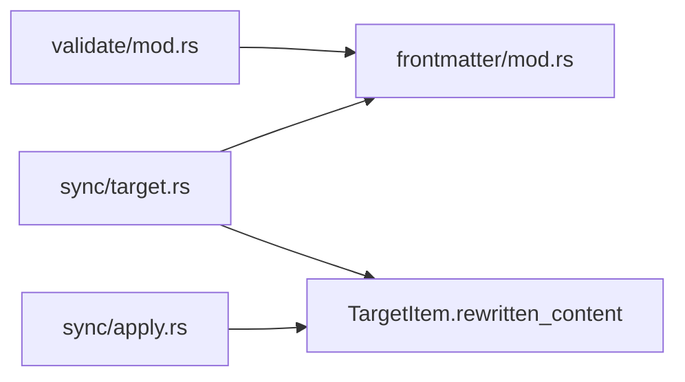

# Frontmatter Module Design

Fixes issues #3 (substring corruption) and #4 (temp file collisions). Phase 1 of the refactor — no dependencies on other phases.

## Problem

Two incompatible frontmatter implementations exist:

1. **`validate/mod.rs`** — Parses YAML frontmatter to extract the `skills:` list. Read-only. Uses `serde_yaml` to deserialize between `---` delimiters into a minimal struct.
2. **`sync/target.rs`** — Rewrites skill references when collisions force renames. Uses `line.replace(old_name, new_name)` on raw text.

The substring replacement corrupts adjacent names:

```yaml
# Before rewrite: skill "plan" renamed to "plan__haowjy_meridian-base"
skills:
  - plan
  - planner
  - planning-extended

# After line.replace("plan", "plan__haowjy_meridian-base"):
skills:
  - plan__haowjy_meridian-base
  - plan__haowjy_meridian-basener          # corrupted
  - plan__haowjy_meridian-basening-extended # corrupted
```

The bug is structural: text-level replacement cannot distinguish a skill name from a substring of a different skill name. No amount of regex refinement fixes this reliably because YAML has multiple valid list syntaxes (`[a, b]`, `- a\n- b`, quoted variants) and comments can contain skill names.

Additionally, `sync/target.rs` writes rewritten content to `/tmp/mars-rewrite/<name>.md` — a shared global path that concurrent syncs or same-named agents from different sources can clobber (issue #4).

## Approach

Single `frontmatter` module that:
1. **Parses** — splits markdown at `---` delimiters, deserializes YAML into a typed map
2. **Provides typed access** — skills list as `Vec<String>`, readable and writable
3. **Rewrites** — modifies individual elements of the skills vec (exact match, not substring)
4. **Serializes** — reconstructs valid markdown: YAML frontmatter + original body

Both `validate/` and `sync/target.rs` depend on this module. No other module touches frontmatter content.

### Why This Eliminates the Bug

The rewrite operates on `Vec<String>` elements. Each element is a complete skill name. Renaming `"plan"` means finding the vec element that `== "plan"` and replacing it. `"planner"` is a separate element — it never matches. No regex, no substring search, no ambiguity.

```rust
// The entire rewrite logic — operates on values, not text
for skill in &mut frontmatter.skills {
    if let Some(new_name) = renames.get(skill.as_str()) {
        *skill = new_name.clone();
    }
}
```

### Why Not Preserve Exact YAML Formatting

An alternative approach reconstructs only the `skills:` lines within the raw YAML text, preserving exact formatting of other fields. Rejected because:

- YAML has multiple valid representations for lists (`[a, b]` vs block `- a`). A text-level approach must handle all variants — reintroducing the complexity that caused the bug.
- mars-managed files are synced from upstream, not hand-authored. Normalizing YAML formatting is acceptable.
- `serde_yaml` serialization produces consistent, readable output. The slight reformatting (key order preserved via `Mapping`, style may shift) is a non-issue for machine-managed content.

## Module Location

```
src/
  frontmatter/
    mod.rs          # Frontmatter struct, parse, serialize, rewrite_skills
```

Single file — the module is small enough that splitting would add navigation overhead without clarity. If it grows (e.g., schema validation of frontmatter fields), split then.

## Public API

### Types

```rust
use indexmap::IndexMap;
use serde_yaml::Value;

/// Parsed frontmatter from a markdown file (agent profile, skill definition, etc.).
///
/// Provides typed access to the `skills` list and preserves all other YAML fields
/// for lossless round-tripping. The markdown body (everything after the closing `---`)
/// is stored separately.
#[derive(Debug, Clone)]
pub struct Frontmatter {
    /// All YAML key-value pairs, in original order.
    /// Skills are stored here AND accessible via typed methods.
    yaml: serde_yaml::Mapping,

    /// Markdown body after the closing `---` delimiter.
    body: String,
}

/// Errors from frontmatter parsing.
#[derive(Debug, thiserror::Error)]
pub enum FrontmatterError {
    #[error("malformed YAML frontmatter: {0}")]
    MalformedYaml(#[from] serde_yaml::Error),

    #[error("frontmatter is not a YAML mapping")]
    NotAMapping,
}
```

**Design decision: `serde_yaml::Mapping` over typed struct.**

A struct with typed fields (`name: Option<String>`, `model: Option<String>`, etc.) requires updating the struct for every new frontmatter field. Agent profiles, skill definitions, and future file types may have different fields. A `Mapping` preserves everything without knowing the schema. Typed accessors provide safe reads for known fields (skills, name) without schema coupling.

**Design decision: no `has_frontmatter` flag.**

A document without frontmatter produces a `Frontmatter` with an empty `yaml` mapping and the entire content as `body`. Serializing it back produces the original content (no `---` delimiters added). The empty-mapping state encodes "no frontmatter" without a separate flag.

### Core Methods

```rust
impl Frontmatter {
    /// Parse a markdown document into frontmatter + body.
    ///
    /// Rules:
    /// - First line must be exactly `---` (with optional trailing whitespace)
    /// - Closing `---` terminates the YAML block
    /// - Everything after closing `---` is the body
    /// - No opening `---` → empty mapping, entire content is body
    /// - Valid delimiters but invalid YAML → FrontmatterError::MalformedYaml
    /// - Valid YAML but not a mapping (e.g., a scalar) → FrontmatterError::NotAMapping
    /// - Empty YAML between delimiters → empty mapping
    pub fn parse(content: &str) -> Result<Self, FrontmatterError>;

    /// Read the `skills` list. Returns empty vec if no `skills` field
    /// or if the field isn't a sequence.
    pub fn skills(&self) -> Vec<String>;

    /// Replace the `skills` list. If `skills` is empty, removes the field.
    /// If the frontmatter had no `skills` field and `skills` is non-empty,
    /// adds it.
    pub fn set_skills(&mut self, skills: Vec<String>);

    /// Read the `name` field, if present and a string.
    pub fn name(&self) -> Option<&str>;

    /// Read any YAML field by key.
    pub fn get(&self, key: &str) -> Option<&Value>;

    /// The markdown body (everything after closing `---`).
    pub fn body(&self) -> &str;

    /// Whether this document had frontmatter (i.e., yaml is non-empty
    /// or the original document had `---` delimiters).
    pub fn has_frontmatter(&self) -> bool;

    /// Serialize back to a complete markdown document.
    ///
    /// - If yaml is empty and document had no frontmatter: returns body as-is
    /// - Otherwise: `---\n{yaml}---\n{body}`
    pub fn render(&self) -> String;
}
```

**`render()` not `to_string()`** — avoids confusion with `Display` trait. The name signals that this produces a full markdown document, not just the frontmatter.

### Skill Rewriting

```rust
/// Rename skills in a frontmatter's skills list using exact match.
///
/// `renames` maps old skill names to new skill names.
/// Returns the set of skills that were actually renamed (for logging/reporting).
/// Returns empty set if no skills matched.
pub fn rewrite_skills(
    fm: &mut Frontmatter,
    renames: &IndexMap<String, String>,
) -> IndexSet<String> {
    let mut renamed = IndexSet::new();
    let mut skills = fm.skills();

    for skill in &mut skills {
        if let Some(new_name) = renames.get(skill.as_str()) {
            renamed.insert(skill.clone());
            *skill = new_name.clone();
        }
    }

    if !renamed.is_empty() {
        fm.set_skills(skills);
    }

    renamed
}

/// Convenience: parse content, apply renames, render back.
///
/// Returns `Ok(None)` if no skills were renamed (content unchanged).
/// Returns `Ok(Some(new_content))` if skills were renamed.
/// Returns `Err` if frontmatter parsing fails.
pub fn rewrite_content_skills(
    content: &str,
    renames: &IndexMap<String, String>,
) -> Result<Option<String>, FrontmatterError> {
    let mut fm = Frontmatter::parse(content)?;
    let renamed = rewrite_skills(&mut fm, renames);
    if renamed.is_empty() {
        Ok(None)
    } else {
        Ok(Some(fm.render()))
    }
}
```

**Why `IndexMap` for renames:** Deterministic iteration order for reproducible output. Already used throughout the mars-agents codebase.

**Why return the renamed set:** The caller (`sync/target.rs`) needs to know which skills were actually rewritten — for logging, for computing the `installed_checksum` (dual checksums from the lock design), and for reporting to the user.

## Parse Implementation

```rust
impl Frontmatter {
    pub fn parse(content: &str) -> Result<Self, FrontmatterError> {
        // 1. Check for opening delimiter
        let Some(rest) = content.strip_prefix("---") else {
            return Ok(Self {
                yaml: serde_yaml::Mapping::new(),
                body: content.to_string(),
            });
        };

        // Opening `---` must be the entire first line (modulo whitespace)
        let first_line_end = rest.find('\n').unwrap_or(rest.len());
        if !rest[..first_line_end].trim().is_empty() {
            // `---` followed by non-whitespace on the same line → not frontmatter
            return Ok(Self {
                yaml: serde_yaml::Mapping::new(),
                body: content.to_string(),
            });
        }

        let after_opening = &rest[first_line_end.saturating_add(1)..];

        // 2. Find closing delimiter
        let closing_pos = after_opening
            .lines()
            .enumerate()
            .find(|(_, line)| line.trim() == "---")
            .map(|(i, _)| {
                // Calculate byte offset of the closing `---` line
                after_opening.lines()
                    .take(i)
                    .map(|l| l.len() + 1) // +1 for newline
                    .sum::<usize>()
            });

        let Some(closing_pos) = closing_pos else {
            // No closing `---` → treat entire content as body (no frontmatter)
            return Ok(Self {
                yaml: serde_yaml::Mapping::new(),
                body: content.to_string(),
            });
        };

        let yaml_text = &after_opening[..closing_pos];
        let body_start = closing_pos + "---".len();
        let body = after_opening[body_start..]
            .strip_prefix('\n')
            .unwrap_or(&after_opening[body_start..]);

        // 3. Parse YAML
        if yaml_text.trim().is_empty() {
            return Ok(Self {
                yaml: serde_yaml::Mapping::new(),
                body: body.to_string(),
            });
        }

        let value: Value = serde_yaml::from_str(yaml_text)?;
        let yaml = match value {
            Value::Mapping(m) => m,
            Value::Null => serde_yaml::Mapping::new(),
            _ => return Err(FrontmatterError::NotAMapping),
        };

        Ok(Self {
            yaml,
            body: body.to_string(),
        })
    }
}
```

### Edge Case Behavior

| Input | `yaml` | `body` | `render()` |
|-------|--------|--------|-------------|
| No `---` at start | empty | entire content | entire content (no delimiters) |
| `---\n---\nbody` | empty | `body` | `---\n---\nbody` |
| `---\nname: foo\n---\nbody` | `{name: foo}` | `body` | `---\nname: foo\n---\nbody` |
| `---\ninvalid: [:\n---` | **Error** (MalformedYaml) | — | — |
| `---\n42\n---\nbody` | **Error** (NotAMapping) | — | — |
| `---` without closing | empty | entire content | entire content |
| `---\nskills: [a, b]\n---` | `{skills: [a, b]}` | `""` | `---\nskills:\n- a\n- b\n---\n` |

**Design decision: malformed YAML is an error, not a warning.**

The validate module currently treats malformed YAML as a warning (empty skills list). That's appropriate for *validation reporting*. But the frontmatter module is a parser — it should report parse failures accurately. The caller decides the policy:

- `validate/` catches `FrontmatterError::MalformedYaml` and emits a warning
- `sync/target.rs` catches it and skips rewriting (or propagates, depending on severity)

This separates mechanism (accurate parsing) from policy (what to do about failures).

## Integration: validate/mod.rs

**Before:**
```rust
// validate/mod.rs — has its own frontmatter parser
pub fn parse_agent_skills(agent_path: &Path) -> Result<Vec<String>> {
    let content = fs::read_to_string(agent_path)?;
    // ... custom --- delimiter splitting
    // ... serde_yaml parse into AgentFrontmatter { skills: Option<Vec<String>> }
    // ... return skills or empty vec
}

pub fn check_deps(
    agents: &[(String, PathBuf)],
    available_skills: &HashSet<String>,
) -> Result<Vec<ValidationWarning>> {
    for (name, path) in agents {
        let skills = parse_agent_skills(path)?;
        // ... check each skill against available_skills
    }
    // ...
}
```

**After:**
```rust
// validate/mod.rs — delegates to frontmatter module
use crate::frontmatter::{self, Frontmatter};

pub fn parse_agent_skills(agent_path: &Path) -> Result<Vec<String>> {
    let content = fs::read_to_string(agent_path)?;
    match Frontmatter::parse(&content) {
        Ok(fm) => Ok(fm.skills()),
        Err(frontmatter::FrontmatterError::MalformedYaml(_)) => {
            // Preserve existing behavior: malformed YAML → empty skills + warning
            Ok(vec![])
        }
        Err(e) => Err(e.into()),
    }
}

// check_deps unchanged — it already calls parse_agent_skills
```

The validate module keeps its `parse_agent_skills` convenience function but delegates parsing to `frontmatter::Frontmatter`. The error-to-warning policy stays in validate where it belongs.

## Integration: sync/target.rs

**Before:**
```rust
// sync/target.rs — has its own frontmatter string replacement
pub fn rewrite_skill_refs(
    target: &mut TargetState,
    renames: &[RenameAction],
    graph: &ResolvedGraph,
) -> Result<()> {
    for item in target.items.values_mut() {
        let content = fs::read_to_string(&item.source_path)?;
        let mut rewritten = content.clone();
        for rename in renames {
            // THE BUG: substring replacement
            for line in rewritten.lines() {
                // line.replace(rename.old_name, rename.new_name) — corrupts adjacent names
            }
        }
        // Write to /tmp/mars-rewrite/<name>.md — THE OTHER BUG: shared global path
        fs::write(format!("/tmp/mars-rewrite/{}.md", item.name()), &rewritten)?;
        item.rewritten_path = Some(tmp_path);
    }
    Ok(())
}
```

**After:**
```rust
// sync/target.rs — delegates to frontmatter module, stores content in memory
use crate::frontmatter;

pub fn rewrite_skill_refs(
    target: &mut TargetState,
    renames: &IndexMap<String, String>,  // old_skill_name → new_skill_name
    graph: &ResolvedGraph,
) -> Result<()> {
    for item in target.items.values_mut() {
        if item.kind() != ItemKind::Agent {
            continue; // only agents have skill refs in frontmatter
        }
        let content = fs::read_to_string(&item.source_path)?;
        match frontmatter::rewrite_content_skills(&content, renames) {
            Ok(Some(new_content)) => {
                // Store rewritten content in memory — no temp files
                item.rewritten_content = Some(new_content);
            }
            Ok(None) => {
                // No skills matched — content unchanged
            }
            Err(frontmatter::FrontmatterError::MalformedYaml(e)) => {
                // Agent with unparseable frontmatter — log warning, skip rewrite
                tracing::warn!(
                    agent = %item.dest_path.display(),
                    error = %e,
                    "skipping skill rewrite: malformed frontmatter"
                );
            }
            Err(e) => return Err(e.into()),
        }
    }
    Ok(())
}
```

**Key change: `rewritten_content: Option<String>` on `TargetItem`.**

```rust
pub struct TargetItem {
    // ... existing fields ...

    /// If Some, this content should be written to disk instead of copying
    /// from source_path. Set by frontmatter skill rewriting.
    /// Used by sync/apply.rs and for installed_checksum computation.
    pub rewritten_content: Option<String>,
}
```

This eliminates the temp file problem entirely. The rewritten content lives in memory on the `TargetItem`. The apply step checks `rewritten_content` before reading from `source_path`:

```rust
// sync/apply.rs (existing, modified)
fn content_to_install(item: &TargetItem) -> Result<Vec<u8>> {
    match &item.rewritten_content {
        Some(content) => Ok(content.as_bytes().to_vec()),
        None => Ok(fs::read(&item.source_path)?),
    }
}
```

The `installed_checksum` in the lock is computed from whatever content was actually written — `rewritten_content` if present, source content otherwise. This aligns with the dual-checksum design (see [features.md](../../agent-package-management/design/features.md) §Dual Checksums).

## Dependency Graph



No circular dependencies. `frontmatter/` depends only on `serde_yaml`, `indexmap`, `thiserror` — no internal crate dependencies.

## Test Plan

### Unit Tests (in `src/frontmatter/mod.rs`)

**Parse round-trip:**
```rust
#[test]
fn parse_roundtrip_preserves_content() {
    let input = "---\nname: coder\nskills:\n- plan\n- review\n---\n# Body\ntext";
    let fm = Frontmatter::parse(input).unwrap();
    assert_eq!(fm.skills(), vec!["plan", "review"]);
    assert_eq!(fm.name(), Some("coder"));
    assert_eq!(fm.body(), "# Body\ntext");
    // Round-trip produces valid parseable output (may differ in formatting)
    let rendered = fm.render();
    let reparsed = Frontmatter::parse(&rendered).unwrap();
    assert_eq!(reparsed.skills(), vec!["plan", "review"]);
    assert_eq!(reparsed.name(), Some("coder"));
    assert_eq!(reparsed.body(), "# Body\ntext");
}
```

**Edge cases:**
```rust
#[test]
fn no_frontmatter() {
    let fm = Frontmatter::parse("# Just markdown\nno frontmatter").unwrap();
    assert!(fm.skills().is_empty());
    assert_eq!(fm.body(), "# Just markdown\nno frontmatter");
    assert_eq!(fm.render(), "# Just markdown\nno frontmatter");
}

#[test]
fn empty_frontmatter() {
    let fm = Frontmatter::parse("---\n---\nbody").unwrap();
    assert!(fm.skills().is_empty());
    assert_eq!(fm.body(), "body");
}

#[test]
fn frontmatter_without_skills() {
    let fm = Frontmatter::parse("---\nname: reviewer\nmodel: opus\n---\nbody").unwrap();
    assert!(fm.skills().is_empty());
    assert_eq!(fm.name(), Some("reviewer"));
}

#[test]
fn malformed_yaml_is_error() {
    let result = Frontmatter::parse("---\ninvalid: [:\n---\nbody");
    assert!(matches!(result, Err(FrontmatterError::MalformedYaml(_))));
}

#[test]
fn skills_empty_list() {
    let fm = Frontmatter::parse("---\nskills: []\n---\nbody").unwrap();
    assert!(fm.skills().is_empty());
}
```

**Rewrite correctness — the corruption regression test:**
```rust
#[test]
fn rewrite_does_not_corrupt_adjacent_names() {
    let content = "---\nskills:\n  - plan\n  - planner\n  - planning-extended\n---\nbody";
    let renames = IndexMap::from([("plan".to_string(), "plan__haowjy_meridian-base".to_string())]);

    let result = rewrite_content_skills(content, &renames).unwrap().unwrap();
    let fm = Frontmatter::parse(&result).unwrap();

    assert_eq!(fm.skills(), vec![
        "plan__haowjy_meridian-base",
        "planner",               // NOT corrupted
        "planning-extended",     // NOT corrupted
    ]);
}

#[test]
fn rewrite_multiple_renames() {
    let content = "---\nskills:\n  - code-review\n  - planning\n---\nbody";
    let renames = IndexMap::from([
        ("code-review".to_string(), "code-review__haowjy_meridian-base".to_string()),
        ("planning".to_string(), "planning__someone_cool-tools".to_string()),
    ]);

    let result = rewrite_content_skills(content, &renames).unwrap().unwrap();
    let fm = Frontmatter::parse(&result).unwrap();

    assert_eq!(fm.skills(), vec![
        "code-review__haowjy_meridian-base",
        "planning__someone_cool-tools",
    ]);
}

#[test]
fn rewrite_no_match_returns_none() {
    let content = "---\nskills:\n  - planner\n---\nbody";
    let renames = IndexMap::from([("plan".to_string(), "plan__x".to_string())]);

    // "plan" does NOT match "planner" — exact match only
    let result = rewrite_content_skills(content, &renames).unwrap();
    assert!(result.is_none());
}

#[test]
fn rewrite_no_frontmatter_returns_none() {
    let content = "# No frontmatter";
    let renames = IndexMap::from([("plan".to_string(), "plan__x".to_string())]);
    assert!(rewrite_content_skills(content, &renames).unwrap().is_none());
}
```

**Non-skills fields preserved:**
```rust
#[test]
fn rewrite_preserves_other_fields() {
    let content = "---\nname: coder\ndescription: Writes code\nmodel: opus\nskills:\n  - plan\n---\nbody";
    let renames = IndexMap::from([("plan".to_string(), "plan__x".to_string())]);

    let result = rewrite_content_skills(content, &renames).unwrap().unwrap();
    let fm = Frontmatter::parse(&result).unwrap();

    assert_eq!(fm.name(), Some("coder"));
    assert_eq!(fm.get("description").and_then(|v| v.as_str()), Some("Writes code"));
    assert_eq!(fm.get("model").and_then(|v| v.as_str()), Some("opus"));
    assert_eq!(fm.skills(), vec!["plan__x"]);
}
```

## Alternatives Considered

### 1. Regex-Based Skill Matching

Replace `line.replace` with a regex like `\bplan\b` to match whole words only.

**Rejected:** YAML skill names can contain hyphens (e.g., `planning-extended`), which regex word boundaries treat as non-word characters. `\bplan\b` would still match within `planning-extended` at the wrong boundary. Custom regex patterns for YAML list items add complexity without eliminating the fundamental problem — text-level matching in a structured format.

### 2. Line-Level YAML Reconstruction

Parse frontmatter with serde, but only rewrite the `skills:` lines in the raw text using the parsed knowledge of which line numbers contain skill values.

**Rejected:** Fragile. Block-style (`- skill`) and flow-style (`[skill1, skill2]`) have different line layouts. Multi-line values, comments between items, and mixed indentation make line-number mapping error-prone. Full serde round-trip is simpler and more reliable.

### 3. Typed Struct with All Known Fields

```rust
struct Frontmatter {
    name: Option<String>,
    description: Option<String>,
    model: Option<String>,
    skills: Vec<String>,
    #[serde(flatten)]
    extra: HashMap<String, Value>,
}
```

**Rejected for primary struct:** Couples the frontmatter module to the agent profile schema. New frontmatter fields require struct changes. The `serde(flatten)` catch-all works but has known edge cases with serde_yaml (ordering, nested maps). The `Mapping` approach is simpler and schema-agnostic.

**Could revisit** if typed field access becomes important beyond `skills` and `name`. For now, `get(key)` provides untyped access to any field.

### 4. Preserve Raw YAML, Only Modify Skills Block

Keep the original YAML text byte-for-byte and only splice in the modified skills section.

**Rejected:** Requires finding the exact byte range of the `skills:` value in the raw YAML text. This is a mini-parser on top of the YAML parser. The potential benefit (byte-perfect preservation of non-skills formatting) doesn't justify the complexity for machine-managed files.

## Migration Checklist

1. Create `src/frontmatter/mod.rs` with `Frontmatter`, `FrontmatterError`, `rewrite_skills`, `rewrite_content_skills`
2. Add `pub mod frontmatter;` to `src/lib.rs`
3. Add unit tests in `src/frontmatter/mod.rs` (or `src/frontmatter/tests.rs`)
4. Verify: `cargo test` (new tests pass, existing 281 unchanged)
5. Migrate `validate/mod.rs` to call `frontmatter::Frontmatter::parse`
6. Remove the old frontmatter parsing code from `validate/mod.rs`
7. Verify: `cargo test` (all 281 still pass)
8. Add `rewritten_content: Option<String>` field to `TargetItem`
9. Migrate `sync/target.rs::rewrite_skill_refs` to call `frontmatter::rewrite_content_skills`
10. Remove old string-replacement rewrite code and `/tmp/mars-rewrite/` logic from `sync/target.rs`
11. Update `sync/apply.rs` to check `TargetItem.rewritten_content`
12. Verify: `cargo test` (all pass)
13. `cargo clippy -- -D warnings` clean
