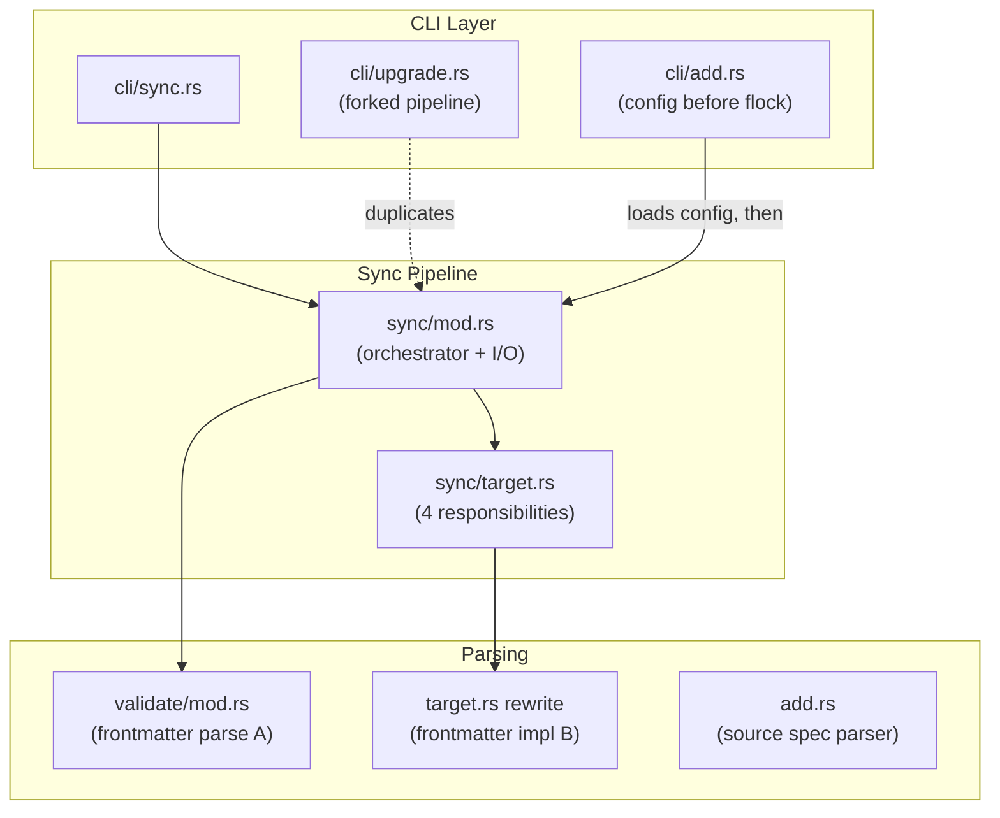
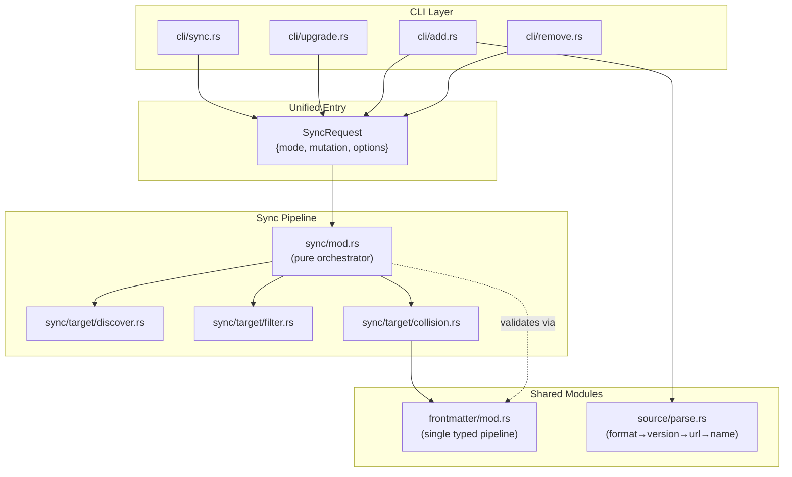

# mars-agents v1 Refactor: Design Overview

## Goal

Refactor the mars-agents crate (11,280 lines, 281 tests, 13 CLI commands) to eliminate entire bug classes through type system enforcement, module boundary clarity, and pipeline unification. Not a rewrite — restructure working code incrementally so every phase leaves the crate compiling and tests passing.

## Architecture Before and After

### Before (Current State)



**Key problems**: Upgrade forks the engine. Add loads config before flock. Two incompatible frontmatter implementations. String-typed identities. Resolver ignores locked commit SHAs.

### After (Target State)



**Key changes**: All commands route through `SyncRequest`. Config loaded under flock. Single frontmatter module. Source spec parser separated. Target responsibilities split. Newtypes prevent string confusion.

## Subsystem Designs

Each subsystem has its own design doc with concrete Rust types:

| Subsystem | Doc | Fixes Issues |
|-----------|-----|--------------|
| [Unified sync pipeline](sync-pipeline.md) | SyncRequest, ResolutionMode, ConfigMutation, flock-first pattern | #1 (forked engine), #2 (config races), #14 (sync/mod.rs concerns) |
| [Frontmatter module](frontmatter.md) | Parse → typed struct → rewrite → serialize | #3 (substring corruption), #4 (temp file collisions), #13 (target.rs split) |
| [Newtypes and parsing](newtypes-and-parsing.md) | SourceName, ItemName, DestPath, SourceId, RenameRule, SourceSpecParser | #6 (SSH misparse), #8 (stringly-typed), #9 (name-keyed deps), #16 (mixed concerns) |
| [Resolver and errors](resolver-and-errors.md) | Locked SHA replay, exit code mapping | #5 (resolver ignores SHA), #7 (broken exit codes) |
| [Extensibility analysis](extensibility.md) | Extension points, v2 compatibility, YAGNI boundaries | Future-proofing without over-engineering |

## Issue Coverage Matrix

| # | Issue | Subsystem | Phase |
|---|-------|-----------|-------|
| 1 | Upgrade forks sync engine | sync-pipeline | 4 |
| 2 | Config load/mutation races | sync-pipeline | 4 |
| 3 | Frontmatter substring corruption | frontmatter | 1 |
| 4 | Temp files not namespaced | frontmatter | 1 |
| 5 | Resolver ignores locked SHA | resolver-and-errors | 5 |
| 6 | SSH URL misparse | newtypes-and-parsing | 2 |
| 7 | Exit code mapping broken | resolver-and-errors | 3 |
| 8 | Stringly-typed identities | newtypes-and-parsing | 6-7 |
| 9 | Dependency identity by name | newtypes-and-parsing | 7 |
| 10 | Dead SourceFetcher abstraction | cleanup | 8 |
| 11 | Lock provenance heuristic | cleanup | 8 |
| 12 | build()/check_collisions() split | sync-pipeline | 4 |
| 13 | target.rs 4 responsibilities | sync-pipeline | 4 |
| 14 | sync/mod.rs too many concerns | sync-pipeline | 4 |
| 15 | EffectiveConfig bundles too much | newtypes-and-parsing | 7 |
| 16 | parse_source_specifier mixes 4 | newtypes-and-parsing | 2 |
| 17 | SourceProvider trait is fat | cleanup | 8 |

## Phase Ordering Strategy

Phases are ordered to maximize independent shippability while front-loading correctness fixes:

```
Phase 1: Frontmatter module               (new module, fixes #3 #4)
Phase 2: Source spec parser                (new module, fixes #6 #16)
Phase 3: Exit code mapping                 (isolated, fixes #7)
Phase 4: Unified sync pipeline + flock     (structural, fixes #1 #2 #12 #13 #14)
Phase 5: Resolver locked SHA replay        (independent, fixes #5)
Phase 6: Foundation newtypes               (SourceName, ItemName, CommitHash, ContentHash)
Phase 7: Path newtypes + SourceId          (DestPath, SourceUrl, SourceId, RenameRule)
Phase 8: Cleanup                           (dead code, lock provenance, SourceProvider split)
```

**Rationale for this order:**
- Phases 1-3 are quick, independent wins that fix real bugs and create clean modules
- Phase 1 (frontmatter) reduces target.rs from 4 responsibilities to 3, making phase 4 cleaner
- Phase 4 is the highest-risk structural change — combines unified pipeline + flock-first config mutation since they're tightly coupled (SyncRequest + ConfigMutation both need to be in the pipeline)
- Phase 5 depends on phase 4 (uses `ResolutionMode` to determine SHA replay behavior per mode)
- Phases 6-7 are systematic newtype introductions — lower risk per change, high total touch count. Easier after the pipeline is unified (fewer call sites to update)
- Phase 8 is cleanup that's safe to do last — dead `SourceFetcher`, fat `SourceProvider` trait, lock provenance heuristics

Each phase produces a shippable state: `cargo test` passes, CLI works, no broken commands.

## Cross-Cutting Design Decisions

### Type System Strategy

The refactor uses Rust's type system to make bug classes impossible rather than prevented by convention:

1. **Newtypes prevent string confusion.** `SourceName` and `ItemName` can't be accidentally swapped. `DestPath` can't be used where `SourcePath` is expected.
2. **Enums prevent invalid states.** `ResolutionMode` is an enum, not a bool flag + optional HashSet. You can't construct `Maximize` without targets.
3. **Pipeline types enforce ordering.** The `SyncRequest` must be constructed before the pipeline runs — config mutation intent is captured, not applied prematurely.
4. **Module boundaries enforce SRP.** The frontmatter module owns parsing and serialization. No other module does string manipulation on YAML content.

### Migration Approach

Each phase follows the same pattern:
1. Introduce the new type/module alongside the old code
2. Migrate callers one at a time
3. Remove the old code path
4. Verify: `cargo test`, `cargo clippy`, type checker passes

This avoids big-bang changes that are hard to review and hard to revert.

### Test Strategy

- Existing 281 tests serve as regression guards — they must pass after every phase
- New tests accompany each structural change
- Integration tests verify CLI behavior end-to-end
- The frontmatter module gets property-based tests (parse → modify → serialize roundtrip)

## Naming Convention

The requirements doc mentions "uv-style naming" — specifically `upgrade` instead of `update`. The current codebase already uses `upgrade` for the maximize-versions command and `update` as a synonym. Phase 4 (unified pipeline) is the natural place to standardize:
- `mars upgrade` = maximize versions (already exists)
- `mars sync` = normal sync (already exists)
- Remove `mars update` alias if it exists, or make it an alias for `upgrade`
