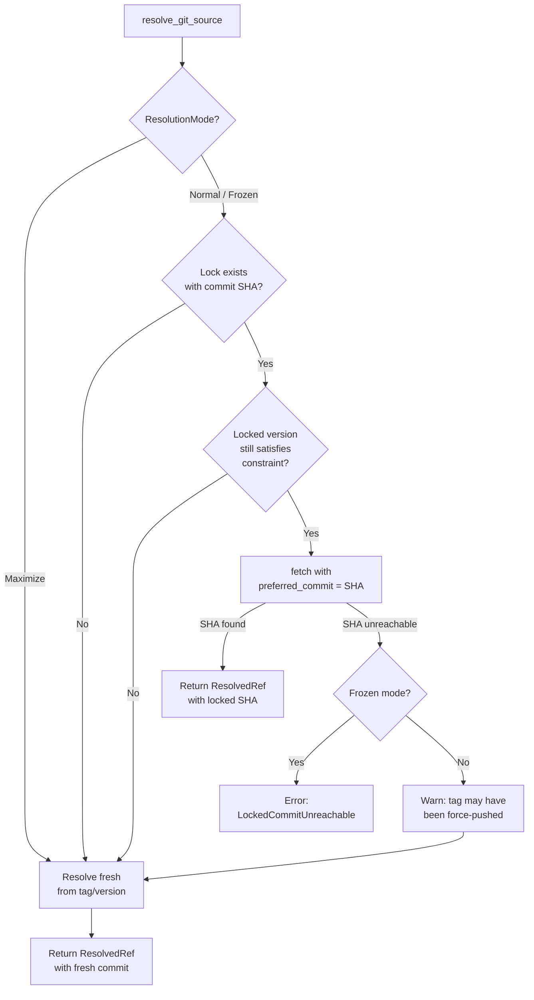

# Resolver Locked-SHA Replay & Exit Code Mapping

Fixes requirements #5 (resolver ignores locked SHA) and #7 (exit code mapping broken).

See [design overview](overview.md) for how this fits into the v1 refactor. See [original architecture](../../agent-package-management/design/rust-architecture.md) for the full error type hierarchy and exit code spec.

## Problem 1: Resolver Ignores Locked Commit SHAs

### Current Behavior

The lock file records commit SHAs:

```rust
// lock/mod.rs (lines 33-44)
pub struct LockedSource {
    pub url: Option<String>,
    pub path: Option<String>,
    pub version: Option<String>,
    pub commit: Option<String>,     // ← recorded but never used as checkout target
    pub tree_hash: Option<String>,
}
```

The resolver reads `locked.version` to prefer an already-resolved version, but ignores `locked.commit`:

```rust
// resolve/mod.rs (lines 352-372) — current lock preference logic
// reads locked.version to decide whether to re-fetch
// does NOT read locked.commit as a checkout target
```

When `fetch()` is called, it resolves the tag to whatever commit it currently points at. A force-pushed tag silently produces different content. Frozen sync checks for action-level changes but can't detect this because the version string hasn't changed — only the underlying commit has.

### The Failure Mode

```
Time 0: mars sync       → tag v1.0.0 points to abc123 → lock records commit=abc123
Time 1: Author force-pushes v1.0.0 to point at def456
Time 2: mars sync       → tag v1.0.0 resolves to def456 → different content, no warning
Time 2: mars sync --frozen  → also gets def456 → frozen guarantee violated
```

### Design: SHA-Preferred Checkout

**Principle:** When a lock file exists with a commit SHA, the resolver should use that SHA as the checkout target — not just the version string. The version string determines _which source to consider_, the SHA determines _what content to check out_.

#### New Parameter on `source::git::fetch`

```rust
// source/git.rs — updated fetch signature

/// Hint from the resolver about what commit to prefer.
/// The git source uses this to checkout the exact locked state
/// instead of resolving the tag fresh.
pub struct FetchOptions {
    /// If set, try this SHA before resolving version/tag.
    /// Used for locked-SHA replay — guarantees reproducible checkout.
    pub preferred_commit: Option<String>,
}

pub fn fetch(
    url: &str,
    version: Option<&str>,
    cache: &CacheDir,
    options: &FetchOptions,     // ← new parameter
) -> Result<ResolvedRef, MarsError> {
    let repo = ensure_cloned_and_fetched(url, cache)?;

    if let Some(ref sha) = options.preferred_commit {
        match checkout_commit(&repo, sha) {
            Ok(tree_path) => {
                // SHA found and checked out — return with original version metadata
                return Ok(ResolvedRef {
                    source_name: String::new(), // filled by caller
                    version: version.and_then(|v| semver::Version::parse(v).ok()),
                    commit: Some(sha.clone()),
                    tree_path,
                });
            }
            Err(_) => {
                // SHA unreachable — caller decides whether to error or fallback
                return Err(MarsError::LockedCommitUnreachable {
                    commit: sha.clone(),
                    url: url.to_string(),
                });
            }
        }
    }

    // No preferred commit — resolve from version/tag as before
    if let Some(v) = version {
        checkout_version(&repo, v)
    } else {
        checkout_head(&repo)
    }
}
```

**Key point:** `checkout_commit` is a thin wrapper around the existing OID path in `checkout_version` (lines 294-310 of current `source/git.rs`). The OID parsing and `repo.find_commit(oid)` logic already exists — this just calls it directly instead of going through tag resolution first.

```rust
/// Direct SHA checkout — extracted from the OID branch of checkout_version
fn checkout_commit(repo: &Repository, sha: &str) -> Result<PathBuf, MarsError> {
    let oid = git2::Oid::from_str(sha)
        .map_err(|e| MarsError::Git(e))?;
    let commit = repo.find_commit(oid)
        .map_err(|e| MarsError::Git(e))?;
    // checkout tree at this commit
    let tree = commit.tree().map_err(|e| MarsError::Git(e))?;
    repo.checkout_tree(tree.as_object(), Some(&mut checkout_opts()))
        .map_err(|e| MarsError::Git(e))?;
    repo.set_head_detached(oid)
        .map_err(|e| MarsError::Git(e))?;
    Ok(repo.workdir().unwrap().to_path_buf())
}
```

#### New Error Variant

```rust
// error.rs — add variant
#[derive(Debug, thiserror::Error)]
pub enum MarsError {
    // ... existing variants ...

    #[error("locked commit {commit} is no longer reachable in {url} — the tag may have been force-pushed")]
    LockedCommitUnreachable {
        commit: String,
        url: String,
    },
}
```

This maps to **exit code 2** (resolution/validation error) — the lock file references a state that no longer exists, which is a reproducibility failure, not an I/O failure.

#### Changes to `resolve/mod.rs`

The resolver's lock preference path (currently lines 352-372) changes to pass the locked SHA through to the git source:

```rust
// resolve/mod.rs — updated resolve_git_source

fn resolve_git_source(
    source_name: &str,
    spec: &GitSpec,
    locked: Option<&LockedSource>,
    mode: &ResolutionMode,
    cache: &CacheDir,
) -> Result<ResolvedRef, MarsError> {
    // Maximize mode: ignore lock entirely, resolve fresh
    if mode.is_maximize() {
        return fetch_fresh(source_name, spec, cache);
    }

    // If lock exists, try to replay from locked state
    if let Some(locked) = locked {
        if version_satisfies_constraint(locked.version.as_deref(), &spec.version) {
            // Locked version still satisfies constraint — use locked SHA
            let fetch_opts = FetchOptions {
                preferred_commit: locked.commit.clone(),
            };
            match git::fetch(&spec.url, locked.version.as_deref(), cache, &fetch_opts) {
                Ok(mut resolved) => {
                    resolved.source_name = source_name.to_string();
                    return Ok(resolved);
                }
                Err(MarsError::LockedCommitUnreachable { .. }) if mode.is_frozen() => {
                    // Frozen mode: SHA must be reachable — propagate error
                    return Err(MarsError::LockedCommitUnreachable {
                        commit: locked.commit.clone().unwrap_or_default(),
                        url: spec.url.clone(),
                    });
                }
                Err(MarsError::LockedCommitUnreachable { commit, url }) => {
                    // Normal mode: warn and fall through to tag resolution
                    eprintln!(
                        "warning: locked commit {} for {} is unreachable — \
                         tag may have been force-pushed, re-resolving from tag",
                        &commit, &url
                    );
                    // Fall through to fresh resolution below
                }
                Err(e) => return Err(e), // Real errors propagate
            }
        }
        // else: locked version no longer satisfies constraint — re-resolve
    }

    // No lock, lock doesn't apply, or SHA was unreachable in normal mode
    fetch_fresh(source_name, spec, cache)
}

fn fetch_fresh(
    source_name: &str,
    spec: &GitSpec,
    cache: &CacheDir,
) -> Result<ResolvedRef, MarsError> {
    let fetch_opts = FetchOptions { preferred_commit: None };
    let mut resolved = git::fetch(&spec.url, spec.version.as_deref(), cache, &fetch_opts)?;
    resolved.source_name = source_name.to_string();
    Ok(resolved)
}
```

#### Behavior by Resolution Mode

| Mode | Locked SHA exists | SHA reachable | Behavior |
|------|------------------|---------------|----------|
| **Normal** (`Minimal`) | Yes | Yes | Checkout locked SHA directly |
| **Normal** (`Minimal`) | Yes | No (force-push) | Warn, re-resolve from tag |
| **Normal** (`Minimal`) | No | N/A | Resolve from version constraint |
| **Frozen** | Yes | Yes | Checkout locked SHA directly |
| **Frozen** | Yes | No | **Error** — lock is unreproducible |
| **Frozen** | No | N/A | Resolve from version (existing behavior) |
| **Maximize** (`Upgrade`) | Any | Any | Ignore lock, resolve newest |

#### Flow Diagram



#### What Doesn't Change

- **`lock::build()`** — already records `commit` from `ResolvedRef.commit`. No changes needed.
- **`ResolvedRef` struct** — already has `commit: Option<String>`. No changes needed.
- **`ResolvedNode`** — already carries `resolved_ref: ResolvedRef`. No changes needed.
- **`checkout_version`** — existing OID branch at lines 294-310 already handles SHA checkout. We extract it into `checkout_commit` for direct use.
- **Path sources** — no commit SHAs, no lock replay. Unaffected.

#### Edge Cases

1. **Lock has `commit: None`** (old lock files, path sources). Falls through to existing version-based resolution. No behavior change.

2. **Lock has commit but no version** (e.g., source was pinned to a raw SHA like `repo@abc123`). The `version_satisfies_constraint` check should pass when version is None and the constraint allows any version. The SHA is still used as preferred_commit.

3. **Network-isolated frozen sync.** If the repo is already cloned in cache and the SHA is in the local clone, frozen sync works offline. If the cache is missing, the clone fails with a git error (exit 3), which is correct — you need the cache for offline frozen sync.

4. **SHA exists but tag now points elsewhere.** Normal mode: we checkout the locked SHA, preserving the old content. The version metadata says "v1.0.0" but the commit differs from the tag's current target. This is correct — the lock is the authority, not the tag.

---

## Problem 2: Exit Code Mapping

### Current Behavior

```rust
// main.rs — current
fn main() {
    let cli = Cli::parse();
    match cli::dispatch(cli) {
        Ok(code) => std::process::exit(code),
        Err(e) => {
            eprintln!("error: {e}");
            std::process::exit(3);  // ← every error is exit 3
        }
    }
}
```

The `Ok(code)` path already handles success (0) and conflicts (1) — commands return `Ok(1)` when sync completes with unresolved merge conflicts. The problem is the `Err` path: all errors collapse to exit 3 regardless of whether they're config errors, resolution failures, or I/O errors.

### Design Spec

From the [feature spec](../../agent-package-management/design/features.md) and [architecture doc](../../agent-package-management/design/rust-architecture.md):

| Exit Code | Meaning | Error Variants |
|-----------|---------|----------------|
| 0 | Clean success | `Ok(0)` |
| 1 | Success with unresolved conflicts | `Ok(1)` or `Err(MarsError::Conflict)` |
| 2 | Resolution/validation/config error | `Config`, `Resolution`, `Validation`, `Collision`, `Lock` (parse errors), `LockedCommitUnreachable` |
| 3 | I/O or git error | `Io`, `Git`, `Source` (fetch failures) |

### Design: `exit_code()` Method on `MarsError`

Add a method directly on `MarsError`. This keeps the mapping next to the error definition where it can't drift from variant additions.

```rust
// error.rs

impl MarsError {
    /// Map error variant to CLI exit code.
    ///
    /// 1 = conflicts remain (user needs to resolve)
    /// 2 = resolution/validation/config error (bad input, constraint conflict)
    /// 3 = I/O or git error (infrastructure failure)
    pub fn exit_code(&self) -> i32 {
        match self {
            // Conflicts — exit 1
            // Note: most conflicts go through Ok(1), but if a conflict
            // error is raised outside the normal sync flow, it's still exit 1
            MarsError::Conflict { .. } => 1,

            // Config/resolution/validation — exit 2
            MarsError::Config(_) => 2,
            MarsError::Lock(_) => 2,
            MarsError::Resolution(_) => 2,
            MarsError::Validation(_) => 2,
            MarsError::Collision { .. } => 2,
            MarsError::LockedCommitUnreachable { .. } => 2,

            // I/O and infrastructure — exit 3
            MarsError::Source { .. } => 3,
            MarsError::Io(_) => 3,
            MarsError::Git(_) => 3,
        }
    }
}
```

### Changes to `main.rs`

```rust
// main.rs — updated
fn main() {
    let cli = Cli::parse();
    match cli::dispatch(cli) {
        Ok(code) => std::process::exit(code),
        Err(e) => {
            eprintln!("error: {e}");
            std::process::exit(e.exit_code());
        }
    }
}
```

One-line change: `3` → `e.exit_code()`.

### `cli/mod.rs` Dispatch — No Changes Needed

The dispatch function already propagates `Result<i32, MarsError>` from command handlers. Each handler returns `Ok(0)` for success, `Ok(1)` for conflicts. Errors propagate naturally to main.

```rust
// cli/mod.rs — existing pattern (no changes)
pub fn dispatch(cli: Cli) -> Result<i32, MarsError> {
    match cli.command {
        Command::Sync(args) => sync::run(args),
        Command::Add(args) => add::run(args),
        Command::Remove(args) => remove::run(args),
        Command::Upgrade(args) => upgrade::run(args),
        // ...
    }
}
```

### Why `Conflict` Maps to Exit 1 in the Error Path

In normal operation, merge conflicts are handled within the sync pipeline — conflict markers are written, and the command returns `Ok(1)`. The `MarsError::Conflict` variant exists for edge cases where a conflict surfaces as an error (e.g., a conflict during a non-sync operation, or a conflict that can't be handled by marker insertion). Mapping it to exit 1 keeps the semantics consistent: "conflicts exist, user action needed."

### Why `Lock` Maps to Exit 2, Not 3

Lock parse errors (`LockError`) indicate a corrupt or incompatible lock file — this is a validation problem with the user's project state, not an infrastructure failure. The user needs to run `mars repair` or regenerate the lock, which is a "fix your input" situation (exit 2), not a "check your network" situation (exit 3).

### Why `LockedCommitUnreachable` Maps to Exit 2

A force-pushed tag that makes a locked SHA unreachable is a reproducibility failure. The lock file promises a state that no longer exists upstream. This is conceptually a resolution/validation error: "your lock file is invalid." It's not an I/O error because the network is working fine — the problem is semantic, not mechanical.

### Exhaustiveness Guard

The `exit_code()` match must be exhaustive (no `_ => 3` wildcard). If a new `MarsError` variant is added, the compiler forces the developer to assign an exit code. This prevents new errors from silently defaulting to exit 3.

```rust
// GOOD: exhaustive match — compiler catches new variants
match self {
    MarsError::Conflict { .. } => 1,
    MarsError::Config(_) => 2,
    // ... every variant explicitly listed
}

// BAD: wildcard hides new variants
match self {
    MarsError::Conflict { .. } => 1,
    _ => 3,  // ← new variants silently become exit 3
}
```

---

## Implementation Notes

### Phase Ordering

From the [design overview](overview.md):
- **Exit code mapping** is Phase 3 — isolated, no dependencies, quick win.
- **Locked SHA replay** is Phase 6 — independent but benefits from the cleaner pipeline after Phase 4.

These two changes are independent of each other. Exit codes can ship in Phase 3 without waiting for the SHA replay work. The new `LockedCommitUnreachable` variant should be added with its exit code in Phase 3 (define the variant, map it to exit 2), even though the resolver won't produce it until Phase 6.

### Testing

**Exit code mapping (Phase 3):**
- Unit test: `MarsError::Config(...).exit_code() == 2` for each variant
- Smoke test: `mars sync` with a broken config → verify exit code 2
- Smoke test: `mars sync` with a nonexistent repo → verify exit code 3

**Locked SHA replay (Phase 6):**
- Integration test: create a git repo with tag v1.0.0 at commit A, sync, force-push tag to commit B, sync again → verify content is still from commit A
- Integration test: same setup but with `--frozen` → verify content is from commit A
- Integration test: force-push AND delete the original commit (gc), `--frozen` → verify exit code 2 with clear error message
- Integration test: `mars upgrade` after force-push → verify it resolves fresh to commit B

### Files Modified

| File | Phase | Change |
|------|-------|--------|
| `src/error.rs` | 3 | Add `LockedCommitUnreachable` variant |
| `src/error.rs` | 3 | Add `exit_code()` method |
| `src/main.rs` | 3 | Replace `3` with `e.exit_code()` |
| `src/source/git.rs` | 6 | Add `FetchOptions` struct and `checkout_commit` function |
| `src/source/git.rs` | 6 | Update `fetch()` signature to accept `FetchOptions` |
| `src/resolve/mod.rs` | 6 | Update lock preference path to pass `preferred_commit` |
| `src/resolve/mod.rs` | 6 | Handle `LockedCommitUnreachable` per resolution mode |
| All callers of `git::fetch` | 6 | Pass `FetchOptions { preferred_commit: None }` where no lock replay is needed |

### Alternatives Considered

**Alternative for SHA replay: Store tag SHA separately from commit SHA.** Git tags can be annotated (tag object → commit object) or lightweight (direct commit ref). We could store both the tag OID and the dereferenced commit OID. Rejected because it adds complexity without value — what matters for reproducibility is the commit SHA, regardless of tag type. The `checkout_commit` function takes a commit OID directly.

**Alternative for SHA replay: Re-resolve and compare.** Instead of checking out the locked SHA, resolve normally and then compare the resulting commit against the lock. If they differ, warn or error. Rejected because this still checks out the wrong content in the success path — you've already cloned/fetched at the new commit. Using the locked SHA as the checkout target is both simpler and more correct.

**Alternative for exit codes: Match in `main.rs` instead of method on `MarsError`.** Keeps error.rs pure, puts the mapping at the boundary. Rejected because it splits the exit code decision from the variant definition — when a new variant is added to error.rs, the developer must remember to update a match in a different file. The method approach uses the compiler to enforce completeness at the definition site.
