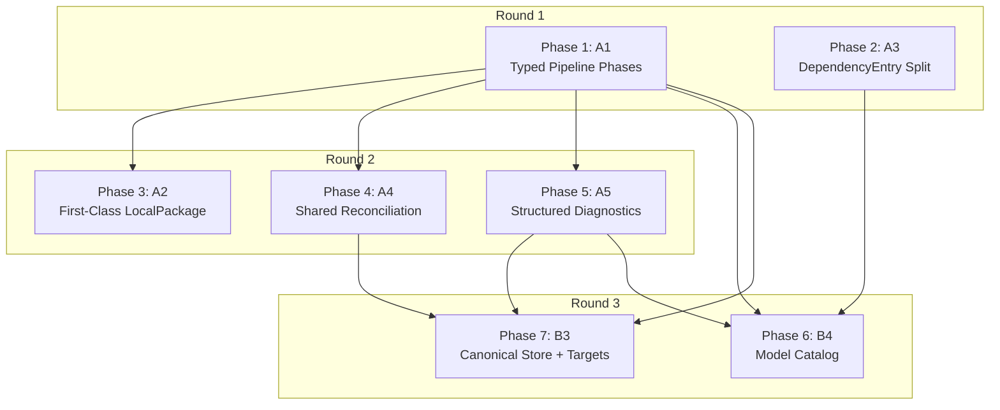

# Implementation Plan: Mars Refactor

Decomposition of the mars-agents refactor into 7 phases across 3 execution rounds.

## Scope

Ships: A1-A5 (pipeline decomposition) + B3 (.mars/ canonical store) + B4 (model catalog).
Does NOT ship: B1 (rules/item kinds), B2 (harness variants), B5-B8 (capabilities).

## Phase Dependency Graph

## Execution Rounds

| Round | Phases | Parallelism | Notes |
|-------|--------|-------------|-------|
| 1 | Phase 1 (A1), Phase 2 (A3) | Parallel | A1 touches sync/, A3 touches config/. No file overlap. |
| 2 | Phase 3 (A2), Phase 4 (A4), Phase 5 (A5) | Parallel | A2 touches sync/self_package + target. A4 extracts reconcile/. A5 replaces eprintln! calls. Minimal overlap — coordinate on sync/mod.rs. |
| 3 | Phase 6 (B4), Phase 7 (B3) | Parallel | B4 adds models module + manifest extension. B3 adds target sync phase + .mars/ layout. Independent subsystems. |

## Risk Assessment

| Phase | Risk | Reason |
|-------|------|--------|
| A1 | **High** | Restructures the core pipeline. Every test depends on sync working. |
| A3 | Low | Internal type split, no behavior change, serde compatible. |
| A2 | Medium | Removes inject_self_items, changes how local items enter pipeline. |
| A4 | Medium | Extracting shared code — must not regress atomicity guarantees. |
| A5 | Low | Mechanical replacement of eprintln! with collector pattern. |
| B4 | Medium | New subsystem (auto-resolve, cache, merge). Most code is additive. |
| B3 | **High** | Architectural pivot — .mars/ becomes source of truth, all targets are copies. Changes the fundamental write path. |

## Phase Blueprints

- [Phase 1: A1 — Typed Pipeline Phases](phase-1-typed-pipeline.md)
- [Phase 2: A3 — DependencyEntry Split](phase-2-dep-split.md)
- [Phase 3: A2 — First-Class LocalPackage](phase-3-local-package.md)
- [Phase 4: A4 — Shared Reconciliation](phase-4-reconciliation.md)
- [Phase 5: A5 — Structured Diagnostics](phase-5-diagnostics.md)
- [Phase 6: B4 — Model Catalog](phase-6-model-catalog.md)
- [Phase 7: B3 — Canonical Store + Managed Targets](phase-7-canonical-store.md)
