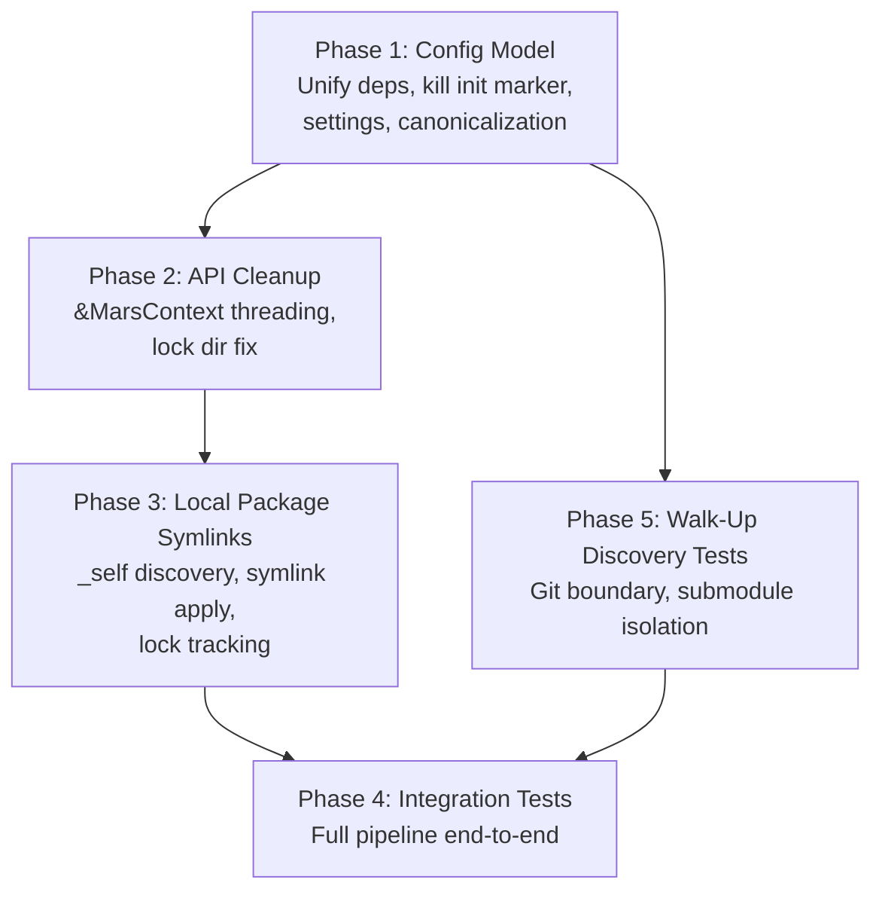

# Implementation Plan

## Execution Order



```
Round 1: Phase 1                    (foundation — everything depends on it)
Round 2: Phase 2, Phase 5           (independent — Phase 2 touches sync, Phase 5 touches discovery)
Round 3: Phase 3                    (needs Phase 2's &MarsContext API)
Round 4: Phase 4                    (needs Phase 3 + Phase 5)
```

Phases 2 and 3 both modify `src/sync/mod.rs` — Phase 2 changes the `execute()` signature and all internal references, Phase 3 adds local item discovery into the same function body. They MUST run sequentially, with Phase 3 building on Phase 2's changes. Phase 5 only touches `src/cli/mod.rs` (discovery) and is independent of Phase 2 (sync), so they can run in parallel.

---

## Phase 1: Config Model & Init Cleanup (Unified Dependencies)

**Scope:** Unify `[sources]` and `[dependencies]` into single `[dependencies]`, kill init marker, protect package manifests, add `managed_root` to settings, fix canonicalization, gitignore `mars.local.toml`, default project root to git root.

This is the most impactful phase — it changes the core data model that everything else builds on.

### Files to modify

**`src/config/mod.rs`** — Core data model unification:

1. **Delete `SourceEntry` struct entirely.** Its fields (`url`, `path`, `version`, `filter: FilterConfig`) must be merged into `DepSpec`.

2. **Expand `DepSpec` to be the unified dependency entry:**
   ```rust
   /// Unified dependency specification — replaces both old DepSpec and SourceEntry.
   /// Used in [dependencies] for both "what to install locally" (consumer)
   /// and "what downstream consumers inherit" (package manifest).
   #[derive(Debug, Clone, Serialize, Deserialize, PartialEq)]
   pub struct DependencyEntry {
       #[serde(default, skip_serializing_if = "Option::is_none")]
       pub url: Option<SourceUrl>,
       #[serde(default, skip_serializing_if = "Option::is_none")]
       pub path: Option<PathBuf>,
       #[serde(default, skip_serializing_if = "Option::is_none")]
       pub version: Option<String>,
       #[serde(flatten)]
       pub filter: FilterConfig,
   }
   ```
   This has all fields from `SourceEntry` (`url`, `path`, `version`, `filter`) — the old `DepSpec` only had `url`, `version`, `agents`, `skills`. The new struct adds `path` support and uses `FilterConfig` (which includes `agents`, `skills`, `exclude`, `rename`) via flatten.

3. **Update `Config` struct — drop `sources` field:**
   ```rust
   pub struct Config {
       #[serde(default, skip_serializing_if = "Option::is_none")]
       pub package: Option<PackageInfo>,
       #[serde(default)]
       pub dependencies: IndexMap<String, DependencyEntry>,
       #[serde(default)]
       pub settings: Settings,
   }
   ```
   The `sources: IndexMap<SourceName, SourceEntry>` field is removed. `dependencies` changes type from `IndexMap<String, DepSpec>` to `IndexMap<String, DependencyEntry>`.

4. **Update `Manifest` struct** — `dependencies` type changes to `IndexMap<String, DependencyEntry>`.

5. **Add `managed_root` to `Settings`:**
   ```rust
   pub struct Settings {
       #[serde(default, skip_serializing_if = "Option::is_none")]
       pub managed_root: Option<String>,
       #[serde(default, skip_serializing_if = "Vec::is_empty")]
       pub links: Vec<String>,
   }
   ```

6. **Update `merge()` and `merge_with_root()`:**
   - Iterate `config.dependencies` instead of `config.sources`
   - The validation logic (url XOR path, include XOR exclude) stays identical but now reads from `DependencyEntry` fields
   - Add `_self` reserved name validation:
     ```rust
     if name == "_self" {
         return Err(ConfigError::Invalid {
             message: "dependency name `_self` is reserved for local package items".into(),
         }.into());
     }
     ```
   - Override warning: `config.dependencies.contains_key(override_name)` instead of `config.sources.contains_key(override_name)`

7. **Update `migrate_legacy_source_urls()`:**
   - Iterate `config.dependencies.values_mut()` instead of `config.sources.values_mut()`

8. **Update all tests** — every test that uses `config.sources` must use `config.dependencies` instead. Every test that constructs a `SourceEntry` must construct a `DependencyEntry`. TOML strings with `[sources.xxx]` become `[dependencies.xxx]`.

**`src/cli/mod.rs`** — Discovery and context:

1. **Delete `INIT_MARKER` constant** (line 43: `const INIT_MARKER: &str = "# created by mars init";`)

2. **Simplify `is_consumer_config()`** (currently line 253):
   - Remove the `INIT_MARKER` comment scanning
   - Change `table.contains_key("sources")` to `table.contains_key("dependencies")`
   ```rust
   fn is_consumer_config(path: &Path) -> Result<bool, MarsError> {
       let content = match std::fs::read_to_string(path) {
           Ok(c) => c,
           Err(e) if e.kind() == std::io::ErrorKind::NotFound => return Ok(false),
           Err(e) => return Err(MarsError::Io(e)),
       };
       let value: toml::Value = toml::from_str(&content).map_err(|e| ConfigError::Invalid {
           message: format!("failed to parse {}: {e}", path.display()),
       })?;
       let Some(table) = value.as_table() else {
           return Ok(false);
       };
       Ok(table.contains_key("dependencies"))
   }
   ```

3. **Change `detect_managed_root()` to return `Result<PathBuf>`** and read `settings.managed_root`:
   ```rust
   fn detect_managed_root(project_root: &Path) -> Result<PathBuf, MarsError> {
       // 1. Check settings in mars.toml
       match crate::config::load(project_root) {
           Ok(config) => {
               if let Some(name) = &config.settings.managed_root {
                   return Ok(project_root.join(name));
               }
           }
           Err(MarsError::Config(ConfigError::NotFound { .. })) => {}
           Err(e) => return Err(e),
       }
       // 2-3. Existing heuristic fallback (unchanged)
       // ...
   }
   ```
   Update `MarsContext::new()` to call `detect_managed_root(&project_canon)?` (propagate the Result).

4. **Fix `from_roots()` to canonicalize both paths** — currently only `managed_root` is canonicalized. Add canonicalization for `project_root`:
   ```rust
   pub fn from_roots(project_root: PathBuf, managed_root: PathBuf) -> Result<Self, MarsError> {
       let project_canon = if project_root.exists() {
           project_root.canonicalize().unwrap_or(project_root.clone())
       } else {
           project_root.clone()
       };
       let managed_canon = if managed_root.exists() {
           managed_root.canonicalize().unwrap_or(managed_root.clone())
       } else {
           managed_root.clone()
       };
       // ... starts_with check using project_canon ...
   }
   ```

5. **Add `default_project_root()` helper** — walk up from cwd to find `.git`:
   ```rust
   fn default_project_root() -> Result<PathBuf, MarsError> {
       let cwd = std::env::current_dir()?;
       let mut dir = cwd.as_path();
       loop {
           if dir.join(".git").exists() {
               return Ok(dir.to_path_buf());
           }
           match dir.parent() {
               Some(parent) => dir = parent,
               None => return Ok(cwd),
           }
       }
   }
   ```

6. **Add `--root` footgun rejection** in `find_agents_root()` — if `explicit` path's basename is in `WELL_KNOWN` or `TOOL_DIRS`, reject with descriptive error.

7. **Update `find_agents_root()` error message** — change "run `mars init` to add [sources]" to "run `mars init` to add [dependencies]".

8. **Update all tests:**
   - `find_root_with_explicit_path`: write `"[dependencies]\n"` instead of `"[sources]\n"`
   - `find_root_with_default_managed_dir`: same
   - `find_root_with_custom_managed_dir_marker`: same
   - `context_rejects_symlinked_managed_root_outside_project`: same
   - `package_manifest_without_sources_is_not_consumer`: test name can stay (rename optional), but behavior is correct (no `[dependencies]` = not consumer)

**`src/cli/init.rs`** — Init rewrite:

1. **Rewrite `ensure_consumer_config()`:**
   - New file: write `[dependencies]\n` (no INIT_MARKER)
   - Existing with `[dependencies]`: return `Ok(true)` (already initialized)
   - Existing with `[package]` only: return **error** refusing to mutate
   - Remove all INIT_MARKER references
   ```rust
   fn ensure_consumer_config(project_root: &Path) -> Result<bool, MarsError> {
       let config_path = project_root.join("mars.toml");
       if !config_path.exists() {
           crate::fs::atomic_write(&config_path, b"[dependencies]\n")?;
           return Ok(false);
       }
       let content = std::fs::read_to_string(&config_path)?;
       let value: toml::Value = toml::from_str(&content).map_err(|e| ConfigError::Invalid {
           message: format!("failed to parse {}: {e}", config_path.display()),
       })?;
       let table = value.as_table().ok_or_else(|| /* ... */)?;
       if table.contains_key("dependencies") {
           return Ok(true); // already a consumer
       }
       if table.contains_key("package") {
           return Err(MarsError::Config(ConfigError::Invalid {
               message: "mars.toml contains [package] but no [dependencies]. To use this as both \
                   a package and a consumer, add [dependencies] manually. Running `mars init` \
                   won't modify an existing package manifest.".into(),
           }));
       }
       // File exists but has neither — treat as fresh
       crate::fs::atomic_write(&config_path, b"[dependencies]\n")?;
       Ok(false)
   }
   ```

2. **Add `ensure_local_gitignored(project_root)`** — append `mars.local.toml` to project root `.gitignore`. Call from `run()` after `ensure_consumer_config()`.

3. **Update `run()`:**
   - Call `default_project_root()` (from `super::`) instead of `std::env::current_dir()` as the fallback when no `--root` is given
   - Persist `settings.managed_root` when target != `.agents`: load config, set field, save
   - Handle re-init with different target: update `managed_root` in config, warn user
   - Call `ensure_local_gitignored(&project_root)` after `ensure_consumer_config()`

4. **Update tests:**
   - `ensure_consumer_config_creates_root_mars_toml`: assert `[dependencies]` not `[sources]`, remove INIT_MARKER assertion
   - **`ensure_consumer_config_upgrades_package_only_file`**: **INVERT** — must assert `Err(...)` instead of `Ok(false)`. Rename to `ensure_consumer_config_refuses_package_only`.

**`src/sync/mod.rs`** — Sync pipeline terminology:

1. **Rename `ConfigMutation::UpsertSource`** to `ConfigMutation::UpsertDependency`:
   - `UpsertSource { name, entry: SourceEntry }` → `UpsertDependency { name, entry: DependencyEntry }`
   - `RemoveSource { name }` → `RemoveDependency { name }`

2. **Update `apply_mutation()`:**
   - `UpsertDependency` arm: `config.dependencies.get_mut(name)` / `config.dependencies.insert(...)` instead of `config.sources`
   - `RemoveDependency` arm: `config.dependencies.contains_key(name)` / `config.dependencies.shift_remove(name)`
   - `SetOverride` arm: `config.dependencies.contains_key(source_name)`
   - `SetRename` arm: `config.dependencies.get_mut(source_name)`
   - All error messages: "source `{name}` not found" → "dependency `{name}` not found"

3. **Update `validate_targets()`:** `effective.sources.contains_key(name)` stays (EffectiveConfig still uses `sources` internally as the resolved set — see note below).

4. **Update `mutate_link_config()`:** no change needed (operates on `settings.links`).

5. **Update step 15 persist logic:** `ConfigMutation::UpsertSource` → `ConfigMutation::UpsertDependency`, `ConfigMutation::RemoveSource` → `ConfigMutation::RemoveDependency`.

**Note on `EffectiveConfig`:** The `EffectiveConfig.sources` field name is an internal implementation detail — it represents the resolved dependency set after merge. It could be renamed to `dependencies` for consistency, but this is optional and can be deferred. The critical user-facing change is that `Config.sources` is gone and `Config.dependencies` is the sole field.

**`src/cli/add.rs`** — Terminology:

1. Update doc comment: "add or update a source" → "add or update a dependency"
2. `ParsedSource` struct → rename to `ParsedDependency` (or keep, since it's internal)
3. `parse_source_specifier()` → `parse_dependency_specifier()` (or keep)
4. `ConfigMutation::UpsertSource { name, entry }` → `ConfigMutation::UpsertDependency { name, entry }`
5. The `entry` type changes from `SourceEntry` to `DependencyEntry` — fields are the same shape (url, path, version, filter)
6. User-facing messages: "source `{}` already exists — updated" → "dependency `{}` already exists — updated", "added source `{}`" → "added dependency `{}`"
7. Check: `c.dependencies.contains_key(&parsed.name)` (already correct if `Config.sources` is gone)

**`src/cli/remove.rs`** — Terminology:

1. Doc comment: "remove a source" → "remove a dependency"
2. `ConfigMutation::RemoveSource { name }` → `ConfigMutation::RemoveDependency { name }`
3. Message: "removed source" → "removed dependency"
4. Help text: `source` arg → `dependency` (the clap field name)

**`src/cli/list.rs`** — Terminology:

1. Filter arg help: "Filter by source name" stays or becomes "Filter by dependency name"
2. All display strings referencing "source" in user output → "dependency" where appropriate

**`src/cli/why.rs`** — Terminology:

1. User-facing output referencing "source" → "dependency"

**`src/cli/outdated.rs`** — Core logic change:

1. Iterate `config.dependencies` instead of `config.sources`:
   ```rust
   for (name, dep_entry) in &config.dependencies {
       let url = match &dep_entry.url {
           Some(u) => u,
           None => continue, // local path deps have no version
       };
       // ...
   }
   ```
2. Lock check: `old_lock.sources` stays (lock file sources → renamed in lock file, see below)
3. User message: "no git sources to check" → "no git dependencies to check"

**`src/cli/upgrade.rs`**, **`src/cli/override_cmd.rs`**, **`src/cli/rename.rs`** — similar terminology updates where they reference "source" in user-facing messages.

**`src/lock/mod.rs`** — Lock file key rename:

1. **Rename `LockFile.sources`** to `LockFile.dependencies`:
   ```rust
   pub struct LockFile {
       pub version: u32,
       #[serde(default)]
       pub dependencies: IndexMap<SourceName, LockedSource>,
       #[serde(default)]
       pub items: IndexMap<DestPath, LockedItem>,
   }
   ```
   This changes the serialized TOML from `[sources.base]` to `[dependencies.base]`.

2. **Update `LockFile::empty()`**: `dependencies: IndexMap::new()`

3. **Update `build()`**: `sources.insert(...)` → `dependencies.insert(...)`, `sources.sort_keys()` → `dependencies.sort_keys()`

4. **Update all lock tests**: TOML strings with `[sources.xxx]` → `[dependencies.xxx]`, `lock.sources` → `lock.dependencies`

**Other files to grep and update** — any file referencing `config.sources`, `SourceEntry`, `UpsertSource`, `RemoveSource`, `lock.sources`:
- `src/cli/sync.rs` — call site
- `src/cli/doctor.rs` — if it reads sources
- `src/cli/repair.rs` — if it reads sources
- `src/cli/check.rs` — if it reads sources
- `src/resolve/` — if it reads config directly (it reads `EffectiveConfig` which is internal)

### Existing test changes

- `ensure_consumer_config_creates_root_mars_toml` — remove `INIT_MARKER` assertion, verify `[dependencies]` not `[sources]`
- **`ensure_consumer_config_upgrades_package_only_file`** — **INVERT**: must assert `Err(...)` instead of `Ok(false)`. Rename to `ensure_consumer_config_refuses_package_only`.
- All `config/mod.rs` tests using `[sources.xxx]` TOML → `[dependencies.xxx]`
- All `config/mod.rs` tests constructing `SourceEntry` → `DependencyEntry`
- All `cli/mod.rs` tests writing `[sources]\n` → `[dependencies]\n`
- All `lock/mod.rs` tests with `[sources.xxx]` TOML → `[dependencies.xxx]`, `lock.sources` → `lock.dependencies`

### New tests

- `ensure_consumer_config_refuses_package_only` — `[package]` only → error with descriptive message
- `detect_managed_root_reads_settings` — config with `managed_root = ".claude"` → returns `.claude` path
- `detect_managed_root_falls_through_on_missing_config` — no mars.toml → returns `.agents` default
- `detect_managed_root_surfaces_parse_errors` — malformed mars.toml → returns Err (not silent fallback)
- `default_project_root_finds_git_root` — temp dir with `.git` → returns that dir
- `init_rejects_root_that_looks_like_managed_dir` — `--root .agents` → error
- `self_dependency_name_rejected` — `[dependencies._self]` in config → error from `merge()`

### Verification criteria

- `cargo test` passes
- `cargo clippy` clean
- `grep -rn "SourceEntry" src/` returns nothing (struct fully removed)
- `grep -rn "INIT_MARKER" src/` returns nothing
- `grep -rn '\[sources' src/` returns nothing in config/lock structs or TOML test strings (only in user-facing migration messages if any)

**Agent:** `coder` — model: `gpt-5.3-codex`

---

## Phase 2: API Cleanup — `&MarsContext` Threading

**Scope:** Replace two-path args with `&MarsContext` in sync/repair/link. Fix `mars link` lock dir creation.

### Files to modify

**`src/sync/mod.rs`:**

1. **Change `execute()` signature:**
   ```rust
   // Before:
   pub fn execute(project_root: &Path, managed_root: &Path, request: &SyncRequest) -> Result<SyncReport, MarsError>
   // After:
   pub fn execute(ctx: &MarsContext, request: &SyncRequest) -> Result<SyncReport, MarsError>
   ```
   Where `MarsContext` is imported from `crate::cli::MarsContext`.

2. **Replace all internal references:**
   - `project_root` → `ctx.project_root` (appears ~10 times in the function body)
   - `managed_root` → `ctx.managed_root` (appears ~8 times)
   - Specific locations: config load (step 2), config save (step 15), lock load (step 6), lock write (step 17), local load (step 4), resolve (step 7: `project_root` in `RealSourceProvider`), target build (step 8), diff compute (step 12), apply (step 16), cache dir construction (step 13)

3. **Change `mutate_link_config()` signature:**
   ```rust
   // Before:
   pub fn mutate_link_config(project_root: &Path, managed_root: &Path, mutation: &LinkMutation) -> Result<(), MarsError>
   // After:
   pub fn mutate_link_config(ctx: &MarsContext, mutation: &LinkMutation) -> Result<(), MarsError>
   ```
   Replace `project_root` → `ctx.project_root`, `managed_root` → `ctx.managed_root`.

**`src/cli/sync.rs`** — Update call site:
```rust
// Before:
crate::sync::execute(&ctx.project_root, &ctx.managed_root, &request)
// After:
crate::sync::execute(ctx, &request)
```

**`src/cli/add.rs`** — Same call site pattern.

**`src/cli/remove.rs`** — Same.

**`src/cli/upgrade.rs`** — Same.

**`src/cli/override_cmd.rs`** — Same.

**`src/cli/rename.rs`** — Same (if it calls `sync::execute`).

**`src/cli/link.rs`:**
1. Add `std::fs::create_dir_all(ctx.managed_root.join(".mars"))` before lock acquisition
2. Update `mutate_link_config` call: `mutate_link_config(&ctx.project_root, &ctx.managed_root, ...)` → `mutate_link_config(ctx, ...)`

**`src/cli/repair.rs`** — Update `execute_repair_with_collision_cleanup` if it takes two paths.

**`src/sync/mod.rs` (or `src/cli/mod.rs`)** — Add test helper:
```rust
#[cfg(test)]
impl MarsContext {
    pub fn for_test(project_root: PathBuf, managed_root: PathBuf) -> Self {
        MarsContext { project_root, managed_root }
    }
}
```

**Note:** `MarsContext` is defined in `src/cli/mod.rs`. The sync module needs to import it. If this creates a circular dependency, consider moving `MarsContext` to a shared location (e.g., `src/context.rs` or `src/types.rs`). The coder should assess this.

### Files NOT to modify

- `src/cli/resolve_cmd.rs` — operates on lock file directly, no two-path API calls

### Dependencies

Phase 1 (`detect_managed_root` now returns `Result`)

### Verification criteria

- `cargo test` passes
- `cargo clippy` clean
- `grep -rn "fn execute(project_root: &Path, managed_root: &Path" src/` returns nothing
- `grep -rn "fn mutate_link_config(project_root: &Path, managed_root: &Path" src/` returns nothing

**Agent:** `coder` — model: `gpt-5.3-codex`

---

## Phase 3: Local Package Symlinks

**Scope:** Detect `[package]`, discover local items, symlink into managed dir during sync, track in lock file.

### Files to modify

**`src/sync/mod.rs`** — Core pipeline integration:

1. **Add `discover_local_items()` function:**
   ```rust
   struct LocalItem {
       kind: ItemKind,
       name: ItemName,
       source_path: PathBuf,      // absolute path to source
       dest_rel: DestPath,         // relative path under managed root
       source_hash: ContentHash,   // content hash of source
   }

   fn discover_local_items(project_root: &Path) -> Result<Vec<LocalItem>, MarsError> {
       // Scan project_root/agents/*.md → agent items
       // Scan project_root/skills/*/ (dirs with SKILL.md) → skill items
   }
   ```

2. **Add `relative_symlink_path()` helper:**
   ```rust
   fn relative_symlink_path(symlink_location: &Path, target: &Path) -> PathBuf {
       let from_dir = symlink_location.parent().unwrap();
       pathdiff::diff_paths(target, from_dir).unwrap()
   }
   ```

3. **Inject symlink actions after step 13** (create plan) and before step 14 (frozen gate):
   ```rust
   // Step 13b: Inject local package symlinks
   if config.package.is_some() {
       let self_items = discover_local_items(&ctx.project_root)?;
       // Collision check against target_state
       for item in &self_items {
           if target_state.items.contains_key(&item.dest_rel) {
               let existing = &target_state.items[&item.dest_rel];
               eprintln!("warning: local {} `{}` shadows dependency `{}` {} `{}`",
                   item.kind, item.name, existing.source_name, existing.kind, existing.name);
               target_state.items.remove(&item.dest_rel);
           }
       }
       // Inject symlink actions
       for item in &self_items {
           let dest = ctx.managed_root.join(&item.dest_rel);
           let needs_update = match dest.symlink_metadata() {
               Ok(meta) if meta.file_type().is_symlink() => {
                   let current_target = std::fs::read_link(&dest).ok();
                   let expected = relative_symlink_path(&dest, &item.source_path);
                   current_target.as_deref() != Some(expected.as_path())
               }
               Ok(_) => true,
               Err(_) => true,
           };
           if needs_update {
               sync_plan.actions.push(plan::PlannedAction::Symlink { /* ... */ });
           }
       }
   }
   ```

4. **Add `_self` entries to lock file** after step 17 (persist lock): in `lock::build()`, inject synthetic `LockedSource` for `_self` with `path: Some(".")`.

**`src/sync/plan.rs`** — New action variant:
```rust
pub enum PlannedAction {
    // ... existing variants ...
    Symlink {
        source_abs: PathBuf,
        dest_rel: DestPath,
        kind: ItemKind,
        name: ItemName,
    },
}
```

**`src/sync/apply.rs`** — Handle symlink actions:

1. Add `Symlink` arm in `execute_action()`:
   - `dest = managed_root.join(&dest_rel)`
   - `std::fs::create_dir_all(dest.parent())`
   - Remove existing at dest (file, dir, or symlink)
   - Compute relative symlink path
   - `std::os::unix::fs::symlink(relative, &dest)`

2. Add `ActionTaken::Symlinked` variant.

3. Add `Symlink` arm in `dry_run_action()` — report without touching disk.

**`src/lock/mod.rs`** — Track `_self` items:

1. In `build()`, after building dependencies from graph nodes: if any outcome has `source_name == "_self"`, insert synthetic `LockedSource { path: Some(".".into()), version: None, commit: None, .. }` and corresponding `LockedItem` entries.

2. The `_self` entries use actual content hashes from `LocalItem.source_hash`.

**`Cargo.toml`** — Add `pathdiff = "0.2"` dependency.

### Key design details (from design/local-package-sync.md)

1. **Discovery**: Agents are file-level (`agents/*.md`), skills are directory-level (`skills/*/` containing `SKILL.md`).
2. **Bypass diff engine**: `_self` items don't go through diff/plan pipeline — injected directly as `PlannedAction::Symlink`.
3. **Collision handling**: Local wins. Check AFTER `build_with_collisions` returns. `build_with_collisions` signature doesn't change.
4. **Symlink check**: Idempotent — skip if existing symlink already points to correct relative path.
5. **Source paths**: Absolute in `LocalItem`, relative computed at apply time.
6. **Content hashes**: Real hashes (agent file hash, skill SKILL.md hash), not empty strings.
7. **Frozen/dry-run**: `PlannedAction::Symlink` counts as a change for `--frozen`. `--dry-run` reports without touching disk.
8. **Symlink granularity**: Agents → file symlinks. Skills → directory symlinks.

### Dependencies

Phase 2 (`sync::execute` takes `&MarsContext`, so `ctx.project_root` is available for discovery)

### New tests

- `discover_local_items_finds_agents_and_skills` — verify agents are files, skills are directories
- `sync_creates_symlinks_for_local_package` — full sync with `[package]` + `[dependencies]`, verify symlinks exist and are relative
- `sync_skill_symlink_is_directory_level` — skill symlink points to dir, not just SKILL.md
- `local_item_shadows_external_with_warning` — local agent same name as dependency agent → local wins
- `removing_package_section_prunes_self_symlinks` — remove `[package]`, sync → symlinks removed via lock orphan detection
- `sync_idempotent_for_existing_symlinks` — second sync doesn't recreate correct symlinks

### Verification criteria

- `cargo test` passes
- `cargo clippy` clean

**Agent:** `coder` — model: `gpt-5.3-codex`

---

## Phase 4: Integration — Full Pipeline

**Scope:** End-to-end test combining all features from Phases 1-3.

### Files to modify

- `tests/integration/mod.rs` (or `tests/integration.rs` — wherever integration tests live)

### Test scenario

1. Create project with `mars init .claude` (custom target)
2. Verify `mars.toml` has `[dependencies]` (not `[sources]`), no INIT_MARKER
3. Verify `mars.local.toml` is in project root `.gitignore`
4. Verify `settings.managed_root = ".claude"` persisted in mars.toml
5. Add `[package]` section to mars.toml, create `agents/local-agent.md` and `skills/local-skill/SKILL.md`
6. Add external dependency
7. Run `mars sync`
8. Verify: `.claude/agents/local-agent.md` is relative symlink to `../../agents/local-agent.md`
9. Verify: `.claude/skills/local-skill/` is relative symlink to `../../skills/local-skill/`
10. Verify: `.claude/agents/external-agent.md` is a regular file (copied)
11. Verify: lock file has `_self` entries under `[dependencies._self]`
12. Verify: lock file external entries under `[dependencies.xxx]` (not `[sources.xxx]`)
13. Re-run `mars sync` — verify no changes (idempotent)
14. Run `mars init` again on same project — verify idempotent (already initialized message)
15. Verify: `mars init` on a `[package]`-only mars.toml → error

### Dependencies

Phase 3 + Phase 5

### Verification criteria

- `cargo test` passes

**Agent:** `coder` — model: `sonnet`

---

## Phase 5: Walk-Up Discovery Tests (R4)

**Scope:** Test coverage for git boundary behavior in root discovery, using the unified `[dependencies]` consumer detection.

### Files to modify

**`src/cli/mod.rs`:**

1. **Refactor `find_agents_root()`** to accept `start: Option<&Path>` parameter (defaults to `current_dir()` when `None`). This avoids `std::env::set_current_dir` which is process-global and races with parallel test execution.

   Current signature: `pub fn find_agents_root(explicit: Option<&Path>) -> Result<MarsContext, MarsError>`

   New: add an internal `find_agents_root_from(explicit: Option<&Path>, start: &Path)` that the tests call directly, while the public `find_agents_root` calls it with `current_dir()`.

### Tests to add

All use explicit start paths via the new parameter, no cwd mutation. All consumer configs use `[dependencies]` (not `[sources]`):

1. **`walk_up_stops_at_git_boundary`** — outer dir has consumer `mars.toml` + `.git`, inner dir has `.git` but no config → error from inner start path

2. **`walk_up_finds_config_at_git_root`** — dir with `.git` AND consumer `mars.toml` (containing `[dependencies]`), start from subdir → found

3. **`walk_up_skips_package_only_toml`** — child dir has `mars.toml` with only `[package]`, parent has consumer config (with `[dependencies]`) + `.git` → finds parent consumer config

4. **`walk_up_from_deep_subdirectory`** — consumer config at root, start is `src/foo/bar/` → found

5. **`submodule_isolation`** — outer repo has `.git` dir + consumer config, inner dir has `.git` file (submodule marker, create as file not dir) → start from inner → error (must not see outer config)

### Dependencies

Phase 1 (`is_consumer_config` checks `[dependencies]` not `[sources]`)

### Verification criteria

- `cargo test` passes
- All 5 tests pass
- No `set_current_dir` calls in tests

**Agent:** `coder` — model: `sonnet`

---

## Phase Staffing Summary

| Phase | Agent | Model | Notes |
|-------|-------|-------|-------|
| 1 | coder | gpt-5.3-codex | Foundation — most files touched, data model change |
| 2 | coder | gpt-5.3-codex | Mechanical refactor, many call sites |
| 3 | coder | gpt-5.3-codex | New feature, most design complexity |
| 4 | coder | sonnet | Integration test — straightforward |
| 5 | coder | sonnet | Refactor + tests — straightforward |

**Review after Phase 1:** One reviewer on correctness (does `[dependencies]` fully replace `[sources]` everywhere? Any missed references?) on a strong model. This phase is high-risk because it touches the core data model — a missed `sources` reference will cause compile errors or silent bugs.

**Review after Phase 3:** Two reviewers — one on correctness (symlink edge cases, lock file tracking, path handling) on a strong model, one on design alignment (does implementation match design docs) on a different strong model.

**Final verification after all phases:** verifier agent to run `cargo test && cargo clippy && cargo fmt --check`.
