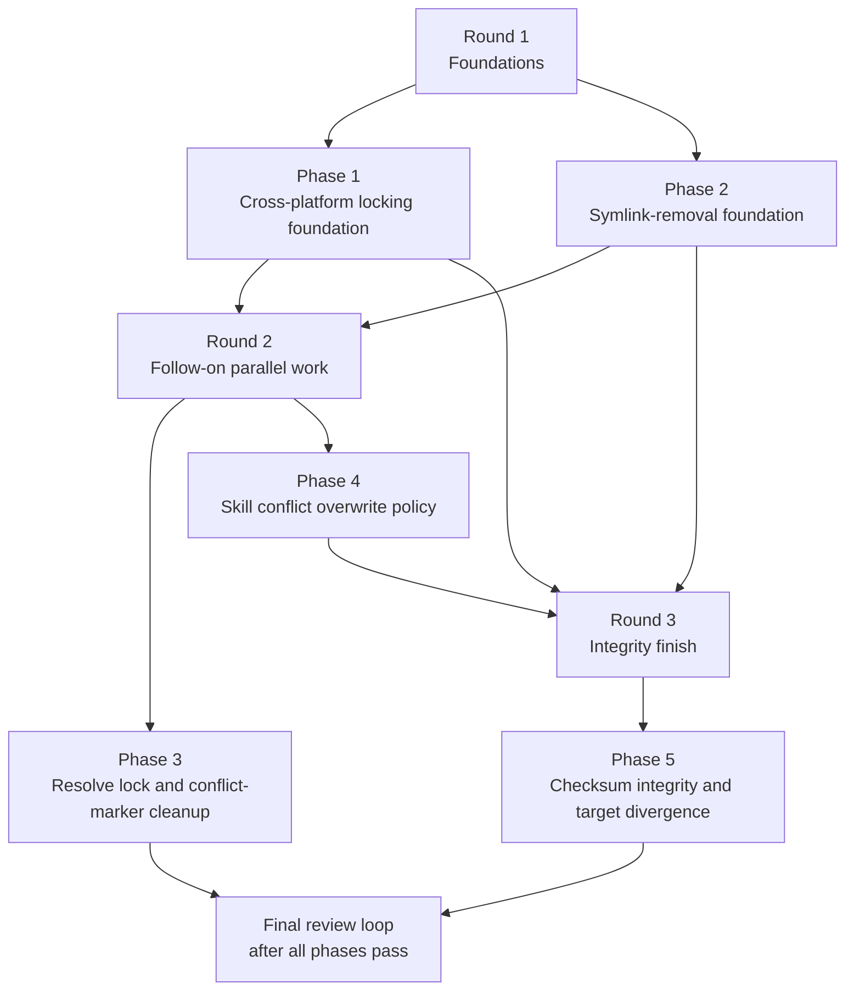

# Implementation Plan: Mars Sync Pipeline Hardening + Windows Support

## Parallelism Posture

**Posture:** parallel

**Cause:** The work has two clean foundational lanes up front. Phase 1 owns `src/fs/mod.rs` and Windows dependency wiring for R1/REF-03. Phase 2 owns the sync-pipeline symlink removal for R3/REF-01 across the planner, apply, reconcile, discover, and target-sync stack. Those write sets are disjoint, so forcing them into a serial chain would only slow delivery. After that, the work splits again into a lock-consumer cleanup lane (Phase 3) and a planner conflict-policy lane (Phase 4). The final checksum/integrity phase must wait because it re-enters shared sync plumbing (`sync/mod.rs`, `lock/mod.rs`, `target_sync/mod.rs`, and `fs/mod.rs`) and depends on the post-refactor pipeline shape.

## Execution Rounds

| Round | Phases | Justification |
|---|---|---|
| 1 | Phase 1, Phase 2 | R1/REF-03 and R3/REF-01 are both foundational, but they touch disjoint modules. Phase 2 is a large exhaustiveness refactor that must land atomically; Phase 1 is isolated to locking and dependency wiring. Running them together gives the safest available parallelism. |
| 2 | Phase 3, Phase 4 | Phase 3 depends on Phase 1 because `resolve_cmd.rs` must consume the new `FileLock` implementation. Phase 4 depends on Phase 2 because it relies on the copy-only planner shape after symlink removal. Once those prerequisites exist, their file sets are separate. |
| 3 | Phase 5 | Phase 5 touches `sync/apply.rs`, `sync/mod.rs`, `lock/mod.rs`, `target_sync/mod.rs`, and `fs/mod.rs`. It depends on Phase 1 for the settled cross-platform fs helpers, on Phase 2 for the simplified action/materialization model, and on Phase 4 for finalized conflict-planning behavior before checksum and divergence rules are pinned down. |

## Refactor Handling

| Refactor | Phase | Handling | Why this sequence |
|---|---|---|---|
| REF-01 | Phase 2 | Remove `Materialization`, `PlannedAction::Symlink`, `ActionTaken::Symlinked`, `atomic_symlink()`, and `InstalledItem.is_symlink` in one atomic refactor pass. | This is the foundational simplifier for the sync pipeline. R4 and R5 are cleaner only after the copy-only model exists everywhere. |
| REF-02 | Phase 3 | Consolidate `has_conflict_markers` while `src/cli/resolve_cmd.rs` is already open for the sync-lock change. | The cleanup is small, shares the same files, and should not become its own phase. |
| REF-03 | Phase 1 | Move Unix locking details behind `#[cfg(unix)]` and add the Windows platform module and dependency wiring. | Windows compilation cannot be verified until the lock implementation stops exposing Unix-only APIs at the top level. |

## Phase Dependency Map

## Staffing

| Phase | Builder | Tester lanes | Intermediate escalation reviewer policy |
|---|---|---|---|
| Phase 1 | `@coder` on `gpt-5.3-codex` | `@verifier` on `gpt-5.4-mini`; `@unit-tester` on `gpt-5.2`; `@smoke-tester` on `gpt-5.4-mini` for build/test/clippy/windows-check from `/home/jimyao/gitrepos/mars-agents/` | Escalate to `@reviewer` on `gpt-5.4` only if testers find lock-semantic drift between Unix and Windows paths, `WouldBlock` mapping ambiguity, or RAII release behavior that no longer matches the spec. |
| Phase 2 | `@coder` on `gpt-5.3-codex` | `@verifier` on `gpt-5.4-mini`; `@smoke-tester` on `gpt-5.4`; `@unit-tester` on `gpt-5.2` | Escalate to `@reviewer` on `gpt-5.4` for planner/apply/reconcile parity gaps and to `@reviewer` on `gpt-5.2` if the refactor leaves hidden symlink assumptions in doctor, discover, or target-sync behavior. |
| Phase 3 | `@coder` on `gpt-5.3-codex` | `@verifier` on `gpt-5.4-mini`; `@smoke-tester` on `gpt-5.4` | Escalate to `@reviewer` on `gpt-5.2` if concurrent `resolve` plus `sync` still shows lock-order or corruption risk, or if conflict-marker cleanup changes CLI-visible behavior unexpectedly. |
| Phase 4 | `@coder` on `gpt-5.3-codex` | `@verifier` on `gpt-5.4-mini`; `@smoke-tester` on `gpt-5.4`; `@unit-tester` on `gpt-5.2` | Escalate to `@reviewer` on `gpt-5.4` if testers find skill-directory data loss outside the accepted overwrite rule, or if warning emission leaks into a second diagnostic channel instead of `DiagnosticCollector`. |
| Phase 5 | `@coder` on `gpt-5.3-codex` | `@verifier` on `gpt-5.4-mini`; `@smoke-tester` on `gpt-5.4`; `@unit-tester` on `gpt-5.2` | Escalate to `@reviewer` on `gpt-5.2` for checksum-discipline and divergence-preservation edge cases, and to `@reviewer` on `gpt-5.4` if target-sync self-healing vs preservation semantics diverge from the spec. |

## Final Review Loop

- `@reviewer` on `gpt-5.4`: design alignment, cross-phase behavioral regressions, and EARS coverage across locking, sync planning, and integrity checks.
- `@reviewer` on `gpt-5.2`: concurrency, checksum/error-path rigor, Windows gating, and edge cases around failed writes or divergent targets.
- `@reviewer` on `claude-opus-4-6`: user-visible warnings, CLI/reporting clarity, and documentation/help-text drift.
- `@refactor-reviewer` on `claude-sonnet-4-6`: module-boundary cleanup, deletion of dead symlink-era abstractions, and size/coupling discipline across `sync/*`.
- After each review pass, route fixes back to `@coder` on `gpt-5.3-codex`, rerun only the affected tester lanes, then rerun the full reviewer fan-out until convergence.

## Escalation Policy

- Intermediate phases stay tester-led by default.
- Use scoped reviewer escalation only when a tester finds a behavioral mismatch the coder cannot close with a direct fix and retest.
- Prefer `gpt-5.4` for spec/design alignment questions, `gpt-5.2` for race, integrity, and platform edge cases, and `claude-opus-4-6` for warning text and operator-facing behavior.
