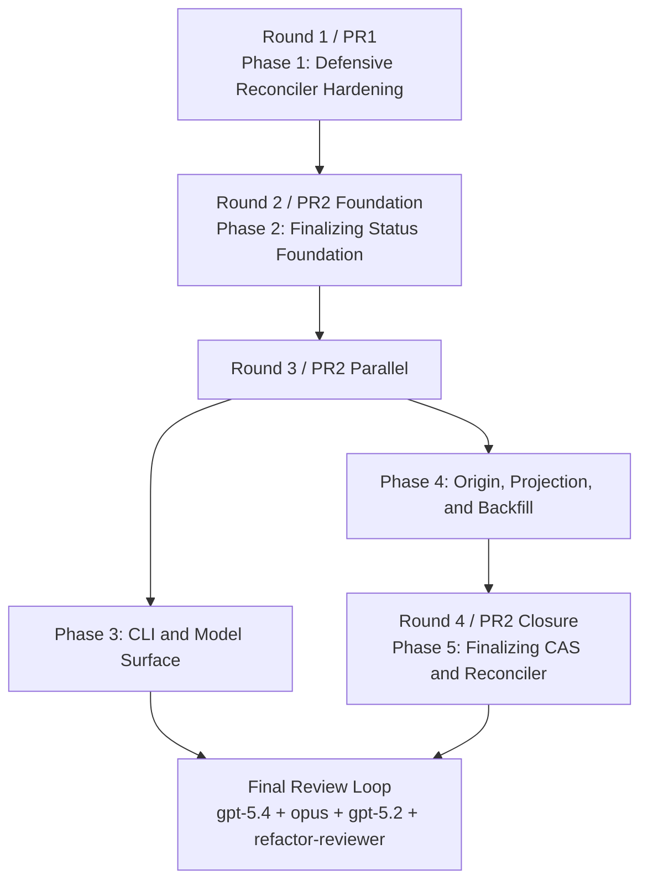

# Plan Overview — orphan-run reaper fix (Round 2)

## Parallelism Posture

**Posture:** `limited`

**Cause:** the preferred two-PR split is compatible with the design, but the
state-layer nexus (`spawn_store.py`, `reaper.py`, `runner.py`,
`streaming_runner.py`) still serializes the final lifecycle work. The only safe
coder-parallel round is after `finalizing` becomes a first-class status but
before CAS/finalization logic lands: one phase can update the CLI/model surface
while another rewires terminal origins and projection rules.

## Rounds

### Round 1 — PR1 defensive prevention

- **Phase 1 — defensive-reconciler-hardening**
  Ships the preventive fix first with no event-schema change: runner-owned
  heartbeat, recent-activity gating, depth gate coverage, and the first half of
  the reconciler split.

**Why this round exists:** it prevents new false `orphan_run` rows before the
structural repair lands, matches the preferred zero-schema PR1 split, and
creates the runtime scaffolding Phase 5 closes over.

### Round 2 — PR2 foundation

- **Phase 2 — finalizing-status-foundation**
  Introduces `finalizing` as a legal lifecycle state and centralizes active /
  terminal membership in the core lifecycle layer.

**Why this round exists:** downstream phases need one source of truth for the
new status before they can compile, validate transitions, or expose the status
cleanly.

### Round 3 — PR2 parallel fanout

- **Phase 3 — cli-and-model-surface**
  Updates CLI validation and presentation to treat `finalizing` and
  `orphan_finalization` as first-class user-visible states.
- **Phase 4 — origin-projection-backfill**
  Adds explicit finalize origins, authoritative-over-reconciler projection,
  writer-site tagging, stats surfacing, and read-path backfill self-repair.

**Why this round exists:** after Phase 2, these write sets are cleanly split:
Phase 3 owns `cli/spawn.py` and `ops/spawn/models.py`; Phase 4 owns
`spawn_store.py`, the finalize writers, `ops/spawn/api.py`, and backfill tests.
They can move in parallel without merge pressure.

### Round 4 — PR2 closure

- **Phase 5 — finalizing-cas-and-reconciler**
  Lands `mark_finalizing`, reconciler admissibility checks, finalizing-specific
  orphan policy, and the late-update invariant.

**Why this round exists:** it depends on Phase 1's heartbeat scaffolding,
Phase 2's status foundation, and Phase 4's mandatory `origin=` contract on
`finalize_spawn`.

## Refactor Handling

| Refactor | Handling | Phase / PR | Notes |
|---|---|---|---|
| `R-01` | split | Phase 2 + Phase 3 + Phase 5 / PR2 | Phase 2 owns the literal and transition table, Phase 3 owns CLI / model consumers, Phase 5 finishes lifecycle-validator wiring on the new helpers. |
| `R-02` | complete | Phase 4 / PR2 | Mandatory `origin=` on `finalize_spawn`, `terminal_origin`, and all 11 writer sites. |
| `R-03` | complete | Phase 5 / PR2 | `mark_finalizing` CAS, reconciler guard, and terminal-downgrade protection land together. |
| `R-04` | split | Phase 1 + Phase 5 / PR1 then PR2 | Phase 1 extracts the snapshot / decider shell needed for heartbeat and depth gating; Phase 5 adds finalizing / CAS branches. |
| `R-05` | complete | Phase 1 / PR1 | `MERIDIAN_DEPTH` gate moves into `reconcile_active_spawn`. |
| `R-06` | complete | Phase 1 / PR1 | Runner-owned heartbeat plus recent-activity reaper checks. |
| `R-07` | complete | Phase 4 / PR2 | Legacy origin shim plus explicit removal trigger. |
| `R-08` | deferred | no phase in this cycle | Keep `exited_at` as telemetry/audit only. Removal waits until a post-fix release where `meridian doctor` can prove supported state roots no longer depend on legacy rows. |
| `R-09` | split | Phase 3 + Phase 4 + Phase 5 / PR2 | Phase 3 removes CLI / formatter heuristics, Phase 4 updates API stats surfaces, Phase 5 removes reaper classification dependence on `exited_at`. |

## Mermaid Fanout

## Staffing Contract

### Per-phase teams

| Phase | Coder | Tester lanes | Intermediate-phase escalation reviewer policy |
|---|---|---|---|
| Phase 1 | `@coder` on `gpt-5.3-codex` | `@verifier`, `@smoke-tester`, `@unit-tester` | If testers disagree about heartbeat timing or read-path behavior, add one `@reviewer` on `gpt-5.4` focused on concurrent state and races. |
| Phase 2 | `@coder` on `gpt-5.3-codex` | `@verifier`, `@unit-tester` | Escalate only if lifecycle-table changes expose a design/spec mismatch. Reviewer focus: design alignment. |
| Phase 3 | `@coder` on `gpt-5.3-codex` | `@verifier`, `@smoke-tester`, `@unit-tester` | If CLI text / filter changes disagree with the spec, use one `@reviewer` on `gpt-5.4` focused on design alignment. |
| Phase 4 | `@coder` on `gpt-5.3-codex` | `@verifier`, `@smoke-tester`, `@unit-tester` | If writer-origin tagging or projection semantics remain disputed, use one `@reviewer` on `claude-opus-4-6` focused on crash-only state semantics. |
| Phase 5 | `@coder` on `gpt-5.3-codex` | `@verifier`, `@smoke-tester`, `@unit-tester` | If CAS races or admissibility semantics remain unresolved after testing, add one `@reviewer` on `gpt-5.4` focused on concurrent state and one `@reviewer` on `claude-opus-4-6` only if the disagreement crosses design boundaries. |

### Final review loop

- `@reviewer` on `gpt-5.4` — design alignment and contract correctness across all 36 EARS leaves.
- `@reviewer` on `claude-opus-4-6` — concurrent state, crash-only behavior, and race windows across `spawn_store.py` / `reaper.py` / runners.
- `@reviewer` on `gpt-5.2` — CLI / stats / consumer-surface regressions and backfill read-path behavior.
- `@refactor-reviewer` — structural integrity, split quality in `reconcile_active_spawn`, and deletion of `exited_at`-driven lifecycle semantics.

### Escalation policy

- Tester findings route back to the owning `@coder` first.
- Add a scoped `@reviewer` only when the finding is behavioral, non-mechanical, and the coder cannot resolve it without reinterpreting the design.
- Do not open a broad review fanout during intermediate phases.
- Re-run the owning tester lanes after every substantive fix.
- Final review fanout starts only after Phases 1-5 are green.
