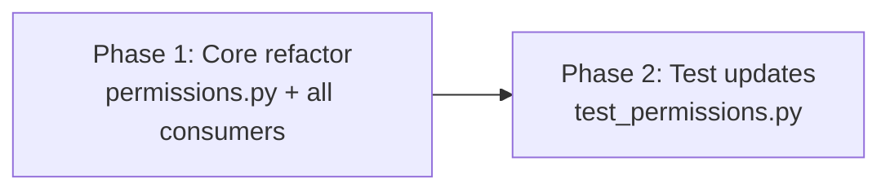

# Sandbox Simplification: Implementation Plan

## Delta Summary

Remove `PermissionTier` enum and all validation infrastructure around it. Make `sandbox` a plain `str | None` passthrough from profile YAML through to harness CLI flags. ~12 files touched, no new abstractions introduced.

## Phase Structure

Two phases, sequential. Phase 1 is the core change (permissions module + all consumers). Phase 2 is test updates. Splitting further would create partial-compilation states where imports break between phases.

### Why not more phases?

The enum removal, field rename (`tier` -> `sandbox`), and consumer updates are tightly coupled — removing the enum breaks every file that imports it. Splitting into "remove enum" and "update consumers" creates an uncompilable intermediate state. A single phase for all production code keeps the codebase valid at every commit point.

Test updates are separated because they're independently verifiable and the test file has the most complex changes (assertion rewrites, not just import fixes).

## Execution

| Round | Phase | Agent | Model | Estimated files |
|-------|-------|-------|-------|-----------------|
| 1 | Phase 1: Core refactor | coder | default | 8 production files |
| 1 | Phase 2: Test updates | coder | default | 1 test file |

Both phases can actually run in **Round 1 together** since the test file changes are predictable from the design doc — the coder just needs to know the new interface shape. But if the orchestrator prefers safety, Phase 2 can wait for Phase 1 to land.

## Verification

After both phases: `uv run pyright` (0 errors) + `uv run pytest-llm` (all pass) + `uv run ruff check .`

## Review Staffing

This is a low-risk mechanical refactor. 2 reviewers sufficient:
- Reviewer 1 (default model): correctness focus — verify every `PermissionTier` reference is gone, no `.tier` field access remains
- Reviewer 2 (different model): design alignment — verify implementation matches design docs
