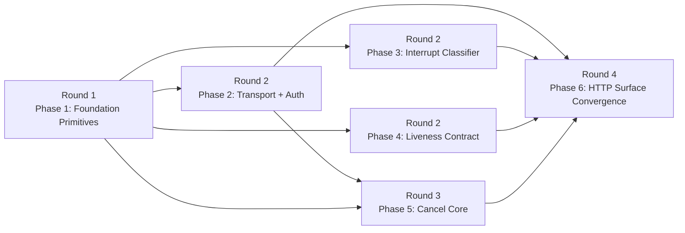

# Plan Overview — Spawn Control Plane Redesign

## Parallelism Posture

**Posture:** `limited`

**Cause:** The design supports one meaningful fan-out round after the
foundation work, but the rest of the change converges on three shared
hotspots: `src/meridian/lib/app/server.py`,
`src/meridian/lib/streaming/spawn_manager.py`, and the lifecycle control
surfaces. Forcing broader parallelism would create overlapping write
ownership and phases that are only "done" once another phase lands.

## Rounds

### Round 1 — Phase 1 `foundation-primitives`

Land the non-controversial substrate first: heartbeat helper extraction,
inject/interrupt serialization primitives, and the `launch_mode="app"`
schema extension. Every later phase depends on at least one of these.

### Round 2 — Parallel fan-out

- **Phase 2 `transport-auth`**
  Delivers AF_UNIX transport, `AuthorizationGuard`, and CLI/control-socket
  auth composition. This is the policy lane.
- **Phase 3 `interrupt-classifier`**
  Delivers the non-fatal interrupt classifier change in
  `streaming_runner.py`. This is the runner lane.
- **Phase 4 `liveness-contract`**
  Delivers app-managed `runner_pid`/heartbeat parity and single-writer
  finalize semantics. This is the app-liveness lane.

**Why this fan-out works:** after Phase 1, these three phases are
independently testable and can be scoped to mostly disjoint ownership:
policy/auth files, runner classification, and app/liveness wiring.

### Round 3 — Phase 5 `cancel-core`

Land the shared cancel semantics only after auth and app ownership signals
exist. This phase owns `SignalCanceller` core behavior, removes
control-socket cancel, and makes CLI cancel authoritative for CLI-launched
spawns.

### Round 4 — Phase 6 `http-surface-convergence`

Finish the convergence work last: inject HTTP parity, the dedicated
`POST /cancel` endpoint, the `DELETE` removal, and the app-managed
cross-process cancel bridge. This round intentionally owns the remaining
`server.py` work so earlier phases do not collide on that file.

## Refactor Handling

| Refactor | Phase | Handling |
|---|---|---|
| `R-01` | Phase 1 | Extract `heartbeat.py` and re-home the helper without changing ownership yet. |
| `R-02` | Phase 1 | Add `inject_lock.py`, `InjectResult`, and `inbound_seq` ordering primitives. |
| `R-03` | Phase 5 | Land `SignalCanceller` core for CLI-lane cancel and shared finalizing/idempotency logic. |
| `R-04` | Phase 3 | Narrow `_terminal_event_outcome` so interrupt is non-terminal. |
| `R-05` | Phase 6 | Reshape HTTP endpoints, inject validation, cancel handler, and legacy `DELETE` removal. |
| `R-06` | Phase 5 | Delete control-socket cancel, `SpawnManager.cancel`, and CLI `--cancel` on `spawn inject`. |
| `R-07` | Phase 4 | Move app-managed spawns onto the same `runner_pid` + heartbeat + single-writer finalize contract. |
| `R-08` | Phase 2 | Land `AuthorizationGuard` core plus CLI/control-socket composition. Phase 6 consumes the guard for new HTTP lifecycle endpoints. |
| `R-09` | Phase 6 | Add the cross-process app-cancel bridge once the AF_UNIX `/cancel` endpoint exists. |
| `R-10` | Phase 2 | Move app transport to AF_UNIX and remove the default TCP-hosted primary surface. |
| `R-11` | Phase 1 | Extend `launch_mode` schema with `"app"` before any dispatch relies on it. |

## Mermaid Fanout

## Staffing Contract

### Per-phase teams

| Phase | Coder | Tester lanes | Intermediate escalation policy |
|---|---|---|---|
| Phase 1 | `@coder` on `gpt-5.3-codex` | `@verifier`, `@unit-tester` | Escalate only if serialization or schema edits force a cross-phase interface change. |
| Phase 2 | `@coder` on `gpt-5.3-codex` | `@verifier`, `@unit-tester`, `@smoke-tester` | Escalate auth transport or ancestry-policy disputes to a scoped `@reviewer` on `gpt-5.2`. |
| Phase 3 | `@coder` on `gpt-5.3-codex` | `@verifier`, `@unit-tester`, `@smoke-tester` | Escalate only if classifier changes imply harness-specific behavior the design did not cover. |
| Phase 4 | `@coder` on `gpt-5.3-codex` | `@verifier`, `@unit-tester`, `@smoke-tester` | Escalate if app-managed finalize ownership or heartbeat semantics drift from the design. |
| Phase 5 | `@coder` on `gpt-5.3-codex` | `@verifier`, `@unit-tester`, `@smoke-tester` | Escalate finalizing-race or PID-reuse findings to a scoped `@reviewer` on `gpt-5.4`. |
| Phase 6 | `@coder` on `gpt-5.3-codex` | `@verifier`, `@unit-tester`, `@smoke-tester` | Escalate any HTTP contract or auth-mapping regression to `@reviewer` on `gpt-5.2` before widening fixes. |

### Final review loop

- Run one full-change `@reviewer` on `gpt-5.4` for adversarial behavior,
  race conditions, and phase-boundary regressions.
- Run one full-change `@reviewer` on `gpt-5.2` for authorization,
  transport, and capability-boundary review.
- Run one full-change `@reviewer` on `opus` for design alignment and
  documentation/spec drift.
- Run `@refactor-reviewer` after the three reviews converge once on clean
  behavior, with emphasis on the new control-plane boundaries.
- Route fixes back through the owning phase coder; re-run the relevant
  tester lanes before re-running the affected reviewers.

### Escalation policy

- Tester findings that stay inside one phase's files and do not change a
  shared contract go directly back to that phase's coder for fix/retest.
- Tester findings that change a shared contract, a spec leaf boundary, or
  a cross-phase dependency trigger a scoped reviewer before the coder
  edits.
- Any finding that would re-sequence the phase graph or move ownership of
  an EARS leaf is a redesign/planning escalation, not a coder fix.
