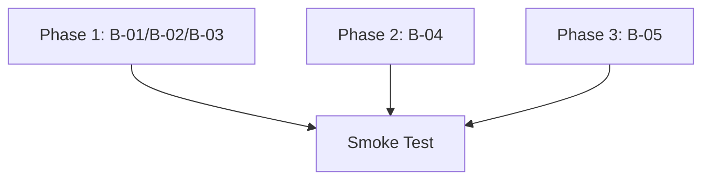

# Plan: spawn-finalize-bugs

## Parallelism Posture
**Full parallel** — all three phases touch non-overlapping file sets with no structural coupling.

## Rounds

### Round 1 (parallel)
- Phase 1: B-01/B-02/B-03 drain-loop family
- Phase 2: B-04 validation handler  
- Phase 3: B-05 report create deletion

### Round 2 (sequential)
- Smoke test across all fixes

## Staffing
- Each phase: @coder + @verifier
- @smoke-tester after all phases complete
- @reviewer in final review only if needed

## Mermaid Fanout

