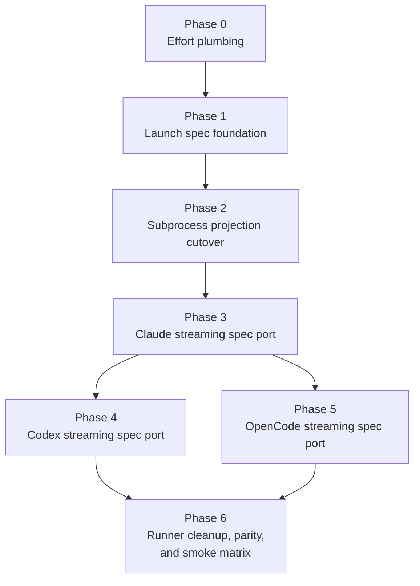

# Streaming Adapter Parity: Implementation Plan

## Execution Summary

7 phases across 6 execution rounds.

This plan keeps the reviewed migration shape but tightens it around real repo seams:
- Phase 0 fixes the upstream `effort` plumbing bug before any spec work starts.
- Phase 2 retires the strategy framework only after spec factories exist and can prove command parity.
- Claude, Codex, and OpenCode streaming ports are separate phases so each transport gets its own verification gate.
- Shared runner cleanup, `ConnectionConfig` cleanup, and the full parity matrix land together at the end, after every transport has switched to specs.

## Phase Dependency Graph

## Execution Rounds

| Round | Phases | Parallelism | Gate |
|---|---|---|---|
| 1 | Phase 0 | Sequential | `PreparedSpawnPlan.effort` reaches both runners and command previews |
| 2 | Phase 1 | Sequential | `resolve_launch_spec()` exists for all adapters and the import-time completeness guard passes |
| 3 | Phase 2 | Sequential | Subprocess `build_command()` output matches the current CLI behavior |
| 4 | Phase 3 | Sequential | Claude streaming consumes specs end-to-end and captures session ids |
| 5 | Phase 4, Phase 5 | Parallel | Codex and OpenCode streaming each pass their own protocol smoke and unit lanes |
| 6 | Phase 6 | Sequential | Shared runner cleanup lands, `ConnectionConfig.model` is gone, and the full parity matrix passes |

## Phase Summary

| Phase | Main delta | Key files |
|---|---|---|
| 0 | Add `effort` to prepared child-spawn plans and thread it to both runners | `src/meridian/lib/ops/spawn/plan.py`, `src/meridian/lib/ops/spawn/prepare.py`, `src/meridian/lib/launch/runner.py`, `src/meridian/lib/launch/streaming_runner.py` |
| 1 | Add `ResolvedLaunchSpec` models plus `resolve_launch_spec()` on every harness adapter | `src/meridian/lib/harness/launch_spec.py`, `src/meridian/lib/harness/adapter.py`, `src/meridian/lib/harness/{claude,codex,opencode}.py` |
| 2 | Reimplement subprocess `build_command()` on top of specs and retire strategy maps | `src/meridian/lib/harness/common.py`, `src/meridian/lib/harness/{claude,codex,opencode}.py` |
| 3 | Change streaming protocol plumbing to pass specs and port Claude streaming | `src/meridian/lib/harness/connections/base.py`, `src/meridian/lib/streaming/spawn_manager.py`, `src/meridian/lib/launch/streaming_runner.py`, `src/meridian/lib/harness/connections/claude_ws.py` |
| 4 | Port Codex streaming bootstrap and approval handling to `CodexLaunchSpec` | `src/meridian/lib/harness/connections/codex_ws.py` |
| 5 | Port OpenCode session creation to `OpenCodeLaunchSpec` | `src/meridian/lib/harness/connections/opencode_http.py` |
| 6 | Extract Claude runner preflight, remove `ConnectionConfig.model`, expand parity coverage, and add smoke guide | `src/meridian/lib/launch/claude_preflight.py`, `src/meridian/lib/launch/{runner,streaming_runner}.py`, `tests/harness/test_launch_spec_parity.py`, `tests/smoke/streaming-adapter-parity.md` |

## Staffing

| Phase | Builder | Testing lanes | Scoped reviewer escalation |
|---|---|---|---|
| 0 | `@coder` on `gpt-5.3-codex` | `@verifier` on `gpt-5.4-mini`; `@unit-tester` on `gpt-5.4` | Use `gpt-5.2` only if plan/runner DTO wiring diverges from preview-command behavior |
| 1 | `@coder` on `gpt-5.3-codex` | `@verifier` on `gpt-5.4-mini`; `@unit-tester` on `gpt-5.2` | Use `gpt-5.4` if the completeness guard or spec shape is ambiguous |
| 2 | `@coder` on `gpt-5.3-codex` | `@verifier` on `gpt-5.4-mini`; `@unit-tester` on `gpt-5.2` | Use `gpt-5.4` if command ordering or permission projection regresses |
| 3 | `@coder` on `gpt-5.3-codex` | `@verifier` on `gpt-5.4-mini`; `@smoke-tester` on `gpt-5.4` | Use `claude-opus-4-6` for unresolved Claude protocol or session-id extraction issues |
| 4 | `@coder` on `gpt-5.3-codex` | `@verifier` on `gpt-5.4-mini`; `@smoke-tester` on `gpt-5.4`; `@unit-tester` on `gpt-5.2` | Use `gpt-5.4` for approval-mode semantics or JSON-RPC contract disputes |
| 5 | `@coder` on `gpt-5.3-codex` | `@verifier` on `gpt-5.4-mini`; `@smoke-tester` on `gpt-5.4` | Use `claude-opus-4-6` if OpenCode API support claims are unclear and need design judgment |
| 6 | `@coder` on `gpt-5.3-codex` | `@verifier` on `gpt-5.4-mini`; `@unit-tester` on `gpt-5.2`; `@smoke-tester` on `gpt-5.4` | Use `gpt-5.4` for parity failures that look structural rather than local |

## Final Review Loop

- `@reviewer` on `gpt-5.4`: design alignment, protocol completeness, and approval/sandbox behavior. Pass the full design set.
- `@reviewer` on `gpt-5.2`: regression hunting around DTO plumbing, import-time assertions, and edge-case parity.
- `@reviewer` on `claude-opus-4-6`: cross-harness integration asymmetries, smoke realism, and operator-facing diagnostics.
- `@refactor-reviewer` on `claude-sonnet-4-6`: module boundaries, naming, and whether the final cleanup actually deletes the old abstraction layers.
- After each review round, return fixes to `@coder` on `gpt-5.3-codex`, rerun the affected tester lanes, then rerun reviewers until convergence.

## Escalation Policy

- Intermediate phases stay tester-driven unless a tester finds a structural mismatch the phase owner cannot resolve locally.
- Escalate to `gpt-5.4` when the issue is about transport contracts, runner protocol boundaries, or parity semantics.
- Escalate to `gpt-5.2` when the issue is about completeness guards, regression coverage, or hidden command-shape drift.
- Escalate to `claude-opus-4-6` when the issue is about real-harness behavior that the design may have over- or under-claimed.

## File Index

- [phase-0-effort-plumbing.md](phase-0-effort-plumbing.md)
- [phase-1-launch-spec-foundation.md](phase-1-launch-spec-foundation.md)
- [phase-2-subprocess-projection-cutover.md](phase-2-subprocess-projection-cutover.md)
- [phase-3-claude-streaming-spec-port.md](phase-3-claude-streaming-spec-port.md)
- [phase-4-codex-streaming-spec-port.md](phase-4-codex-streaming-spec-port.md)
- [phase-5-opencode-streaming-spec-port.md](phase-5-opencode-streaming-spec-port.md)
- [phase-6-runner-cleanup-parity-and-smoke.md](phase-6-runner-cleanup-parity-and-smoke.md)
- [status.md](status.md)
