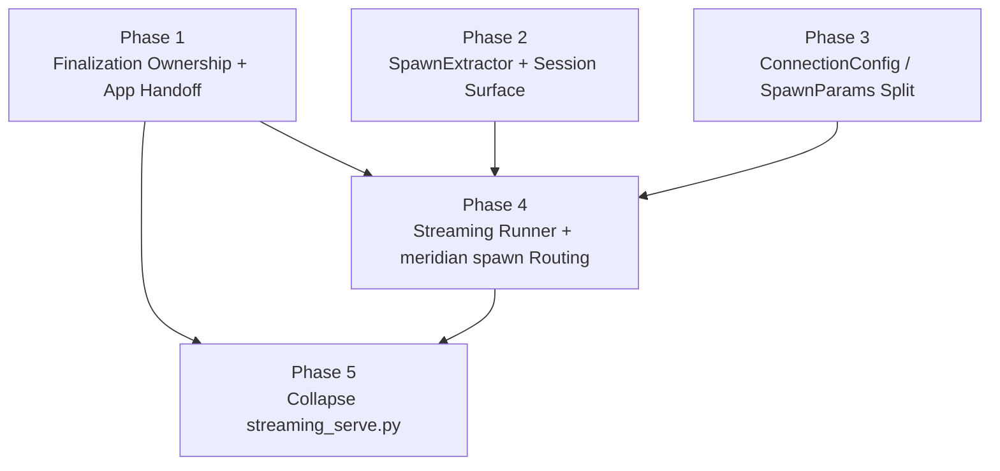

# Streaming Convergence — Implementation Plan

## Delta Summary

Current state:

- `meridian` primary sessions use the PTY path and stay there.
- `meridian spawn` child spawns still use `runner.py` and raw subprocess capture.
- `meridian app` and `meridian streaming serve` already use `SpawnManager` + `HarnessConnection`.

Target state:

- Child spawns that use bidirectional harnesses route through the streaming pipeline.
- `SpawnManager` owns connections, drain, fan-out, and control sockets, but not terminal-state writes.
- `streaming_runner.py` becomes the canonical execution policy layer for streaming-backed child spawns.
- `streaming_serve.py` stops being a third independent execution path.

## Planning Decisions

- **Front-load the lifecycle correction.** The highest-risk change is removing `SpawnManager` auto-finalization and replacing it in current consumers. That must land before routing `execute.py` to the streaming path, otherwise the convergence point would target a lifecycle contract that is about to change.
- **Keep the preparatory refactors separate.** `SpawnExtractor` and the `ConnectionConfig`/`SpawnParams` split are both no-behavior-change phases. They should stay isolated so type and extraction regressions are easy to localize before the routing phase.
- **Collapse `streaming_serve.py` only after the canonical runner exists.** It must keep working when manager finalization is removed, but the actual deduplication should wait until `execute_with_streaming()` exists and can be reused.

## Phase Dependency Diagram

## Execution Rounds

| Round | Phases | Why this round exists |
|---|---|---|
| 1 | Phase 1 | Highest-risk behavior change. Existing app/streaming entry points need a stable post-manager-finalization contract before any convergence work lands. |
| 2 | Phase 2, Phase 3 | Independent preparatory refactors with no intended behavior change. They unblock the runner without mixing concerns. |
| 3 | Phase 4 | Convergence point. Depends on the lifecycle contract from Phase 1 and both preparatory refactors from Round 2. |
| 4 | Phase 5 | Cleanup/deduplication only after the canonical streaming runner is in service. |

## Staffing

### Per-Phase Teams

| Phase | Builder | Testers | Review | Notes |
|---|---|---|---|---|
| 1 | `@coder` (codex) | `@verifier`, `@smoke-tester` | — | Highest-risk phase. Smoke-tester must verify app spawns still finalize correctly. |
| 2 | `@coder` (codex) | `@verifier` | — | Pure refactor. Pyright is the gate — extraction interface changes must type-check cleanly. |
| 3 | `@coder` (codex) | `@verifier` | — | Broad signature change across 3 connections + manager. Pyright is the gate. |
| 4 | `@coder` (codex) | `@verifier`, `@smoke-tester` | — | Integration boundary. Smoke-tester must test all 3 harnesses through `meridian spawn` + `inject`. |
| 5 | `@coder` (codex) | `@verifier`, `@smoke-tester` | — | CLI cleanup. Smoke-tester verifies `streaming serve` still works via the new wrapper. |

### Final Review Loop (after all phases pass)

Fan out `@reviewer` across diverse models over the complete change set:

| Reviewer | Model | Focus Area |
|---|---|---|
| `@reviewer` | opus | Design alignment — verify the implementation matches the approved design (D1-D15). Single-writer finalization invariant. SpawnExtractor protocol correctness. |
| `@reviewer` | gpt-5.4 | Lifecycle safety — race conditions in drain/finalize handoff, retry cleanup, signal masking, PID bookkeeping for reaper. |
| `@refactor-reviewer` | gpt-5.2 | Structural quality — is the ConnectionConfig/SpawnParams boundary clean? Any dead code from the old path? Module boundaries. |

Pass design docs (`design/overview.md`, `design/streaming-runner.md`) to the design-alignment reviewer.

### Escalation

If testers surface behavioral issues a `@coder` cannot resolve, spawn a scoped `@reviewer` on the specific concern. Do not run full reviewer fan-out on intermediate phases — that's reserved for the final loop.

## Phase Summaries

- **Phase 1:** Remove auto-finalization from `SpawnManager`, add an explicit completion surface, and update current streaming consumers to finalize spawns themselves.
- **Phase 2:** Introduce the extraction protocol boundary so streaming and subprocess paths share finalization logic without coupling to `SubprocessHarness`.
- **Phase 3:** Split transport config from command-building params so the connection layer does not become a god-config.
- **Phase 4:** Add `streaming_runner.py`, preserve runner-level policy, and route streaming-capable child spawns through it.
- **Phase 5:** Rewrite `streaming_serve.py` as a thin wrapper around the canonical runner/helper so there are only two execution paths left: PTY primary and streaming-backed child/app paths.
