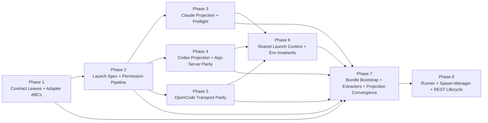

# Streaming Parity Fixes v3: Implementation Plan

## Delta Summary

Current code still reflects the pre-v3 shape: `HarnessId` is sourced from `core.types`, `PermissionResolver.resolve_flags(...)` branches on harness identity, `ResolvedLaunchSpec` still carries duplicated permission state, subprocess and streaming launch assembly diverge, and `SpawnManager` still dispatches through a one-dimensional connection registry with a base-spec fallback.

The approved v3 design replaces that shape in eight phases. The ordering follows `design/typed-harness.md`'s import DAG: leaf contracts first, then launch-spec and permission invariants, then one harness phase per external target, then shared launch context, then eager-import/bootstrap + extractor convergence, then runner/store/server lifecycle convergence.

## Execution Rounds

- Round 1: Phase 1
- Round 2: Phase 2
- Round 3: Phase 3, Phase 4, Phase 5
- Round 4: Phase 6
- Round 5: Phase 7
- Round 6: Phase 8

## Phase List

| Phase | Focus | Key output |
|---|---|---|
| 1 | Typed leaves and abstract contracts | `launch/launch_types.py`, `harness/ids.py`, `BaseHarnessAdapter`, generic `HarnessConnection` |
| 2 | Launch-spec and permission invariants | non-optional resolver, frozen config/spec, import-time accounting, strict REST defaults |
| 3 | Claude transport parity | one shared Claude projection, adapter-owned Claude preflight, canonical arg order |
| 4 | Codex transport parity | subprocess + streaming Codex projection modules, capability fail-closed, confirm-mode event semantics |
| 5 | OpenCode transport parity | normalized model handling, single skills channel, subprocess/streaming MCP split |
| 6 | Shared launch context | `prepare_launch_context(...)`, `merge_env_overrides(...)`, constants/text helpers, no shared-core harness branching |
| 7 | Bootstrap and extractor convergence | eager imports, bundle registration, dispatch guard, projection drift loading, session-id/report extractor parity |
| 8 | Lifecycle convergence | idempotent cancel/interrupt, SIGTERM parity, missing-binary errors, REST + runner final convergence |

## Decision Traceability

The decision log contains both implementation decisions and doc-only bookkeeping from the revision rounds. The doc-only entries already absorbed into the approved design do not create code work on their own: `F1`, `F2`, `F5`, `F14`, `F18`.

Implementation-affecting entries map to phases as follows:

- Phase 1: `D3`, `D22`, `K3`, `F16`
- Phase 2: `D4`, `D6`, `D11`, `D15`, `H2`, `H5`, `K4`, `K7`, `K9`, `F4`, `F7`, `F9`, `F10`, `F20`, `F21`
- Phase 3: `D8`, `D9`, `D10`, `D21`, `F26`
- Phase 4: `D14`, `D16`, `D20`, `G8`, `C3`
- Phase 5: `D17`, `D18`, `F11`
- Phase 6: `D12`, `D13`, `G5`, `K5`, `C1`
- Phase 7: `D1`, `D2`, `D5`, `D7`, `D23`, `G1`, `G2`, `G3`, `G4`, `G9`, `G10`, `H1`, `H3`, `H4`, `K1`, `K2`, `K6`, `C2`, `F3`, `F6`, `F12`, `F13`, `F17`, `F19`
- Phase 8: `D19`, `D24`, `K8`, `F8`, `F15`

The full scenario-to-phase ownership map is in [scenario-ownership.md](/home/jimyao/gitrepos/meridian-channel/.meridian/work/streaming-parity-fixes/plan/scenario-ownership.md). Every scenario in `scenarios/` is claimed exactly once there, including retired `S037`.

## Staffing

### Per-phase teams

| Phase | Coder | Testers | Reviewer escalation |
|---|---|---|---|
| 1 | `@coder` on `gpt-5.3-codex` | `@verifier` on `gpt-5.4-mini`; `@unit-tester` on `gpt-5.4` | `@reviewer` on `gpt-5.4` if Protocol/ABC or generic typing stays unresolved after one fix loop |
| 2 | `@coder` on `gpt-5.3-codex` | `@verifier` on `gpt-5.4-mini`; `@unit-tester` on `gpt-5.4`; `@smoke-tester` on `claude-sonnet-4-6` for REST behavior | `@reviewer` on `gpt-5.2` for permission/design drift |
| 3 | `@coder` on `gpt-5.3-codex` | `@unit-tester` on `gpt-5.4`; `@smoke-tester` on `claude-sonnet-4-6` | `@reviewer` on `claude-opus-4-6` for Claude CLI semantics and preflight boundary issues |
| 4 | `@coder` on `gpt-5.3-codex` | `@unit-tester` on `gpt-5.4`; `@smoke-tester` on `claude-opus-4-6` | `@reviewer` on `gpt-5.4` for Codex capability or lifecycle correctness issues |
| 5 | `@coder` on `gpt-5.3-codex` | `@unit-tester` on `gpt-5.4`; `@smoke-tester` on `claude-sonnet-4-6` | `@reviewer` on `claude-opus-4-6` for OpenCode API/serve contract drift |
| 6 | `@coder` on `gpt-5.3-codex` | `@verifier` on `gpt-5.4-mini`; `@unit-tester` on `gpt-5.4`; `@smoke-tester` on `claude-sonnet-4-6` | `@reviewer` on `gpt-5.2` for shared-core design alignment |
| 7 | `@coder` on `gpt-5.3-codex` | `@verifier` on `gpt-5.4-mini`; `@unit-tester` on `gpt-5.4`; `@smoke-tester` on `claude-opus-4-6` | `@reviewer` on `gpt-5.4` for bootstrap/import-topology regressions |
| 8 | `@coder` on `gpt-5.3-codex` | `@verifier` on `gpt-5.4`; `@unit-tester` on `gpt-5.2`; `@smoke-tester` on `claude-opus-4-6` | `@reviewer` on `gpt-5.4` for race/cancellation issues |

### Final review loop

- `@reviewer` on `gpt-5.4`: correctness, dispatch contracts, lifecycle races, error semantics
- `@reviewer` on `gpt-5.2`: design alignment against all files in `design/` and `decisions.md`
- `@reviewer` on `claude-opus-4-6`: integration boundaries, CLI/API semantics, passthrough behavior, user/harness boundary
- `@refactor-reviewer` on `claude-sonnet-4-6`: import topology, module boundaries, runner decomposition, duplicate logic

### Escalation policy

- Intermediate phases stay tester-driven by default.
- Escalate to `gpt-5.4` when a tester finds a correctness, typing, or lifecycle issue the coder cannot close in one loop.
- Escalate to `gpt-5.2` when the disagreement is about design intent, spec ownership, or whether a guard belongs at all.
- Escalate to `claude-opus-4-6` when the blocker is the real harness interface (`claude`, `codex app-server`, `opencode serve`) or command/payload semantics.
- Escalate to `claude-sonnet-4-6` when the blocker is structural coupling, file placement, or import order.

## Verification Expectations

- Every phase closes with its own scenario subset verified in `scenarios/`.
- Every integration phase probes the real target before coding:
  - Phase 3: `claude --help`
  - Phase 4: `codex exec --help` and `codex app-server --help`
  - Phase 5: `opencode run --help` and `opencode serve --help`
- Phase 8 reruns the cross-phase gates: `uv run ruff check .`, `uv run pyright`, targeted `uv run pytest-llm`, and the relevant smoke guides under `tests/smoke/`.
