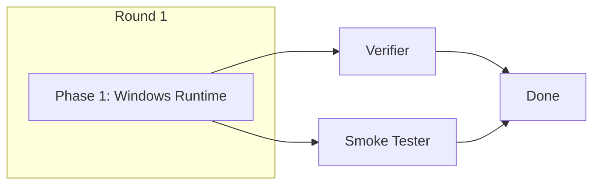

# Windows Runtime Compatibility Implementation Plan

## Summary

Small, focused implementation: 5 files, ~60 lines of changes. Single phase with parallel tester lanes.

## Parallelism Posture

**Sequential single phase** — Changes are tightly coupled (TCP fallback must work end-to-end), but small enough to complete in one pass. No benefit from splitting.

## Phase Structure

| Phase | Description | Claimed EARS |
|-------|-------------|--------------|
| 1 | Windows runtime fallbacks | WIN-01, WIN-02, WIN-03, WIN-04 |

## Staffing

- **@coder**: Implementation
- **@verifier**: Build verification, existing tests pass
- **@smoke-tester**: End-to-end verification on POSIX (Windows smoke requires Windows CI)

## Rounds

### Round 1
- Phase 1: Windows runtime fallbacks

Single round — all changes in one phase.

## Files Modified

| File | Change Summary |
|------|----------------|
| `src/meridian/lib/launch/process.py` | Add Windows guard to skip PTY branch |
| `src/meridian/cli/main.py` | Add `--port` CLI parameter |
| `src/meridian/cli/app_cmd.py` | TCP fallback logic, write `app.port` |
| `src/meridian/lib/streaming/control_socket.py` | Platform-conditional socket, write `control.port` |
| `src/meridian/lib/streaming/signal_canceller.py` | Platform-conditional connector |

## Mermaid

## Exit Criteria

1. All existing tests pass (POSIX behavior unchanged)
2. `--port` flag works for TCP binding on POSIX
3. Platform guards route correctly based on `IS_WINDOWS`
4. Port file discovery implemented for TCP mode
