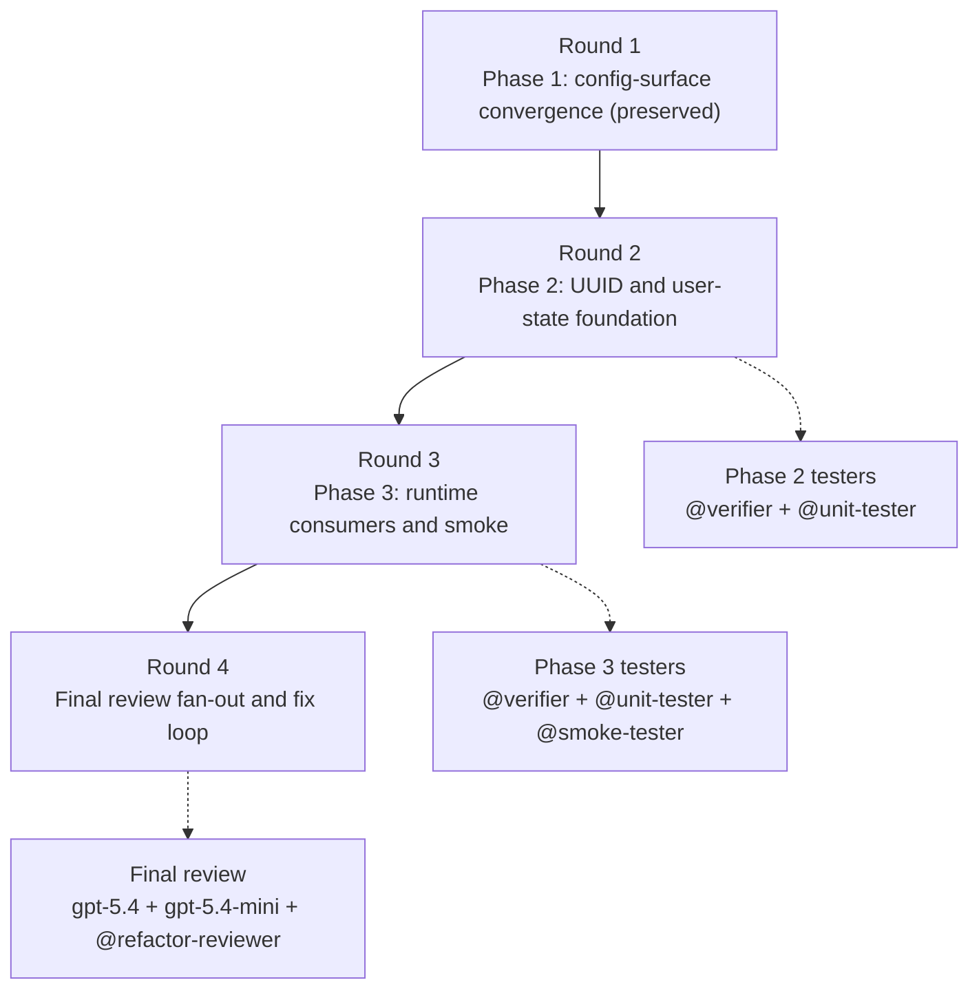

# Workspace Config Simplified UUID Plan

Regenerated on 2026-04-17 for the D28 UUID simplification. This plan preserves
the already-complete config-surface convergence phase and replaces the obsolete
workspace-topology / launch-projection phases with a smaller runtime-home plan
anchored to `simplified-requirements.md`, `design/architecture/runtime-home.md`,
and `design/architecture/paths-layer.md`.

## Parallelism Posture

`limited`

## Cause

The simplified scope removes the old workspace-topology chain, but the runtime
home split still has one hard foundation seam:

- repo `.meridian/` and user-level runtime state need separate path owners
  before high-level operations can stop assuming one mixed state root
- lazy UUID creation and `MERIDIAN_HOME` / Windows resolution must be
  centralized before any caller can safely switch to the new default root
- end-to-end smoke only becomes meaningful after the consumer migration lands,
  because move-preservation and override behavior are integration outcomes, not
  helper-level properties

Safe parallelism exists inside each phase after the coder lands a candidate:
tester lanes fan out in parallel, then the final review loop runs after all
implementation phases are green.

## Rounds

| Round | Work | Why this round exists | Concrete constraint |
|---|---|---|---|
| 1 | [phase-1-config-surface-convergence.md](phase-1-config-surface-convergence.md) | Preserve the already-complete config/bootstrap convergence work that keeps `meridian.toml` policy out of the runtime-home rewrite. | The UUID/user-root change must not reopen project-config location or precedence drift that phase 1 already closed. |
| 2 | [phase-2-uuid-and-user-state-foundation.md](phase-2-uuid-and-user-state-foundation.md) | Introduce the split path model: repo `.meridian/` artifacts vs user-level runtime state, plus lazy UUID and platform-root helpers. | Phase 3 cannot safely migrate operation callers while path ownership and repo-level `fs/work` helpers are still ambiguous. |
| 3 | [phase-3-runtime-consumers-and-smoke.md](phase-3-runtime-consumers-and-smoke.md) | Move high-level runtime consumers onto the new user-level state root and prove the behavior with end-to-end smoke. | Move-preservation, `MERIDIAN_HOME`, and explicit `MERIDIAN_STATE_ROOT` precedence are observable only after the operation and launch paths are wired through the new root contract. |
| 4 | Final review and fix loop | Converge the full change set after the simplified runtime-home phases are test-clean. | Review fan-out and refactor review remain release gates even though the scope shrank. |

## Refactor Handling

| Refactor | Current state | Planned handling | Owner |
|---|---|---|---|
| R01 | Complete in the live repo. | Preserve as a prerequisite boundary: repo-root config policy stays out of the runtime-state path objects. | Phase 1 preserved; later phases regression-test only |
| R02 | Complete enough for the simplified scope. | Preserve as a prerequisite boundary: config loader / commands keep using the phase-1 shared surface while runtime-home paths move under them. | Phase 1 preserved; later phases regression-test only |
| R03 | Superseded by D28 scope reset. | No execution work. The old direct `--add-dir` follow-up depended on workspace projection work that this simplified plan removes. | None |
| R04 | Folded into R01 and already complete. | No remaining work. | None |

## Staffing Contract

### Per-phase teams

| Phase | Coder | Tester lanes | Intermediate escalation reviewer policy |
|---|---|---|---|
| 1 | Preserved completed phase | Evidence already recorded: `@verifier`, `@unit-tester`, `@smoke-tester` | Reopen only if phases 2 or 3 surface a concrete regression in config location, precedence, or bootstrap ownership. |
| 2 | `@coder` on profile default | `@verifier`, `@unit-tester` | Escalate to a scoped GPT `@reviewer` only if testers find repo/user boundary leakage, ambiguous lazy-init semantics, or a wrong owner for `fs/work` helpers. |
| 3 | `@coder` on profile default | `@verifier`, `@unit-tester`, `@smoke-tester` | Escalate to a scoped GPT `@reviewer` only if testers find runtime/env precedence drift, user-root override ambiguity, or evidence that work/fs paths accidentally moved into user state. |

Lane rules:

- `@smoke-tester` is mandatory in phase 3 because the user-root default,
  move-preservation, and override precedence are real integration behaviors.
- `@browser-tester` is not required for this work item.

### Final review loop

Run this only after phases 2 and 3 pass their phase-level tester lanes:

- `@reviewer` on `gpt-5.4` for design-alignment against `HOME-1`, `CFG-1`,
  `BOOT-1`, and D28's simplified ownership model
- `@reviewer` on `gpt-5.4-mini` for correctness, regression, and precedence
  risk across the full diff
- `@refactor-reviewer` on profile default for path-boundary discipline,
  deletion of stale mixed-root helpers, and guardrails against new wrong
  abstractions

Fixes return through the smallest affected tester set first, then rerun the full
review loop until convergence.

## Mermaid Fanout

## Verification Contract

- Every active implementation phase must leave `uv run ruff check .` and
  `uv run pyright` clean before the next phase starts.
- Phase 2 verification must prove:
  - `get_user_state_root()` honors `MERIDIAN_HOME`, Unix defaults, Windows
    `%LOCALAPPDATA%`, and the `%USERPROFILE%\\AppData\\Local\\meridian\\`
    fallback
  - repo `.meridian/` helpers still resolve `fs/`, `work/`, and
    `work-archive/` under the project rather than under the user root
  - lazy UUID helpers do not create `.meridian/id` on read-only resolution
    paths
- Phase 3 smoke must prove:
  - a spawn writes runtime state under `~/.meridian/projects/<UUID>/` by default
  - moving the project directory with the same `.meridian/id` reuses the same
    user-level project state
  - `MERIDIAN_HOME` redirects the default user state root
  - explicit `MERIDIAN_STATE_ROOT` still wins over UUID/user-root resolution
  - repo `.meridian/` does not regain `spawns.jsonl`, `sessions.jsonl`, or
    per-spawn artifact directories
- Release readiness requires `uv run pytest-llm`, `uv run ruff check .`,
  `uv run pyright`, and a clean final review loop.
