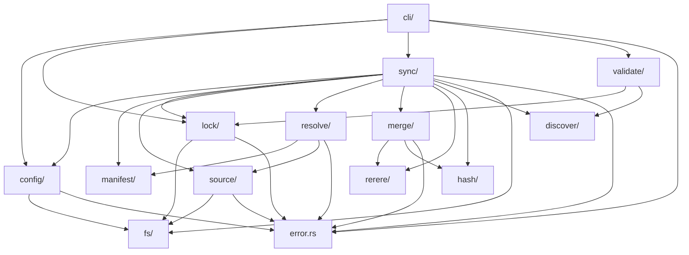

# mars-agents: Rust Code Architecture

## Crate Structure

Single crate, lib + bin separation. No workspace — mars is one focused tool, not a family of libraries. The workspace overhead (multiple Cargo.toml files, cross-crate dependency management) isn't justified until we extract something other consumers need.

```
mars-agents/
  Cargo.toml
  src/
    main.rs           # binary entry point — CLI parsing, exit codes
    lib.rs            # library root — re-exports public API
    cli/              # clap definitions + command handlers
    config/           # agents.toml parsing + validation
    manifest/         # mars.toml (per-package) parsing
    lock/             # agents.lock read/write + models
    source/           # source fetching (git, path)
    resolve/          # dependency resolution + version constraints
    sync/             # the core pipeline: diff → plan → apply
    merge/            # three-way merge + conflict markers
    rerere/           # recorded conflict resolution database
    hash/             # checksum computation
    discover/         # filesystem discovery of agents/skills in source trees
    validate/         # agent→skill dependency validation
    fs/               # atomic writes, temp dirs, file locking
    error.rs          # error types (thiserror)
  tests/
    integration/      # tests that create real git repos + .agents/ trees
    fixtures/         # sample source trees, configs, locks
```

**Why lib + bin?** The library (`mars_agents`) exposes the sync pipeline, config models, and lock models as a public API. This enables:
- Meridian (or any tool) to call mars as a library, not just shell out
- Integration tests that exercise the pipeline without spawning a subprocess
- Future: IDE plugins, language server, or CI tooling that imports the library

`main.rs` is thin — it calls `cli::run()` and converts the result into an exit code.

## Module Dependency Graph



Arrows mean "depends on." No cycles. The dependency flows downward: CLI → sync pipeline → individual concerns → fs/error primitives.

## Module Responsibilities

### `cli/` — Command Parsing and Dispatch

Clap derive API. Each subcommand is a struct. The CLI layer:
- Parses args into typed commands
- Locates `.agents/` root (walk up from cwd, or `--root` flag)
- Calls library functions
- Formats output (human-readable by default, `--json` for machine)
- Maps `MarsError` to exit codes and stderr messages

```
cli/
  mod.rs              # top-level clap App + subcommand dispatch
  add.rs              # mars add
  remove.rs           # mars remove
  sync.rs             # mars sync
  init.rs             # mars init
  doctor.rs           # mars doctor
  repair.rs           # mars repair
  resolve_cmd.rs      # mars resolve (conflict resolution)
  why.rs              # mars why
  outdated.rs         # mars outdated / update / upgrade
  override_cmd.rs     # mars override
  rerere_cmd.rs       # mars rerere
  output.rs           # shared formatting (tables, diffs, colors)
```

**Pattern**: Each command handler receives parsed args, constructs the context (loads config, lock, locates root), calls the library, and formats the result. No business logic in the CLI layer.

### `config/` — User Config (`agents.toml`)

Parses the user's declared sources and settings. Two files: `agents.toml` (committed) and `agents.local.toml` (gitignored, for dev overrides).

```rust
// config/mod.rs

/// User-declared source entry in agents.toml
#[derive(Debug, Clone, Serialize, Deserialize)]
#[serde(tag = "type")]
pub enum SourceEntry {
    #[serde(rename = "git")]
    Git {
        url: String,
        version: Option<String>,    // semver constraint or ref
    },
    #[serde(rename = "path")]
    Path {
        path: PathBuf,
    },
}

/// Top-level agents.toml
#[derive(Debug, Clone, Serialize, Deserialize)]
pub struct Config {
    #[serde(default)]
    pub sources: IndexMap<String, SourceEntry>,
    #[serde(default)]
    pub overrides: IndexMap<String, OverrideEntry>,
    #[serde(default)]
    pub settings: Settings,
}

/// Dev override — local path swap for a git source
#[derive(Debug, Clone, Serialize, Deserialize)]
pub struct OverrideEntry {
    pub path: PathBuf,
}

/// Global settings
#[derive(Debug, Clone, Default, Serialize, Deserialize)]
pub struct Settings {
    #[serde(default = "default_true")]
    pub rerere: bool,
}
```

**Config merge**: `agents.local.toml` entries override `agents.toml` entries with the same source name. The merged view is `EffectiveConfig` — what the rest of the pipeline sees. Overrides replace git sources with path sources at resolution time, but the lock still records the git version for reproducibility.

```rust
pub struct EffectiveConfig {
    pub sources: IndexMap<String, EffectiveSource>,
    pub settings: Settings,
}

pub struct EffectiveSource {
    pub name: String,
    pub spec: SourceSpec,           // resolved: git URL+constraint or path
    pub is_overridden: bool,        // true if local override is active
    pub original_git: Option<GitSpec>, // preserved for lock even when overridden
}
```

### `manifest/` — Package Manifest (`mars.toml`)

Parsed from each source's repository root. Declares what the package provides and its dependencies.

```rust
/// Per-package manifest (mars.toml in package repo root)
#[derive(Debug, Clone, Serialize, Deserialize)]
pub struct Manifest {
    pub package: PackageInfo,
    #[serde(default)]
    pub dependencies: IndexMap<String, DepSpec>,
    #[serde(default)]
    pub provides: ProvidesSpec,
}

#[derive(Debug, Clone, Serialize, Deserialize)]
pub struct PackageInfo {
    pub name: String,
    pub version: String,    // semver
    pub description: Option<String>,
}

#[derive(Debug, Clone, Serialize, Deserialize)]
pub struct DepSpec {
    pub url: String,
    pub version: String,    // semver constraint
}

/// What items this package provides — typed by item kind
#[derive(Debug, Clone, Default, Serialize, Deserialize)]
pub struct ProvidesSpec {
    #[serde(default)]
    pub agents: Vec<String>,
    #[serde(default)]
    pub skills: Vec<String>,
}
```

**Extensibility note**: `ProvidesSpec` uses named fields per item kind (`agents`, `skills`) rather than a generic `HashMap<String, Vec<String>>`. This gives type safety for v1 while remaining easy to extend — adding a new kind means adding a field + updating the discovery/validation logic. The manifest format uses `[provides]` with explicit lists rather than auto-discovery as the default because explicitness prevents syncing stray files.

### `lock/` — Lock File (`agents.lock`)

The ownership registry. Tracks every managed file with provenance and integrity data.

```rust
/// The complete lock file
#[derive(Debug, Clone, Serialize, Deserialize)]
pub struct LockFile {
    pub version: u32,              // schema version, currently 1
    pub sources: IndexMap<String, LockedSource>,
    pub items: IndexMap<ItemId, LockedItem>,
}

/// One resolved source in the lock
#[derive(Debug, Clone, Serialize, Deserialize)]
pub struct LockedSource {
    pub url: Option<String>,
    pub path: Option<String>,
    pub version: Option<String>,   // resolved version (e.g., "2.1.0")
    pub commit: Option<String>,    // resolved git commit hash
    pub tree_hash: Option<String>, // aggregate hash of all items from this source
}

/// One installed item tracked by the lock
#[derive(Debug, Clone, Serialize, Deserialize)]
pub struct LockedItem {
    pub source: String,            // source name
    pub kind: ItemKind,            // agent | skill
    pub version: Option<String>,   // from source's manifest
    pub checksum: String,          // sha256 of installed content
    pub dest_path: String,         // relative path under .agents/
}

/// Stable identity for an installed item — decoupled from source URL
#[derive(Debug, Clone, Hash, Eq, PartialEq, Serialize, Deserialize)]
pub struct ItemId {
    pub kind: ItemKind,
    pub name: String,
}

#[derive(Debug, Clone, Copy, Hash, Eq, PartialEq, Serialize, Deserialize)]
#[serde(rename_all = "lowercase")]
pub enum ItemKind {
    Agent,
    Skill,
}
```

**Lock file format**: TOML, not JSON. Matches agents.toml convention and is more readable in diffs. The lock is deterministically ordered (sorted keys) so git diffs are clean.

**`ItemId` as stable identity**: Items are identified by `(kind, name)`, not by source URL. If a package moves to a different git host, the item identity is preserved. The source field tracks provenance, not identity.

### `source/` — Source Fetching

Fetches source content to a local cache. Two adapters: git and path.

```rust
/// Trait for source fetching — git and path implement this
pub trait SourceFetcher {
    /// Resolve version constraints to a concrete ref/version
    fn resolve(&self, spec: &SourceSpec, cache: &CacheDir)
        -> Result<ResolvedRef>;

    /// Fetch/update source content to cache, return path to source tree
    fn fetch(&self, resolved: &ResolvedRef, cache: &CacheDir)
        -> Result<PathBuf>;

    /// List available versions (for outdated/upgrade)
    fn list_versions(&self, spec: &SourceSpec, cache: &CacheDir)
        -> Result<Vec<semver::Version>>;
}

/// A resolved source reference — pinned to a specific version/commit
#[derive(Debug, Clone)]
pub struct ResolvedRef {
    pub source_name: String,
    pub version: Option<semver::Version>,
    pub commit: Option<String>,
    pub tree_path: PathBuf,        // where the fetched content lives
}
```

**Git adapter** (`source/git.rs`): Uses `git2` for all operations:
- `git ls-remote --tags` equivalent via `git2::Remote::list` for version discovery
- Shallow clone into `.agents/.mars/cache/<url-hash>/` 
- Checkout specific tag/commit
- Re-fetch on `mars sync` if version constraint resolves to a newer tag

**Path adapter** (`source/path.rs`): Resolves relative paths against `.agents/` parent. Returns the path directly — no caching, no copying. Always "fresh."

**Cache layout**:
```
.agents/.mars/cache/
  github.com_haowjy_meridian-base/    # git clone keyed by URL
  github.com_haowjy_meridian-dev/     # another git source
```

URL → directory name: replace `/` with `_`, strip protocol. Collisions are astronomically unlikely and detectable.

### `resolve/` — Dependency Resolution

Topological sort with semver constraint intersection. Not SAT — the graph is small.

```rust
/// The resolved dependency graph — all sources with concrete versions
#[derive(Debug, Clone)]
pub struct ResolvedGraph {
    pub nodes: IndexMap<String, ResolvedNode>,
    pub order: Vec<String>,        // topological order (deps before dependents)
}

#[derive(Debug, Clone)]
pub struct ResolvedNode {
    pub source_name: String,
    pub resolved_ref: ResolvedRef,
    pub manifest: Manifest,
    pub deps: Vec<String>,         // source names this depends on
}
```

**Algorithm**:
1. Start with user's declared sources from `EffectiveConfig`
2. Fetch each source → read `mars.toml` → discover transitive deps
3. For each dependency URL seen, intersect all version constraints from different dependents
4. If intersection is empty → error with clear chain showing who requires what
5. Resolve each constraint to the minimum version satisfying it (Go-style MVS)
6. Topological sort the final graph
7. Return `ResolvedGraph` — ordered list of sources with concrete versions and manifests

```rust
pub fn resolve(
    config: &EffectiveConfig,
    fetchers: &Fetchers,
    cache: &CacheDir,
    locked: Option<&LockFile>,    // prefer locked versions when constraints allow
) -> Result<ResolvedGraph>;
```

**Locked version preference**: When a lock file exists, the resolver prefers the locked commit/version if it still satisfies the constraint. This gives reproducible builds — `mars sync` with unchanged config produces no changes.

### `sync/` — The Core Pipeline

This is the heart of mars. The sync pipeline is a sequence of transforms, each producing an intermediate value consumed by the next. Side effects are concentrated in the final `apply` step.

```rust
/// The complete sync pipeline
pub fn sync(ctx: &SyncContext) -> Result<SyncReport> {
    // 1. Load config + lock
    let config = config::load(&ctx.root)?;
    let lock = lock::load(&ctx.root)?;

    // 2. Fetch sources + resolve deps
    let graph = resolve::resolve(&config, &ctx.fetchers, &ctx.cache, Some(&lock))?;

    // 3. Discover items in each resolved source
    let target = discover::target_state(&graph)?;

    // 4. Validate dependency graph (agent→skill refs)
    let warnings = validate::check_deps(&target)?;

    // 5. Diff current state against target
    let diff = diff::compute(&ctx.root, &lock, &target)?;

    // 6. Plan actions from diff
    let plan = plan::create(&diff, &ctx.options)?;

    // 7. Apply plan (or dry-run)
    let applied = apply::execute(&ctx.root, &plan, &ctx.options)?;

    // 8. Write updated lock
    if !ctx.options.dry_run {
        let new_lock = lock::build(&graph, &applied)?;
        lock::write(&ctx.root, &new_lock)?;
    }

    Ok(SyncReport { applied, warnings })
}
```

#### Sub-modules within `sync/`:

**`sync/target.rs`** — Desired target state computed from the resolved graph:
```rust
/// What .agents/ should look like after sync
pub struct TargetState {
    pub items: IndexMap<ItemId, TargetItem>,
}

pub struct TargetItem {
    pub id: ItemId,
    pub source_name: String,
    pub source_path: PathBuf,    // path to content in fetched source tree
    pub dest_path: PathBuf,      // relative path under .agents/
    pub source_hash: String,     // sha256 of source content
}
```

**`sync/diff.rs`** — Compares current disk state + lock against target:
```rust
pub struct SyncDiff {
    pub items: Vec<DiffEntry>,
}

pub enum DiffEntry {
    /// New item not in lock or on disk
    Add { target: TargetItem },
    /// Source changed, local unchanged → clean update
    Update { target: TargetItem, locked: LockedItem },
    /// Source unchanged, local unchanged → skip
    Unchanged { target: TargetItem, locked: LockedItem },
    /// Source changed AND local changed → needs merge
    Conflict { target: TargetItem, locked: LockedItem, local_hash: String },
    /// In lock but not in target → should be removed
    Orphan { locked: LockedItem },
    /// Local modification, source unchanged → keep local
    LocalModified { target: TargetItem, locked: LockedItem, local_hash: String },
}
```

The four-case merge matrix from the design spec maps directly to these variants. `DiffEntry::Conflict` is the interesting one — it triggers three-way merge.

**`sync/plan.rs`** — Converts diff entries into executable actions:
```rust
pub struct SyncPlan {
    pub actions: Vec<PlannedAction>,
}

pub enum PlannedAction {
    Install { target: TargetItem },
    Overwrite { target: TargetItem },
    Skip { item_id: ItemId, reason: &'static str },
    Merge { target: TargetItem, base_content: Vec<u8>, local_path: PathBuf },
    Remove { locked: LockedItem },
    KeepLocal { item_id: ItemId },
}
```

The plan accounts for `--force` (all conflicts become `Overwrite`) and `--diff` (plan is computed but not executed).

**`sync/apply.rs`** — Executes the plan, producing results:
```rust
pub struct ApplyResult {
    pub outcomes: Vec<ActionOutcome>,
}

pub struct ActionOutcome {
    pub item_id: ItemId,
    pub action: ActionTaken,   // Installed, Updated, Merged, Conflicted, Removed, Skipped, Kept
    pub dest_path: PathBuf,
    pub checksum: Option<String>,
}
```

### `merge/` — Three-Way Merge

Wraps the `threeway_merge` crate. Inputs: base (what mars installed last time, from cache), local (current file on disk), theirs (new source content). Output: merged content or content with conflict markers.

```rust
pub struct MergeResult {
    pub content: Vec<u8>,
    pub has_conflicts: bool,
    pub conflict_count: usize,
}

/// Perform three-way merge
pub fn merge_content(
    base: &[u8],
    local: &[u8],
    theirs: &[u8],
    labels: &MergeLabels,
) -> Result<MergeResult>;

pub struct MergeLabels {
    pub base: String,     // e.g., "base (mars installed)"
    pub local: String,    // e.g., "local"  
    pub theirs: String,   // e.g., "meridian-base@v0.6.0"
}
```

**Base content storage**: The cache stores the exact content mars installed last time, keyed by `(source_name, item_id, version)`. This is the "base" for three-way merge — without it, we can only do two-way diff. The lock file's checksum lets us verify the cache hasn't drifted.

### `rerere/` — Recorded Resolution

Stores conflict resolutions keyed by conflict hash. On future syncs, if the same conflict pattern appears, auto-applies the recorded resolution.

```rust
pub struct RerereDb {
    root: PathBuf,   // .agents/.mars/rerere/
}

impl RerereDb {
    /// Record a resolution: conflicted content → resolved content
    pub fn record(&self, conflict_hash: &str, resolution: &[u8]) -> Result<()>;

    /// Look up a recorded resolution for a conflict hash
    pub fn lookup(&self, conflict_hash: &str) -> Result<Option<Vec<u8>>>;

    /// Forget a specific resolution
    pub fn forget(&self, file_path: &str) -> Result<()>;

    /// List all recorded resolutions
    pub fn list(&self) -> Result<Vec<RerereEntry>>;
}
```

**Conflict hash**: SHA-256 of the conflict markers block (the `<<<<<<<` ... `>>>>>>>` content). Same conflict = same hash = same resolution applies.

### `discover/` — Source Tree Discovery

Scans a fetched source tree for installable items. Reads `mars.toml` manifest first; falls back to filesystem convention (`agents/*.md`, `skills/*/SKILL.md`).

```rust
pub fn discover_source(tree_path: &Path, manifest: &Manifest) -> Result<Vec<DiscoveredItem>>;

pub struct DiscoveredItem {
    pub id: ItemId,
    pub source_path: PathBuf,   // path within source tree
}
```

If the manifest declares `[provides]`, discovery validates that every declared item actually exists on disk. If a manifest declares `agents = ["coder"]` but `agents/coder.md` doesn't exist, that's an error.

### `validate/` — Dependency Validation

Checks that agent→skill references resolve. Agents declare `skills: [X, Y]` in YAML frontmatter. After resolution, every referenced skill must exist somewhere in the target state.

```rust
pub fn check_deps(target: &TargetState) -> Result<Vec<ValidationWarning>>;

pub enum ValidationWarning {
    MissingSkill {
        agent: ItemId,
        skill_name: String,
        suggestion: Option<String>,  // fuzzy match: "did you mean X?"
    },
    OrphanedSkill {
        skill: ItemId,
        // installed but no agent references it
    },
}
```

Uses `serde_yaml` to parse agent frontmatter. Only reads the YAML front matter block (between `---` delimiters), not the full markdown body.

### `hash/` — Checksum Computation

```rust
/// Compute SHA-256 of a file or directory (for skills)
pub fn compute_hash(path: &Path, kind: ItemKind) -> Result<String>;
```

For agents (single `.md` file): SHA-256 of file content.
For skills (directory): SHA-256 of sorted `(relative_path, file_hash)` pairs — deterministic regardless of filesystem ordering.

### `fs/` — File System Primitives

```rust
/// Atomic file write: write to temp file, then rename
pub fn atomic_write(dest: &Path, content: &[u8]) -> Result<()>;

/// Atomic directory install: copy to temp dir, then rename
pub fn atomic_install_dir(src: &Path, dest: &Path) -> Result<()>;

/// Remove a file or directory (skills are dirs)
pub fn remove_item(path: &Path, kind: ItemKind) -> Result<()>;

/// Advisory file lock (flock) for concurrent access
pub struct FileLock { /* fd held open */ }
impl FileLock {
    pub fn acquire(lock_path: &Path) -> Result<Self>;
}
// Drop impl releases the lock
```

**Atomic write pattern**: `write(tmp) → fsync(tmp) → rename(tmp, dest)`. The rename is atomic on POSIX. On Windows, use `ReplaceFile`. Temp files are in the same directory as the destination (same filesystem guarantees atomic rename).

**Advisory lock**: `flock` on `.agents/.mars/mars.lock`. Prevents concurrent `mars sync` from corrupting state. The lock is held for the duration of the apply phase, not the entire pipeline — fetching and resolution can happen without the lock.

## The Sync Pipeline as Data Flow


Each arrow is a function call that takes the previous output and produces the next input. The pipeline is testable at every boundary — you can unit test `diff::compute` by constructing a `TargetState` and `LockFile` in memory without touching disk.

**Pure core, effectful shell**: Steps 1-2 have I/O (reading files, cloning git repos). Steps 3-7 are pure transforms on data structures. Step 8 has I/O (writing files). This concentration of effects at the edges makes the core logic easy to test.

## Error Handling

**`thiserror`** for the library. Every module defines its own error enum with structured variants. The top-level `MarsError` aggregates them.

```rust
// error.rs

#[derive(Debug, thiserror::Error)]
pub enum MarsError {
    #[error("config error: {0}")]
    Config(#[from] ConfigError),

    #[error("lock error: {0}")]
    Lock(#[from] LockError),

    #[error("source error: {source_name}: {message}")]
    Source { source_name: String, message: String },

    #[error("resolution failed: {0}")]
    Resolution(#[from] ResolutionError),

    #[error("merge conflict in {path}")]
    Conflict { path: String },

    #[error("validation: {0}")]
    Validation(#[from] ValidationError),

    #[error("I/O error: {0}")]
    Io(#[from] std::io::Error),

    #[error("git error: {0}")]
    Git(#[from] git2::Error),
}
```

**Why not `anyhow`?** The library needs structured errors so the CLI can match on variants to produce different exit codes and targeted error messages. `anyhow` erases the type. The CLI layer can use `anyhow` internally for error chaining if needed, but the library boundary uses typed errors.

**Exit codes**:
- `0` — success, no conflicts
- `1` — sync completed with unresolved conflicts
- `2` — resolution/validation error (bad config, dep conflict)
- `3` — I/O or git error (network, permissions)

## CLI ↔ Library Connection

The CLI creates a `SyncContext` and calls into the library. The library returns structured results. The CLI formats them.

```rust
// main.rs
fn main() {
    let cli = Cli::parse();
    let result = cli::dispatch(cli);
    match result {
        Ok(exit_code) => std::process::exit(exit_code),
        Err(e) => {
            eprintln!("error: {e}");
            std::process::exit(3);
        }
    }
}
```

```rust
// cli/sync.rs
pub fn run(args: SyncArgs) -> Result<i32> {
    let root = find_agents_root(&args.root)?;
    let ctx = SyncContext {
        root,
        fetchers: default_fetchers(),
        cache: CacheDir::new(&root)?,
        options: SyncOptions {
            force: args.force,
            dry_run: args.diff,
        },
    };

    let report = mars_agents::sync::sync(&ctx)?;
    output::print_sync_report(&report, args.json);

    if report.has_conflicts() {
        Ok(1)
    } else {
        Ok(0)
    }
}
```

**Root discovery**: Walk up from cwd looking for `.agents/agents.toml`. Or use `--root` flag. Error if not found (suggest `mars init`).

**Output formatting**: Human-readable table by default. `--json` flag for machine consumption. Colors via `termcolor` or `owo-colors` (respect `NO_COLOR` env var).

```
$ mars sync
  ✓ meridian-base@0.5.2 (3 agents, 8 skills)
  ✓ meridian-dev-workflow@2.1.0 (8 agents, 5 skills)

  installed   2 new items
  updated     3 items
  removed     1 orphan
  conflicts   1 file (run `mars resolve` after fixing)
```

## Testing Strategy

### Unit Tests (in-module)

Pure logic modules are directly unit-testable with in-memory data structures — no filesystem, no git:

- **`resolve/`**: Construct `EffectiveConfig` + mock manifests → assert topological order, version selection, constraint intersection failures
- **`sync/diff.rs`**: Construct `TargetState` + `LockFile` + mock hashes → assert correct `DiffEntry` variants
- **`sync/plan.rs`**: Construct `SyncDiff` + options → assert correct `PlannedAction` sequence
- **`config/`**: Parse TOML strings → assert `Config` structs
- **`manifest/`**: Parse TOML strings → assert `Manifest` structs
- **`lock/`**: Roundtrip: construct `LockFile` → serialize → deserialize → assert equal
- **`validate/`**: Construct `TargetState` with known frontmatter → assert warnings
- **`hash/`**: Known content → known SHA-256

### Integration Tests (`tests/integration/`)

Tests that exercise the full pipeline with real filesystems. Each test creates a temp directory with a synthetic `.agents/` tree and source repos.

**Git integration tests**: Create real git repos with `git2` (init, commit, tag), then run the full sync pipeline against them. Test:
- Fresh install from git source
- Update when upstream tag advances
- Version constraint resolution with transitive deps
- Conflict detection and merge with local modifications
- Orphan pruning after renames

**Path integration tests**: Create local directories as sources. Simpler but covers the path adapter.

**Merge integration tests**: Set up base → local edit → upstream edit scenarios. Assert correct merge output, conflict markers, rerere recording and replay.

Test fixtures: Committed to the repo as source trees under `tests/fixtures/`. Integration tests copy these to temp dirs, initialize git repos from them, and run sync.

### What Not to Unit Test

- `cli/` — tested via integration tests that run the binary
- `fs/` — atomic writes are hard to unit test meaningfully; integration tests cover them
- `source/git.rs` — git operations are inherently integration tests

## Key Design Decisions

### TOML for Lock File (not JSON)

JSON is what meridian uses today, but TOML:
- Matches `agents.toml` convention
- Produces cleaner git diffs (no trailing commas, no brace nesting)
- Is more readable when users need to inspect the lock
- Is what Cargo uses for `Cargo.lock`

### `IndexMap` Everywhere (not `HashMap`)

Insertion-order preservation is critical for deterministic serialization. The lock file and config must produce identical output given identical input — otherwise git diffs show noise. `indexmap::IndexMap` provides this. All maps in serialized structs use `IndexMap`.

### Semver via the `semver` Crate

Version parsing, constraint matching, and comparison use the `semver` crate. No custom version logic. Constraints use the cargo-style syntax (`^`, `~`, `>=`, `<`, `*`).

### `git2` over Shelling Out to `git`

`git2` (libgit2 bindings) is used for all git operations instead of spawning `git` subprocesses:
- No dependency on git being installed
- Structured error handling
- No shell injection risks
- Faster for repeated operations (no process spawn overhead)

Tradeoff: `git2` adds a C dependency (libgit2) to the build. This is acceptable — libgit2 is mature and widely used (Cargo itself uses it).

### Item Identity = `(kind, name)`, not URL

A package can move between git hosts. The item's identity is its kind and name — `(skill, "frontend-design")` — not which URL it came from. The source field in the lock is provenance, not identity. This means:
- Renaming a git URL in config doesn't trigger reinstall
- Two sources providing the same `(kind, name)` is a conflict (must be resolved, not silently overwritten)

### Extensibility: Typed Items

`ItemKind` is an enum (`Agent | Skill`). Adding a new kind (e.g., `Prompt`, `Tool`) means:
1. Add a variant to `ItemKind`
2. Add a field to `ProvidesSpec` in the manifest
3. Add discovery logic for the new kind's filesystem convention
4. Add a destination path pattern in `sync/apply.rs`

The type system ensures every code path handles the new kind — match exhaustiveness catches missing cases.

### Separable Resolution Root from Install Target

The design supports a future where resolution happens in one location and installation targets another. Today, both are `.agents/`. The `SyncContext` carries separate `root` (where config/lock live) and `install_target` (where files go) paths, defaulting to the same value. This is a one-line change when workspace support arrives.

```rust
pub struct SyncContext {
    pub root: PathBuf,             // .agents/ — config + lock
    pub install_target: PathBuf,   // .agents/ — where items are installed
    pub fetchers: Fetchers,
    pub cache: CacheDir,
    pub options: SyncOptions,
}
```

## Cargo.toml Dependencies

```toml
[package]
name = "mars-agents"
version = "0.1.0"
edition = "2024"

[[bin]]
name = "mars"
path = "src/main.rs"

[dependencies]
clap = { version = "4", features = ["derive"] }
serde = { version = "1", features = ["derive"] }
toml = "0.8"
serde_yaml = "0.9"
git2 = "0.19"
sha2 = "0.10"
threeway-merge = "0.2"
semver = { version = "1", features = ["serde"] }
indexmap = { version = "2", features = ["serde"] }
thiserror = "2"
tempfile = "3"                  # temp dirs for atomic writes
termcolor = "1"                 # colored terminal output

[dev-dependencies]
assert_fs = "1"                 # temp dir fixtures for tests
predicates = "3"                # assertion helpers
assert_cmd = "2"                # CLI integration tests
```
