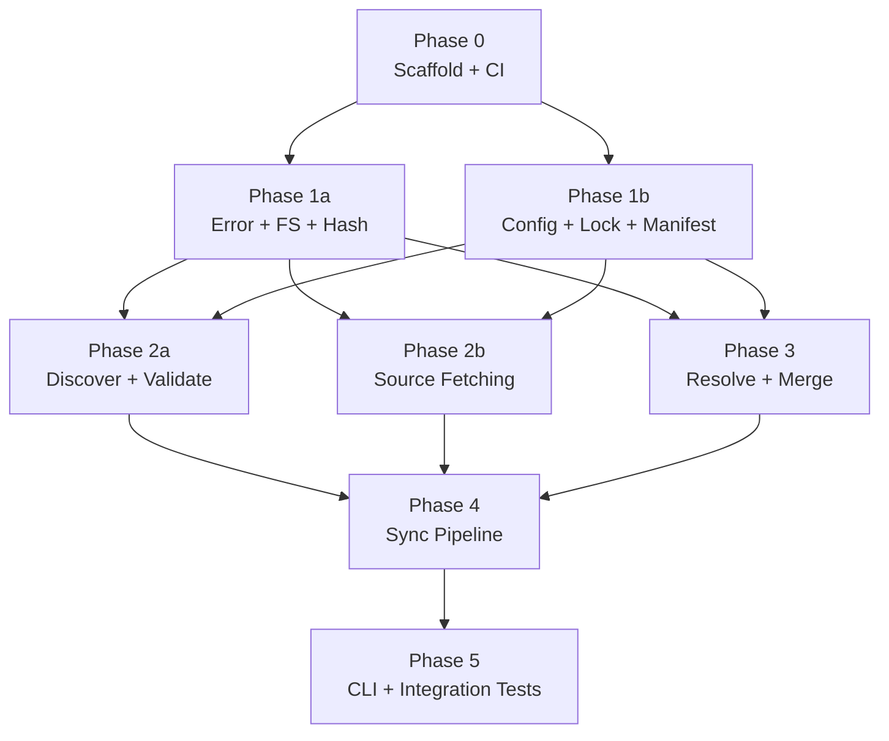

# mars-agents: Implementation Plan

## Execution Summary

7 phases across 5 execution rounds. Estimated total: 8-10 coder sessions + review/test cycles.

The plan follows a foundation-up strategy: pure data types and utilities first (unit-testable without I/O), then I/O adapters, then the integration pipeline, and finally the CLI shell. Each phase produces testable artifacts and stable interfaces that downstream phases consume.

## Phase Dependency Graph

## Execution Rounds

| Round | Phases | Parallelism | Gate |
|-------|--------|-------------|------|
| 1 | Phase 0 | Sequential | `cargo build`, `cargo test`, CI green |
| 2 | Phase 1a, Phase 1b | Parallel (independent modules) | Unit tests pass for all 6 modules |
| 3 | Phase 2a, Phase 2b, Phase 3 | Parallel (independent I/O + logic) | Unit + fixture tests pass |
| 4 | Phase 4 | Sequential (needs all of Round 3) | Full sync pipeline integration tests pass |
| 5 | Phase 5 | Sequential (needs Phase 4) | CLI binary works end-to-end, all tests green |

## Complexity Estimates

| Phase | Scope | Lines (est.) | Risk | Notes |
|-------|-------|-------------|------|-------|
| 0 | Scaffold | ~200 | Low | Boilerplate, Cargo.toml, CI |
| 1a | error + fs + hash | ~400 | Low | Pure utilities, well-defined |
| 1b | config + lock + manifest | ~600 | Low | Serde structs + parsing |
| 2a | discover + validate | ~350 | Low | Filesystem walking + frontmatter parsing |
| 2b | source (git + path) | ~500 | Medium | git2 API, cache management |
| 3 | resolve + merge | ~600 | Medium | Constraint intersection, three-way merge |
| 4 | sync pipeline | ~800 | High | Integration of all modules, 4-case merge matrix |
| 5 | CLI + integration | ~700 | Medium | clap, output formatting, end-to-end tests |

Total: ~4,150 lines of Rust (excluding tests).

## Key Implementation Decisions

1. **Single crate, lib + bin.** No workspace. `main.rs` is thin — calls `cli::run()`.
2. **`thiserror` for library errors, not `anyhow`.** Structured errors enable CLI to map variants to exit codes.
3. **`IndexMap` everywhere.** Deterministic serialization for clean git diffs.
4. **`git2` (libgit2) for all git ops.** No shelling out to `git`.
5. **TOML for lock file.** Matches config convention, clean diffs.
6. **Atomic writes via tmp+fsync+rename.** Crash-safe by default.
7. **Advisory flock during apply only.** Fetching and resolution don't need the lock.
8. **Dual checksums in lock (source + installed).** Prevents mars-managed rewrites from triggering false conflicts.
9. **Three-way merge in v1.** Core differentiator — not deferred.

## Agent Staffing Summary

| Phase | Coder | Reviewers | Testers |
|-------|-------|-----------|---------|
| 0 | coder | — | verifier |
| 1a | coder | 1x SOLID/correctness | verifier |
| 1b | coder | 1x correctness/serde | verifier |
| 2a | coder | 1x correctness | verifier |
| 2b | coder | 1x security + 1x correctness | verifier |
| 3 | coder (strong model) | 2x (correctness, design alignment) | verifier + unit-tester |
| 4 | coder (strong model) | 2x (correctness, design alignment) | verifier + smoke-tester |
| 5 | coder | 1x UX/conventions | verifier + smoke-tester |

## File Index

- [phase-0-scaffold.md](phase-0-scaffold.md) — Crate scaffold, Cargo.toml, CI, module stubs
- [phase-1a-error-fs-hash.md](phase-1a-error-fs-hash.md) — Error types, atomic FS ops, checksum computation
- [phase-1b-config-lock-manifest.md](phase-1b-config-lock-manifest.md) — TOML parsing for all three config files
- [phase-2a-discover-validate.md](phase-2a-discover-validate.md) — Filesystem discovery + agent→skill validation
- [phase-2b-source-fetching.md](phase-2b-source-fetching.md) — Git and path source adapters
- [phase-3-resolve-merge.md](phase-3-resolve-merge.md) — Dependency resolution + three-way merge
- [phase-4-sync-pipeline.md](phase-4-sync-pipeline.md) — target → diff → plan → apply pipeline
- [phase-5-cli-integration.md](phase-5-cli-integration.md) — CLI commands + end-to-end tests
