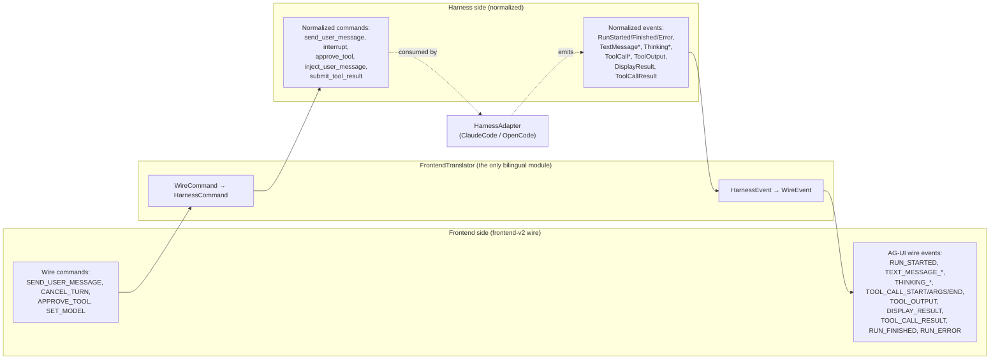
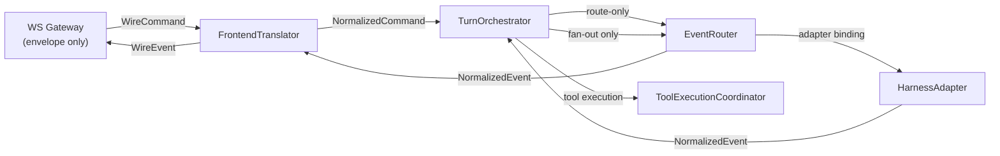
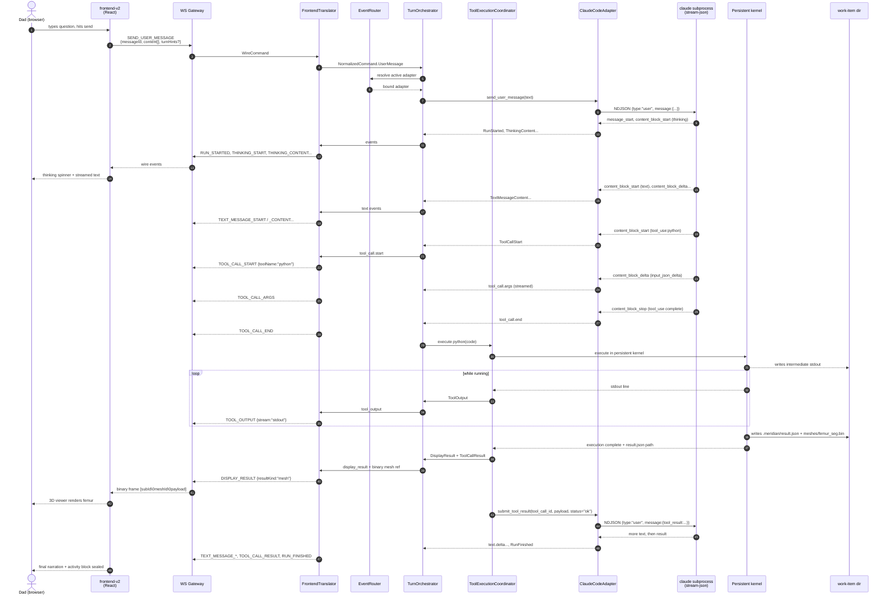
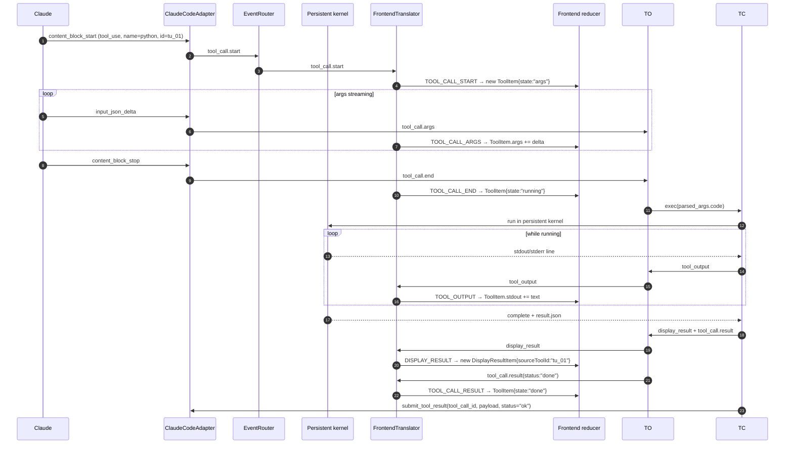
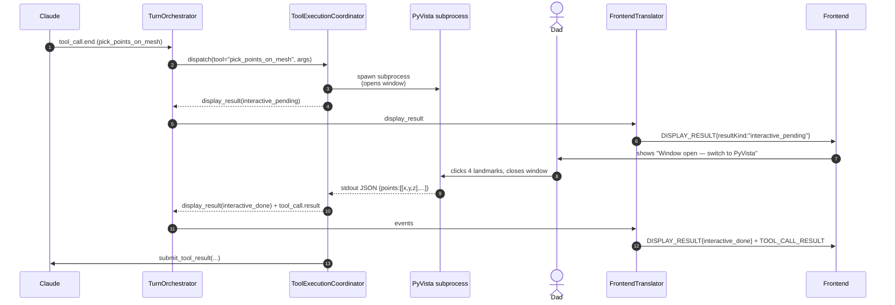
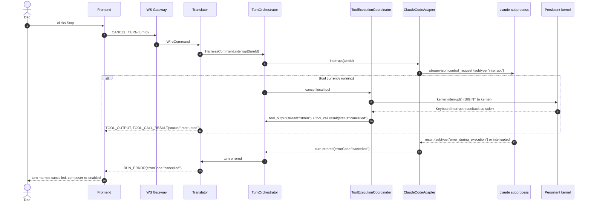

# agent-shell-mvp — Event Flow

> End-to-end choreography for one user message: frontend → FastAPI →
> translator → harness → tool → result capture → events back out. Plus
> mid-turn injection, interrupt, error, and persistence flows. Companion +
> opencode + biomedical-mvp grounding are inputs; this doc is the contract.

This doc is the **runtime narrative** that ties [overview.md](./overview.md),
[harness-abstraction.md](./harness-abstraction.md),
[frontend-protocol.md](./frontend-protocol.md),
[interactive-tool-protocol.md](./interactive-tool-protocol.md), and
[local-execution.md](./local-execution.md) together. If anything in those docs
contradicts this one, fix the contradiction before merging — they must agree.

## 1. Two protocol surfaces

The backend translates between two vocabularies. Neither side ever sees the
other's vocabulary. The **normalized event schema in
[harness-abstraction.md](./harness-abstraction.md)** is canonical. This doc
derives the runtime flow from that schema; it does not redefine event
semantics.



### Frontend-side wire vocabulary

The wire contract is a **thin rename layer** over the canonical normalized
schema plus the existing frontend-v2 envelope. The important wire names are:

| Wire event | Carries | Lifecycle role |
|---|---|---|
| `RUN_STARTED` | `turnId`, `userMessageId` | Turn opens; frontend creates new `ActivityBlock` |
| `THINKING_START` / `_CONTENT` / `_END` | `thinkingId`, `delta` | `ThinkingItem` streams |
| `TEXT_MESSAGE_START` / `_CONTENT` / `_END` | `messageId`, `text` deltas | `ContentItem` streams |
| `TOOL_CALL_START` | `toolCallId`, `toolName`, `messageId` | New `ToolItem` enters block |
| `TOOL_CALL_ARGS` | `toolCallId`, `argsDelta` | Args stream into the `ToolItem` |
| `TOOL_CALL_END` | `toolCallId` | Args complete; execution begins |
| `TOOL_OUTPUT` | `toolCallId`, `stream` (`stdout`/`stderr`), `text`, `sequence` | Streams into `ToolItem.stdout`/`stderr` |
| `DISPLAY_RESULT` | `toolCallId`, `displayId`, `resultKind`, `data` | New `DisplayResultItem` after capture |
| `TOOL_CALL_RESULT` | `toolCallId`, `status` | Closes the `ToolItem` lifecycle |
| `RUN_FINISHED` | `turnId`, `finishReason` | Turn closes; activity block finalized |
| `RUN_ERROR` | `turnId`, `errorCode`, `message` | Turn aborted (cancel, harness crash, etc.) |
| `SESSION_RESYNC` | `sessionId`, `stateDigest` | Reconnect window expired; frontend resets to current session view |

Frontend-side wire **commands** (browser → backend):

| Wire command | Payload |
|---|---|
| `SEND_USER_MESSAGE` | `{ messageId, content: [ContentBlock...], turnHints?: { previousTurnId? } }` — see `frontend-protocol.md` §5.1 for the canonical shape. `content` is an array so the composer can attach images/files alongside text. |
| `CANCEL_TURN` | `{ turnId }` |
| `APPROVE_TOOL` | `{ toolCallId, decision: "allow" \| "deny", remember? }` |
| `INJECT_USER_MESSAGE` (V0, tier-1) | `{ turnId, text }` — backend dispatches to `HarnessSender.inject_user_message()`; the adapter's `mid_turn_injection` mode (`queue` / `interrupt_restart` / `http_post`) determines wire mechanism |

### Harness-side normalized vocabulary

The authoritative dataclass shapes live in
[harness-abstraction.md](./harness-abstraction.md). This flow doc assumes the
canonical field names from there:

- `turn_id`, never `run_id`
- `tool_call_id`, never `toolCallId` in the normalized layer
- `result_kind`, never `resultType`
- `SessionContext` for backend bootstrap inputs, `SessionState` for runtime
  state, `SessionInfo` for the frontend hello payload

## 2. Translator responsibility (SRP)

The `FrontendTranslator` is the **only** module in the system that knows both
vocabularies. Everything else is single-language. It is a rename/wrap layer,
not an orchestrator.



**SRP boundaries**, in order of strictness:

- **WS Gateway** knows envelope (`kind/op/subId/seq`) and JSON framing. It does
  not know what `SEND_USER_MESSAGE` means. It hands the inner payload to the
  translator.
- **FrontendTranslator** knows both vocabularies. Inbound: `WireCommand →
  NormalizedCommand`. Outbound: `NormalizedEvent → WireEvent`. Stateless
  rename/wrap logic only.
- **TurnOrchestrator** owns one user turn's lifecycle. It assigns `turn_id`,
  correlates tool events, dispatches mid-turn injects to the adapter's
  `inject_user_message()` (per `mid_turn_injection` mode — see §6), and
  invokes `ToolExecutionCoordinator` for locally handled tools.
- **EventRouter** knows session ↔ adapter binding plus sink fan-out. It does
  not intercept tool calls or mutate event meaning.
- **ToolExecutionCoordinator** executes `python`, `bash`, and interactive
  tools locally, emits `ToolOutput` / `DisplayResult` / `ToolCallResult`, then
  resumes the harness through `submit_tool_result()`.
- **HarnessAdapter** knows one harness's wire shape (e.g. Claude Code
  stream-json) and emits normalized `HarnessEvent`s. It never sees a
  `WireEvent`; it never imports anything from the translator.

The test that proves SRP holds: replacing the AG-UI wire vocabulary with a
different chat protocol (e.g. an MCP-style transport) means a new translator
file plus zero changes to adapters. Replacing Claude Code with opencode means a
new adapter file plus zero changes to the translator.

## 3. Happy-path walkthrough — "Dad asks about segmentation"

This is the canonical end-to-end. 23 numbered steps. Cross-references to the
[overview.md §4](./overview.md) walkthrough where they overlap.

### 3.1 Sequence diagram



### 3.2 Step-by-step narration

1. **Keystroke.** Dad types `Run preprocessing on the femur DICOM stack` and
   hits enter.
2. **Composer dispatch.** The chat composer calls the WS client's
   `sendUserMessage(content)` action. The client wraps it in the AG-UI envelope
   `{ kind:"control", op:"send_user_message", resource:"turn",
   subId:<currentSubId>, seq:N, payload:{type:"SEND_USER_MESSAGE",
   messageId:"msg_user_7", content:[{type:"text", text:"..."}],
   turnHints:{previousTurnId:"turn_41"}} }` and writes it to the open
   WebSocket. The canonical shape is defined in `frontend-protocol.md` §5.1.
3. **WS Gateway receive.** FastAPI receives the frame, decodes envelope,
   validates `seq` is monotonic for the `subId`, and hands the inner payload
   to the translator with the `subId`/session context attached.
4. **Translator inbound.** `FrontendTranslator.handle_wire_command` matches on
   `payload.type == "SEND_USER_MESSAGE"` and constructs
   `NormalizedCommand.UserMessage(message_id=..., content=[...],
   previous_turn_id=...)`, passing the content-block array through unchanged
   (translator is rename-only; see §2).
5. **Turn orchestration.** `TurnOrchestrator` allocates `turn_id`, records the
   active turn in `SessionState`, resolves the session's bound adapter through
   `EventRouter`, and calls `adapter.sender.send_user_message(...)`.
6. **Adapter writes stdin.** `ClaudeCodeAdapter` serializes a stream-json
   `user` envelope (`{type:"user", message:{role:"user", content:[{type:"text",
   text:...}]}}`) and writes one NDJSON line to the long-lived
   `claude --input-format stream-json` subprocess's stdin. (See
   [harness-abstraction.md](./harness-abstraction.md) for the framing rules.)
7. **Claude warms up.** Claude Code emits its first stdout lines:
   `message_start`, then `content_block_start` for a `thinking` block.
8. **Adapter normalizes events.** The adapter's reader loop parses each NDJSON
   line and emits `RunStarted` once, then `ThinkingContent` events as
   `content_block_delta` lines arrive.
9. **Outbound translation.** `TurnOrchestrator` pushes events into translator outbound;
   translator emits `RUN_STARTED` (once), then `THINKING_START` +
   `THINKING_CONTENT` deltas. Each is wrapped in an envelope
   `{kind:"event", op:"emit", subId, seq:N+k, payload:{...}}` and sent to the
   browser.
10. **Frontend renders thinking.** The activity-stream reducer sees
    `RUN_STARTED`, opens a fresh `ActivityBlock`. `THINKING_START` adds a
    `ThinkingItem`. `THINKING_CONTENT` deltas append text. Dad sees the
    spinner with the agent's reasoning streaming live.
11. **Text block begins.** Claude transitions from `thinking` to a `text`
    content block: `content_block_stop` (closes thinking) → `content_block_start`
    (text) → `content_block_delta` deltas. Adapter emits `thinking.complete`
    then `text.delta`s. Translator emits `THINKING_END` then `TEXT_MESSAGE_START`
    + `_CONTENT` deltas. Frontend appends a `ContentItem`.
12. **Tool call begins.** Claude emits `content_block_start` with
    `type:"tool_use"`, `name:"python"`, `id:"toolu_01..."`. Adapter emits
    `ToolCallStart(tool_call_id="toolu_01...", tool_name="python")`. Translator
    emits `TOOL_CALL_START`. Frontend appends a `ToolItem` to the block.
13. **Args stream.** Claude emits `content_block_delta` with
    `delta:{type:"input_json_delta", partial_json:"..."}`. Adapter emits
    `tool_call.args(toolCallId, argsDelta)`. Translator emits `TOOL_CALL_ARGS`.
    Frontend updates the `ToolItem` args field. (UI may not re-render until
    `END`; that's a frontend choice.)
14. **Args complete.** Claude emits `content_block_stop` for the tool_use
    block. Adapter emits `tool_call.end`. Translator emits `TOOL_CALL_END`.
    Frontend marks args finalized.
15. **Local execution begins.** `TurnOrchestrator` hands locally handled tools
    (`python`, `bash`, registered interactive tools) to
    `ToolExecutionCoordinator`. For `python`, it dispatches to the persistent
    kernel via the local-execution runtime (see
    [local-execution.md](./local-execution.md)). The kernel receives the
    parsed args (`{code: "..."}`) and starts executing.
16. **Stdout streams.** The kernel wrapper writes each `stdout` line into a
    queue tagged with `tool_call_id`. `ToolExecutionCoordinator` drains the
    queue continuously and emits `ToolOutput(tool_call_id, stream:"stdout",
    chunk:text, sequence)`. Translator emits `TOOL_OUTPUT`. Frontend appends
    to `ToolItem.stdout`.
17. **Result capture.** Code in the kernel calls `show_mesh(femur_seg,
    mesh_id="femur_seg_v1")`. The result_helper writes `.meridian/result.json`
    with `{kind:"mesh", mesh_id:"femur_seg_v1", ...}` and a sidecar
    `meridian/meshes/femur_seg_v1.bin`. (File-based capture matches biomedical-mvp
    grounding.)
18. **Display result emission.** Kernel finishes; the wrapper's `try/finally
    _flush()` reads `result.json`. `ToolExecutionCoordinator` emits
    `DisplayResult(tool_call_id, display_id, result_kind:"mesh",
    data:{meshId:"femur_seg_v1", bbox:..., nVertices:...})`. Translator emits
    `DISPLAY_RESULT`. Then
    the WS Gateway sends a **binary frame** in the existing biomedical-mvp
    framing: `[subId bytes] 0x00 [meshId UTF-8] 0x00 [payload bytes]`.
19. **Frontend renders the mesh.** Reducer sees `DISPLAY_RESULT` with
    `resultKind:"mesh"`, creates a `DisplayResultItem`. WS client routes the
    matching binary frame to the 3D viewer slot keyed by `meshId`. PyVista-style
    rendering happens client-side; Dad sees the femur.
20. **Tool result back to Claude.** `ToolExecutionCoordinator` emits
    `ToolCallResult(tool_call_id, status:"done")` for the frontend and then
    calls `submit_tool_result(tool_call_id, result_payload, status="ok")` on
    the adapter. The adapter writes the Claude-native `tool_result` frame so
    Claude can continue.
21. **Agent narrates.** Claude emits more text (`content_block_*` for a final
    text block). The same translation pipeline emits `TEXT_MESSAGE_*`. Dad
    sees the agent's interpretation of the segmentation: `"Femur segmented;
    32k vertices, looks clean. Ready for landmarks?"`
22. **Turn ends.** Claude emits `result` (`type:"result"`,
    `subtype:"success"`, `total_cost_usd`, etc.). Adapter emits
    `RunFinished(turn_id, finishReason:"success")`. Translator emits
    `RUN_FINISHED`. Frontend seals the activity block.
23. **Files persist.** Everything written under
    `.meridian/work/<work-item>/` (DICOM artifacts, segmentation, mesh,
    decision log entries) is the audit trail. Decision 9 holds.

## 4. Tool call subflow — `python` zoom-in

This zooms in on steps 12–20 above. The point is to make the wire-event ↔
`ActivityItem` mapping unambiguous, because ambiguity here means the frontend
silently mis-renders mid-implementation.



### 4.1 Frontend state transitions

The biomedical-mvp `ActivityItem` model says:

- `ToolItem` owns `stdout`, `stderr`, `args`, `state`.
- `DisplayResultItem` is a **separate** item, linked to its source via
  `sourceToolId`.
- Per-tool defaults (collapsed/visible) come from `toolDisplayConfigs` keyed
  by `toolName`.

Mapping:

| Wire event | `ToolItem` mutation | `DisplayResultItem` mutation |
|---|---|---|
| `TOOL_CALL_START` | create with `state:"args"` | — |
| `TOOL_CALL_ARGS` | append to `.args` (raw JSON delta) | — |
| `TOOL_CALL_END` | parse `.args` JSON, set `state:"running"` | — |
| `TOOL_OUTPUT(stdout)` | append `.stdout` keyed by `sequence` | — |
| `TOOL_OUTPUT(stderr)` | append `.stderr` keyed by `sequence` | — |
| `DISPLAY_RESULT` | — | create new item with `sourceToolId` |
| `TOOL_CALL_RESULT(ok)` | set `state:"done"` | — |
| `TOOL_CALL_RESULT(error)` | set `state:"error"`, store `.error` | — |

The reducer is identical to the biomedical-mvp pivot reducer; this doc
documents the contract it depends on.

### 4.2 Example payloads (concrete JSON)

```json
// TOOL_CALL_START
{"type":"TOOL_CALL_START","toolCallId":"tu_01H...","toolName":"python","messageId":"msg_01H..."}

// TOOL_CALL_ARGS (one of many)
{"type":"TOOL_CALL_ARGS","toolCallId":"tu_01H...","argsDelta":"\"code\": \"import SimpleITK"}

// TOOL_CALL_END
{"type":"TOOL_CALL_END","toolCallId":"tu_01H..."}

// TOOL_OUTPUT
{"type":"TOOL_OUTPUT","toolCallId":"tu_01H...","stream":"stdout","text":"Loaded 512 slices\n","sequence":3}

// DISPLAY_RESULT (mesh)
{"type":"DISPLAY_RESULT","toolCallId":"tu_01H...","displayId":"disp_01H...",
 "resultKind":"mesh","data":{"meshId":"femur_seg_v1","nVertices":32104,"bbox":[[0,0,0],[12,8,8]]}}

// (followed immediately by binary frame on the same WS)
// [subId bytes][0x00]["femur_seg_v1"][0x00][~1.2 MB binary]

// TOOL_CALL_RESULT
{"type":"TOOL_CALL_RESULT","toolCallId":"tu_01H...","status":"done"}
```

## 5. Interactive tool subflow — PyVista point picker

User-blocking interactive tools (Decision 6, Decision 10 Path B) live on the
same wire vocabulary. They do **not** introduce a new event type. They reuse
`DISPLAY_RESULT` with two new `resultKind` values: `interactive_pending` and
`interactive_done`. Full mechanics in
[interactive-tool-protocol.md](./interactive-tool-protocol.md); here we
specify the **wire shape** the rest of the system depends on.



### 5.1 Wire shapes

```json
// emitted as soon as the subprocess is spawned
{"type":"DISPLAY_RESULT","toolCallId":"tu_07...","displayId":"disp_07...","resultKind":"interactive_pending",
 "data":{"toolName":"pick_points_on_mesh","prompt":"Click 4 landmarks on the femur"}}

// emitted when the subprocess exits cleanly
{"type":"DISPLAY_RESULT","toolCallId":"tu_07...","displayId":"disp_07...","resultKind":"interactive_done",
 "data":{"toolName":"pick_points_on_mesh","points":[[1.2,3.4,5.6],...],"durationMs":18432}}

// emitted if the user closes without picking (or any tool error)
{"type":"DISPLAY_RESULT","toolCallId":"tu_07...","displayId":"disp_07...","resultKind":"interactive_done",
 "data":{"toolName":"pick_points_on_mesh","cancelled":true,"reason":"window_closed_without_picks"}}
```

### 5.2 Frontend behavior

The activity-stream reducer treats `interactive_pending` as a **persistent**
status display attached to the parent `ToolItem` and keyed by `displayId`. It
stays visible until a matching `interactive_done` arrives for the same
`displayId`. The UI surfaces this as a banner ("waiting for you to pick points
in the PyVista window") plus a soft pulse on the activity block.

This means the wire contract supports the V0 shape (single window, blocks the
agent), and by reusing `DISPLAY_RESULT` it does not fork the protocol. New
interactive tools register via [interactive-tool-protocol.md](./interactive-tool-protocol.md),
and the wire layer never needs new event types.

## 6. Mid-turn injection flow

> **Updated by p1135 per `findings-harness-protocols.md`.** Mid-turn
> injection is **tier-1 V0**, not deferred to V1. All three primary
> harnesses (Claude Code, Codex `app-server`, OpenCode) expose stable
> mid-turn primitives — see `harness-abstraction.md` §2.5. The wire
> contract treats `INJECT_USER_MESSAGE` as a first-class command, and the
> backend dispatches it to `HarnessSender.inject_user_message()` which
> picks the right wire mechanism per harness mode. Earlier framing of "V0
> ships Option A (reject)" is **superseded**.

The user sends a new message while the agent is mid-tool-call. The
backend's behavior is determined by the active adapter's
`HarnessCapabilities.mid_turn_injection` mode, **not** by a V0/V1 toggle.

### 6.1 Three modes (one per harness, plus a fallback)

| Mode | Adapter | Behavior | Wire shape |
|---|---|---|---|
| **`queue`** | Claude Code (V0) | Adapter writes a `user` NDJSON line to stream-json stdin; Claude queues it to the next turn boundary. Composer is enabled mid-turn; UI shows a "queued for next turn" hint. | `INJECT_USER_MESSAGE` → ack → `MESSAGE_QUEUED{queuePosition:N}` → eventually emitted as a normal `RUN_STARTED` for the new turn |
| **`interrupt_restart`** | Codex `app-server` (V1) | Adapter calls `turn/interrupt` then `turn/start` with the new prompt. Composer is enabled mid-turn; UI shows a "this will interrupt the current turn" hint. | `INJECT_USER_MESSAGE` → ack → `RUN_ERROR{code:"cancelled"}` for current → `RUN_STARTED` for new |
| **`http_post`** | OpenCode (V1) | Adapter posts to `/session/:id/prompt_async`. Composer is enabled mid-turn; no special hint. | `INJECT_USER_MESSAGE` → ack → harness decides ordering |
| **`none`** | fallback | Backend rejects with `RUN_ERROR{code:"agent_busy"}`. No live adapter ships in this mode; reserved for hypothetical future harnesses that genuinely cannot support mid-turn input. | `INJECT_USER_MESSAGE` → error response |

### 6.2 V0 wire shape (queue mode — Claude Code)

```json
// browser sends mid-turn
{"kind":"control","op":"inject_user_message","subId":"sess1","seq":42,
 "payload":{"type":"INJECT_USER_MESSAGE","turnId":"turn_42",
            "text":"Wait, use the left femur"}}

// backend ack — message accepted, queued
{"kind":"event","op":"emit","subId":"sess1","seq":43,
 "payload":{"type":"MESSAGE_QUEUED","turnId":"turn_42","queuePosition":1,
            "originatingCommandId":"cmd_77"}}

// later, the queued message starts a new turn
{"kind":"event","op":"emit","subId":"sess1","seq":58,
 "payload":{"type":"RUN_STARTED","turnId":"turn_43","triggeredByCommandId":"cmd_77"}}
```

The composer stays enabled mid-turn. The "queued" message renders in a
pending pill below the composer until its `RUN_STARTED` arrives; on Codex
the same UX renders with an "interrupting current turn" indicator instead.
The composer's **Stop** button still goes through §7 if the user wants to
cancel rather than queue.

### 6.2.1 Local tool cancellation in `interrupt_restart` mode

When the active adapter's mode is `interrupt_restart` (Codex), an
`INJECT_USER_MESSAGE` cancels the current turn before starting the new
one. **Any in-flight shell-owned tool must be cancelled in lockstep**, or
a stale `tool_result` from the old tool will land after the new turn has
already started.

The `TurnOrchestrator` enforces this:

1. Receive `INJECT_USER_MESSAGE` for a turn whose adapter is `interrupt_restart`.
2. If `ToolExecutionCoordinator` is currently executing a tool for this
   turn, dispatch a local cancel through the same channel as §7's
   interrupt flow (kernel `kernel.interrupt()`, interactive subprocess
   SIGTERM). Wait for the local tool to acknowledge.
3. Call `adapter.inject_user_message(text)`. The adapter sends
   `turn/interrupt` then `turn/start`.
4. Any late `tool_result` from the cancelled tool is dropped at the
   coordinator (it sees the turn id is no longer active).

`queue` and `http_post` modes do **not** cancel in-flight local tools —
the queued/posted message is delivered when the harness next picks it up,
which respects the in-flight tool's natural completion. Only
`interrupt_restart` triggers the local-cancel cascade.

### 6.3 CLI side: `meridian spawn inject` is a V0 command

`meridian spawn inject <spawn_id> "message"` is a V0 CLI command per
`findings-harness-protocols.md`. It calls `adapter.inject_user_message()`
on the spawn's adapter and prints the resulting `CommandAck`. The CLI
behavior is harness-agnostic — whether the adapter is Claude Code (queue),
Codex (interrupt+restart), or OpenCode (HTTP POST), the CLI command and
its observable behavior are identical. This is the mechanism that lets
dev-orchestrators steer their child spawns from anywhere a meridian CLI
is reachable. See `synthesis.md` Q7 for the user decision on routing
`meridian spawn` through the same `HarnessAdapter` family the shell uses.

## 7. Interrupt flow

User clicks **Stop** on the composer.



**Key points:**

- `interrupt` is a **harness command**, not a wire event. The translator
  converts `CANCEL_TURN` → `interrupt`.
- The harness adapter handles the interrupt in its native shape: Claude Code
  uses a `control_request` of subtype `interrupt`; opencode uses
  `POST /session/:id/abort`.
- The persistent kernel is interrupted **via the kernel protocol's interrupt
  channel** (Jupyter `interrupt_request` over the control channel; for an
  in-process kernel, send `SIGINT` to the executor thread). Interactive tool
  subprocesses are killed (`SIGTERM`, then `SIGKILL` after a grace period).
- The frontend sees `RUN_ERROR{errorCode:"cancelled"}` and seals the activity
  block in a "cancelled" state, distinct from "error" and "success".

## 8. Error flows

| Failure | Detection | Wire result | Recovery |
|---|---|---|---|
| **Harness subprocess crashes** | Adapter's reader loop sees EOF or non-zero exit | `turn.errored(errorCode:"harness_crashed")` → `RUN_ERROR` | Process is restarted manually in V0; frontend shows reconnect banner and a fresh session |
| **Tool execution crashes** | Kernel returns non-zero exit / Python exception | `tool_output(stderr)` with traceback, then `tool_call.result(status:"error", error:"...")` → `TOOL_CALL_RESULT{error}`; turn continues so the agent can react | Agent decides next step based on error |
| **Translator/router internal error** | Caught at WS gateway boundary | `RUN_ERROR{errorCode:"backend_internal", message}` and the offending event is dropped | Frontend shows generic error toast; turn marked errored; user can retry |
| **Backend restart (V0)** | WS disconnects; client tries to reconnect | On reconnect after the 30s buffer window, gateway sends `SESSION_RESYNC{stateDigest}` | V0: state is lost; frontend resets to the current live session view. V1: persistence rehydrates (see §9) |
| **Tool output buffer overflow** | Per-tool stdout buffer exceeds limit (e.g. 5 MB) | `TOOL_OUTPUT{text:"...[truncated 12.4 MB]..."}` once, then suppress further `stdout` until `TOOL_CALL_RESULT` | Frontend shows truncation indicator; full output available in `.meridian/work/<id>/` files |
| **Binary frame size > limit** | Mesh > configured cap (e.g. 50 MB) | `DISPLAY_RESULT{resultKind:"mesh_too_large", data:{path, size}}` instead of mesh; binary frame skipped | Frontend renders link to file rather than 3D viewer |

### 8.1 Error envelope shapes

```json
// harness crash
{"type":"RUN_ERROR","turnId":"turn_01...","errorCode":"harness_crashed",
 "message":"claude subprocess exited with code 137 (SIGKILL)"}

// tool error (turn continues)
{"type":"TOOL_CALL_RESULT","toolCallId":"tu_03...","status":"error",
 "error":{"kind":"python_exception","exceptionType":"FileNotFoundError",
          "message":"No such file: $MERIDIAN_WORK_DIR/data/raw/femur-scan/femur.dcm"}}

// backend internal
{"type":"RUN_ERROR","turnId":"turn_01...","errorCode":"backend_internal",
 "message":"FrontendTranslator: unknown harness event type 'mystery_blob'"}
```

## 9. Persistence events (V1 placeholder)

V0 is single-session-per-process. The work item directory is the process
identity. Restart = lose live conversation state. The reconnect shape below is
reserved so V1 can add persistence without breaking the contract.

### 9.1 V0 position

- Active session lives in-memory in `SessionManager` for one backend process
  bound to one work item.
- On WS disconnect, the session continues in the backend for **30 seconds**.
  Events are buffered in memory and replayed by `seq` if the client reconnects
  within that window.
- After 30 seconds, stale buffered events are dropped and reconnect gets a
  `SESSION_RESYNC` event with the current session state digest.
- On backend restart, all live sessions are gone; frontend reconnects to a
  fresh shell for the same work item.
- Files written under `.meridian/work/<id>/` survive — Decision 9 — but the
  conversation transcript does not.

### 9.2 V1 hooks

Reserved wire events the V0 backend will not emit but the frontend may safely
no-op on:

| Event | Purpose |
|---|---|
| `SESSION_RESUMED` | After reconnect, signals that a prior session has been rehydrated |
| `MESSAGE_HISTORY` | Bulk history snapshot on resume (used by Companion-style replay) |
| `SESSION_RESYNC` | Reconnect buffer expired; frontend must reset to the current server view |

> Note: `MESSAGE_QUEUED` is **V0 tier-1**, not a V1 hook. The Claude V0
> adapter (mode `queue`) emits it as the ack for an inbound
> `INJECT_USER_MESSAGE`. See §6 for the wire shape. *(Corrected by p1135;
> earlier draft listed it as V1-only.)*

V1 will likely persist sessions to a SQLite store under
`.meridian/work/<id>/sessions/` (matching the meridian-channel files-as-authority
discipline). Companion's launcher.json + per-session JSON model is the
reference. The harness's own session ID (Claude internal session ID for
`--resume`, opencode session UUID for `POST /session/:id/init`) must be
captured at session start so resume actually works — a V0 implementation gap
to flag for V1 planning.

## 10. Edge cases and failure modes

These are the cases the design must handle correctly. Each names the
behavior, not just the symptom. If the implementation diverges, this section
is the spec to come back to.

### 10.1 User disconnects WS mid-turn, reconnects

- **V0**: SessionManager keeps the session running for 30 seconds and buffers
  events in memory. Reconnect within that window replays from the last seen
  `seq`. After the window expires, the server sends `SESSION_RESYNC` and the
  frontend resets to the current session state.
- **V1**: persistence replaces the in-memory window with durable replay.
- **Wire requirement**: the WS reconnect handshake must include the last
  `seq` the client saw so the backend can detect the gap.

### 10.2 Two browser tabs connect to the same backend

- **V0**: Multiple tabs share the **same session** because the work item is
  the process identity. SessionManager fans out events to all subscribers
  bound to that process.
- **Risk**: both tabs sending `SEND_USER_MESSAGE` to the same session.
- **V0 rule**: `SEND_USER_MESSAGE` is only valid while the session has **no
  active turn**. If a turn is active, the TurnOrchestrator rejects the
  command with a typed error (`INVALID_STATE: turn_active; use
  INJECT_USER_MESSAGE`) and the frontend surfaces it as a composer hint.
  The `agent_busy` path from §6 is reserved for adapters whose
  `mid_turn_injection="none"` — no V0 adapter ships in that mode, so in
  practice V0 always has a valid path: `SEND_USER_MESSAGE` when idle,
  `INJECT_USER_MESSAGE` when a turn is active. The second tab picks the
  right verb based on its own SESSION_HELLO-derived view of turn state.
- **Race window**: if two tabs both dispatch `SEND_USER_MESSAGE` while both
  still believe the session is idle, the orchestrator processes them
  sequentially — the first allocates a turn, the second sees the active
  turn and is rejected as above. The second tab's user can retry as an
  inject.
- **Recommendation**: V0 ships with a soft warning ("Another tab is connected
  to this session") rather than a hard mutex.

### 10.3 Harness emits out-of-order events

- **Defined order**: `TOOL_CALL_START → TOOL_CALL_ARGS* → TOOL_CALL_END →
  TOOL_OUTPUT* → DISPLAY_RESULT* → TOOL_CALL_RESULT`.
- **Adapter responsibility**: enforce ordering inside the adapter's reader
  loop. If Claude emits `content_block_delta` before `content_block_start`
  (it doesn't, but the adapter must defend against it), the adapter logs a
  warning and **drops** the orphan event. The router never sees out-of-order
  normalized events.
- **Why here, not in the translator**: SRP. The translator assumes its input
  is well-ordered. Putting reorder logic in the translator would couple it
  to harness-specific quirks, breaking the OCP commitment.

### 10.4 Tool stdout buffer overflows

- **Limit**: per-tool stdout buffer caps at 5 MB (configurable) to prevent
  the WS pipe from drowning. Stderr is capped lower (1 MB).
- **Behavior on overflow**: emit one final `TOOL_OUTPUT` with text
  `"...[truncated, see file]..."`, then suppress further deltas of that
  stream until `TOOL_CALL_RESULT`. The full output is always written to
  `.meridian/work/<id>/turns/<turnId>/<toolCallId>.stdout` — files are
  authority.
- **Frontend**: shows a "[truncated]" affordance on the `ToolItem`, with a
  link to open the file in the work item browser (V1).

### 10.5 Binary mesh frame interleaved with JSON events

- **Wire ordering**: the binary frame for a mesh **must** follow its
  matching `DISPLAY_RESULT` JSON event on the same WS connection. The WS
  Gateway enforces this ordering by holding the binary frame in a small
  per-subscription queue and emitting it immediately after the JSON event
  it belongs to.
- **Frontend**: WS client matches binary frames to pending mesh slots by
  `meshId`. If a binary frame arrives without a matching pending slot
  (shouldn't happen, but defend), it's logged and dropped — the
  `DISPLAY_RESULT` data still has enough metadata to render a placeholder.
- **Concurrent meshes**: multiple meshes from the same tool call use the
  same framing; each frame's `meshId` is the routing key. No mutex needed.

### 10.6 `DISPLAY_RESULT` arrives before `TOOL_CALL_END` (shouldn't, but)

- **Defined behavior**: this is a contract violation. The
  adapter/router MUST NOT emit `DISPLAY_RESULT` for a tool call until that
  tool call has progressed to `TOOL_CALL_END`. If it happens, treat it as
  internal bug: emit `RUN_ERROR{errorCode:"backend_internal"}` and abort
  the turn rather than letting the frontend see an inconsistent state.
- **Why strict**: silently tolerating it leaks bugs into a vague "sometimes
  the UI shows results before the tool finishes" state that's hard to
  debug. Strict crash is loud and gets fixed fast.

### 10.7 Text streams interleaved with tool call streams

- **Reality**: Claude Code never interleaves a `text` content block with a
  `tool_use` content block within one assistant message — content blocks
  are sequential. So at the **harness event** level, this can't happen.
- **At the wire level**, however, two different `messageId`s in the same
  `turnId` might appear sequentially: text → tool → text → tool → text → final
  text → result. The frontend reducer keys `ContentItem`/`ToolItem` by
  `messageId`/`toolCallId` so they don't collide. This is already how the
  biomedical-mvp reducer works.
- **What can go wrong**: if the adapter emits a `text.delta` for one
  `messageId` while another `messageId` is "active" (e.g. mis-tracked
  state), the reducer will create a new `ContentItem` and Dad will see two
  text bubbles. The adapter MUST track the active `messageId` per
  content-block transition.

### 10.8 Approval-required tool (V1)

- **V0 position**: no permission gating. Claude is launched with
  `--permission-mode bypassPermissions` (or equivalent) and tool calls run
  unguarded. The agent profile and the `.agents/` skill set are the only
  guardrails. This matches Decision 4 + the V0 scope fence.
- **V1**: harness emits `permission.request` → translator emits
  `PERMISSION_REQUEST` → frontend shows approval card → user clicks
  approve/deny → frontend sends `APPROVE_TOOL` → translator → adapter →
  harness `control_response`. The wire shape is reserved now so V1 doesn't
  reshape it.

### 10.9 Long-running tool with no output

- A tool that runs silently for 30+ seconds (e.g. a slow segmentation) has
  no `TOOL_OUTPUT`s to update the UI. The frontend's `ToolItem` shows a
  spinner but no progress. **Acceptable for V0** — the kernel wrapper can
  optionally emit a heartbeat `TOOL_OUTPUT{stream:"stdout", text:""}` every
  N seconds to keep WS keepalives clean, but the contract does not require
  it. Document as a known UX limitation; revisit in V1 if Dad complains.

### 10.10 Out-of-order `seq` from a buggy client

- **WS Gateway**: if the inbound envelope's `seq` is not strictly monotonic
  for its `subId`, the gateway sends a `SUBSCRIPTION_RESET` and closes the
  connection. The client must reconnect with a fresh `subId`. This catches
  client bugs early instead of letting them silently corrupt session
  ordering.

## 11. Open questions for the user (do not silently resolve)

Pulled from `requirements.md` Q2; this doc must surface them rather than
pre-decide. The design above accommodates either answer; the implementation
plan needs the answer before phase locks.

1. **Mid-turn injection in V0?** **Updated by p1135: tier-1 V0, not deferred.**
   The HarnessAdapter layer is being built either way; implementing
   `inject_user_message()` honestly from day one is cheaper than retrofitting
   later, and mid-turn steering is the differentiating capability. See
   `synthesis.md` Q6 and `harness-abstraction.md` §2.5.
2. **Permission gating in V0?** Default V1. The wire shape is reserved.
   **Recommendation: stay V1 — Dad's first sessions are exploratory and
   approval prompts add friction.**
3. **Session persistence in V0?** Default V1. **Recommendation: stay V1 —
   files-as-authority means Dad can always reopen the work item to see the
   audit trail; conversation replay can wait.**

These three answers shape the Phase 0 boundary in
[planner output](../plan/). Surface to user before final design lock-in.

## 12. Cross-references

- **Adapter interface and Claude/opencode mapping** →
  [harness-abstraction.md](./harness-abstraction.md)
- **Envelope, subscription model, binary framing details** →
  [frontend-protocol.md](./frontend-protocol.md)
- **PyVista interactive tool subprocess mechanics** →
  [interactive-tool-protocol.md](./interactive-tool-protocol.md)
- **Persistent kernel, stdout streaming, result_helper** →
  [local-execution.md](./local-execution.md)
- **System map and component index** → [overview.md](./overview.md)
- **Decisions 1–10 and Q2 mid-turn discussion** → `../requirements.md`
- **Existing AG-UI / `TOOL_OUTPUT` / `DISPLAY_RESULT` contract** →
  `../exploration/biomedical-mvp-grounding.md`
- **Companion / opencode / codex mid-turn behavior** →
  `../exploration/external-protocols-research.md`
