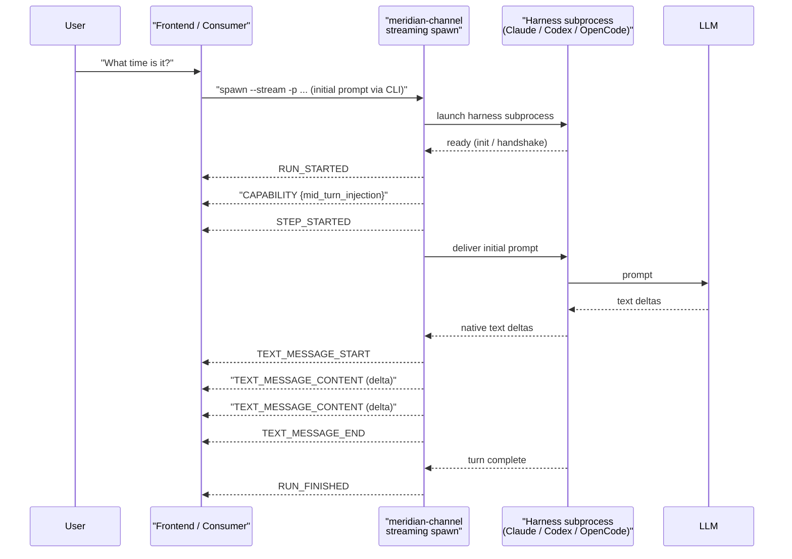
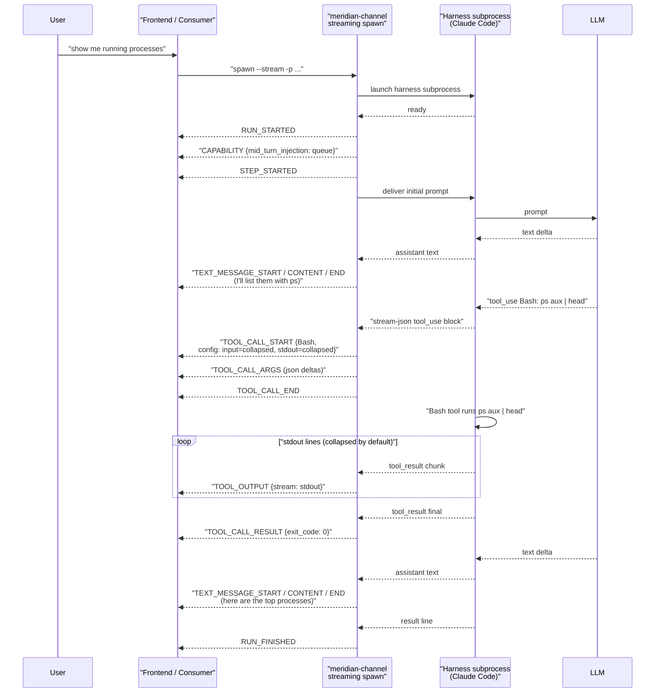

# Event Flow

The canonical AG-UI event sequence emitted by a meridian-channel streaming
spawn, from `RUN_STARTED` through `RUN_FINISHED`. This doc describes *what
happens on the wire*; it does not redefine the events themselves — the names
and payload contracts come from meridian-flow's
[`streaming-walkthrough.md`](../../../../../../meridian-flow/.meridian/work/biomedical-mvp/design/streaming-walkthrough.md)
and [`backend/display-results.md`](../../../../../../meridian-flow/.meridian/work/biomedical-mvp/design/backend/display-results.md).

For the per-harness wire-format → AG-UI mapping, see
[harness-translation.md](harness-translation.md). For the adapter contract
that produces these events, see [`../harness/abstraction.md`](../harness/abstraction.md).

## Event Sequence Overview

A single meridian-channel streaming spawn produces this canonical AG-UI
sequence. Every harness adapter (Claude Code, Codex, OpenCode) honors the
same order; only the source events differ.

| # | Event | Emitted by adapter when … |
|---|---|---|
| 1 | `RUN_STARTED` | Adapter has launched the harness subprocess and the harness has acknowledged readiness (Claude: `system` init line; Codex: `initialize` response; OpenCode: session create response) |
| 2 | `CAPABILITY` | Immediately after `RUN_STARTED`, declaring per-harness capabilities (notably `mid_turn_injection: queue \| interrupt_restart \| http_post \| none`). See "Capability Event Placement" below |
| 3 | `STEP_STARTED` | A new turn begins inside the run (initial prompt acknowledged, or a mid-turn injection causes a new turn boundary) |
| 4 | `THINKING_START` / `THINKING_TEXT_MESSAGE_CONTENT` | Harness emits agent reasoning (Claude `thinking` blocks; Codex `item/reasoning/*`; OpenCode reasoning events). Skipped if the harness does not surface reasoning for this turn |
| 5 | `TEXT_MESSAGE_START` / `TEXT_MESSAGE_CONTENT` / `TEXT_MESSAGE_END` | Harness streams assistant text deltas. `START` on the first delta of a contiguous text block, `CONTENT` per delta, `END` when the block closes |
| 6 | `TOOL_CALL_START` | Harness emits a `tool_use` content block. Payload includes `toolName`, `toolCallId`, and the per-tool render config (see "Per-Tool Behavior Config Attachment" below) |
| 7 | `TOOL_CALL_ARGS` | Streaming JSON deltas of the tool input arguments — emitted as the harness streams them, not buffered |
| 8 | `TOOL_CALL_END` | Tool input is complete and the harness is about to invoke the tool |
| 9 | `TOOL_OUTPUT` `{stream: stdout \| stderr}` | Streaming tool execution output. Per-tool config decides if it renders inline, collapsed, or hidden-popup |
| 10 | `TOOL_CALL_RESULT` | Tool completed; payload includes exit code and structured result summary |
| 11 | `DISPLAY_RESULT` `{resultType}` | Structured tool result (text, markdown, image, table, mesh_ref, etc.). Emitted only when the tool surfaces rich content for inline rendering |
| 12 | `RUN_FINISHED` | Adapter has observed the harness's terminal signal (Claude `result` line; Codex `turn/completed`; OpenCode session completion event) |

Steps 4–11 repeat as the agent thinks, writes text, and calls tools. Steps
3–11 repeat when a new turn boundary occurs (initial turn, mid-turn injection,
or harness-driven step).

## Per-Event Origin (Brief)

For each event the adapter consumes a specific harness-native field. Below is
the *terse* version — the full mapping table lives in
[harness-translation.md](harness-translation.md).

| AG-UI event | Claude Code source | Codex source | OpenCode source |
|---|---|---|---|
| `RUN_STARTED` | `system` init line on stdout | `initialize` JSON-RPC response | session create response |
| `CAPABILITY` | adapter-emitted constant | adapter-emitted constant | adapter-emitted constant |
| `STEP_STARTED` | first `assistant` event after a user turn | `turn/start` notification | `session.turn.started` SSE event |
| `THINKING_*` | `assistant.content[].type == "thinking"` deltas | `item/reasoning/*` notifications | reasoning event family |
| `TEXT_MESSAGE_*` | `assistant.content[].type == "text"` deltas | `item/agentMessage/*` notifications | `message.delta` SSE events |
| `TOOL_CALL_START` | `assistant.content[].type == "tool_use"` (block opens) | `item/tool_call/start` notification | `tool.invoked` SSE event |
| `TOOL_CALL_ARGS` | `tool_use.input` JSON deltas | `item/tool_call/delta` notifications | tool args deltas |
| `TOOL_CALL_END` | `tool_use` block closes | `item/tool_call/end` notification | tool args complete |
| `TOOL_OUTPUT` | `user.content[].type == "tool_result"` partials | `item/commandExecution/output` notifications | `tool.output` SSE events |
| `TOOL_CALL_RESULT` | `user.content[].type == "tool_result"` (final) | `item/tool_call/completed` notification | `tool.completed` SSE event |
| `DISPLAY_RESULT` | adapter-synthesized from result block | adapter-synthesized from result block | adapter-synthesized from result block |
| `RUN_FINISHED` | `result` line on stdout | `turn/completed` notification | `session.completed` SSE event |

See [harness-translation.md](harness-translation.md) for the full row-by-row
table per harness.

## Example Trace 1: Simple Text Turn (no tool calls)

User asks "What time is it?", agent answers with text only. This is the
minimal happy-path trace, shown as the **initial turn of a new streaming
spawn** — the prompt arrives via `meridian spawn --stream -p "..."`, not
via stdin. (The mid-turn injection variant is sketched at the end of
"Stdin Control Frames and Turn Boundaries" below.)



**What the consumer sees**: a single `ContentItem` in the activity stream
with the assistant's text, no tool rows, no display results. The reducer
applies the "text never collapsed" default per
[`streaming-walkthrough.md` Step 5](../../../../../../meridian-flow/.meridian/work/biomedical-mvp/design/streaming-walkthrough.md).

## Example Trace 2: Tool-Call Turn With Inline Output

User asks the Claude Code adapter to "show me the running processes". The
agent calls the `Bash` tool with `ps aux | head`. The adapter emits the bash
tool config (`input: collapsed, stdout: collapsed`) on `TOOL_CALL_START`, so
the row renders collapsed by default — the user sees a one-line summary
unless they expand it. Shown again as the initial turn of a new streaming
spawn.



**What the consumer sees**: a `ContentItem` ("I'll list them with ps"),
followed by a collapsed `ToolItem` (Bash) showing only the header
("ran 1 command"), followed by another `ContentItem` ("here are the top
processes"). The user can expand the bash row to see input + stdout.

**Compare to a Python tool turn**: if the same trace ran the Python tool
instead, `TOOL_CALL_START` would carry `config: stdout=visible` per
meridian-flow's [`python-tool.md`](../../../../../../meridian-flow/.meridian/work/biomedical-mvp/design/backend/python-tool.md),
and stdout would render inline beneath the tool row by default. The reducer
logic doesn't change — only the per-tool config attached to the event does.
A `show_mesh()` call in the Python code would also produce
`DISPLAY_RESULT {resultType: mesh_ref}` events that render as inline mesh
cards, exactly as Step 10 of meridian-flow's streaming walkthrough describes.

## Per-Tool Behavior Config Attachment

The frontend reducer must not have to special-case tool names. Instead, each
`TOOL_CALL_START` event carries a render config object describing how the
input, stdout, and stderr should be presented:

```jsonc
// TOOL_CALL_START payload (subset)
{
  "type": "TOOL_CALL_START",
  "toolCallId": "tc_01J...",
  "toolName": "Bash",
  "config": {
    "input": "collapsed",       // visible | collapsed
    "stdout": "collapsed",      // visible | collapsed | inline
    "stderr": "hidden-popup"    // visible | collapsed | hidden-popup
  }
}
```

The exact field names and value enums are owned by meridian-flow's
[`frontend/component-architecture.md`](../../../../../../meridian-flow/.meridian/work/biomedical-mvp/design/frontend/component-architecture.md)
(`ToolDisplayConfig` type) and the canonical examples in
[`backend/python-tool.md`](../../../../../../meridian-flow/.meridian/work/biomedical-mvp/design/backend/python-tool.md)
and [`backend/bash-tool.md`](../../../../../../meridian-flow/.meridian/work/biomedical-mvp/design/backend/bash-tool.md).
meridian-channel's adapters reuse those values verbatim — no new vocabulary.

**Each adapter owns its harness's tool-config dictionary.** Claude Code's
adapter knows about `Bash`, `Read`, `Write`, `Edit`, `Grep`, `Glob`, `Task`,
`WebFetch`, `WebSearch`, etc., and what render defaults each takes. Codex's
adapter knows its tool set. OpenCode's adapter knows its tool set. The shared
table lives in `harness/ag_ui_events.py` so the three adapters can't drift on
the config shape, but each adapter owns the rows for its harness's tools.
Per-harness tables are listed in
[harness-translation.md](harness-translation.md).

When a harness adds a new tool, the only update needed is one row in the
adapter's config dict — the reducer requires no change because it always
reads the config off the event payload.

## Capability Event Placement

The adapter emits `CAPABILITY` **immediately after** `RUN_STARTED`, before
the first `STEP_STARTED`. This gives the consumer the per-harness mid-turn
injection semantic before the user can submit a mid-turn message:

```jsonc
{
  "type": "CAPABILITY",
  "mid_turn_injection": "queue",          // queue | interrupt_restart | http_post | none
  "runtime_model_switch": false,
  "runtime_permission_switch": false,
  "structured_reasoning_stream": true,
  "cost_tracking": true
}
```

The semantic enum is the one from
[`findings-harness-protocols.md` §1](../../findings-harness-protocols.md).
The consumer renders the right affordance: a Claude consumer shows
"queued for next turn" feedback; a Codex consumer shows "this will interrupt
the current turn"; an OpenCode consumer shows the standard send button.
**Per [D37](../../decisions.md), adapters do not lie about wire-level
behavior to fake uniformity.**

The full per-harness semantics (and the stdin control frame format that
drives them) live in [`../harness/mid-turn-steering.md`](../harness/mid-turn-steering.md).
This doc just notes the placement and the on-wire shape.

## Lifecycle Integration With Existing Artifacts

**Streaming AG-UI emission is additive, not a replacement.** Even in
streaming mode, the adapter still writes the existing per-spawn artifacts to
`.meridian/spawns/<spawn_id>/`:

| Artifact | Producer | Consumer | Why it survives |
|---|---|---|---|
| `report.md` | adapter (final report extraction) | `spawn show`, `spawn report show`, `--from`, `reaper.py` | The dogfood `--from` workflow renders the prior spawn's report into the next spawn's prompt; reaper treats `report.md` as the durable completion signal |
| `output.jsonl` | `launch/runner.py` | `spawn log`, `spawn show` | Raw harness stdout for forensic inspection |
| `stderr.log` | `launch/runner.py` | `spawn log`, `ops/spawn/query.py` | Last-assistant-message extraction for running spawns |
| `prompt.md` | adapter (prompt assembly) | `spawn show`, debugging | Materialized prompt as sent to the harness |
| `params.json` | adapter (launch metadata) | dry-run, `spawn show` | Wire contract for dry-run JSON output |
| `heartbeat` | `launch/runner.py` | `reaper.py` | Liveness signal for orphan detection |
| `harness.pid` | `launch/runner.py` | `reaper.py`, `cancel` | Foreground harness PID for signal delivery |

Per [`../refactor-touchpoints.md` Structural Analysis](../refactor-touchpoints.md#structural-analysis),
all of `spawn show`, `spawn log`, `spawn wait`, `spawn stats`, `--from`, and
`--fork` depend on these artifacts. The streaming AG-UI events are an
**additional** output channel for live consumption (frontends, mid-turn
steering, dev-orchestrator → child injection), not a replacement for the
artifact contract that the existing dev-workflow already depends on.

The contract is:

- **Live consumers** (meridian-flow backend, dev-orchestrator inject, future
  CLI tail commands) consume the AG-UI event stream over the streaming
  spawn's stdout.
- **Post-hoc consumers** (`spawn show`, `spawn log`, `--from`, `reaper`,
  smoke tests) read the same artifacts they read today.

The adapter is the producer for both, but the storage paths are independent.
A failure or regression in AG-UI emission must not break the artifact
contract, and vice versa. This is the central preservation rule of the
refactor — see [D33](../../decisions.md) and
[`../refactor-touchpoints.md`](../refactor-touchpoints.md).

## Stdin Control Frames and Turn Boundaries

The streaming spawn's stdin is a JSONL control channel
(see [D37](../../decisions.md)). Control frames affect the AG-UI event
stream as follows:

- **`{"type": "user_message", "text": "..."}`** — mid-turn user input. The
  adapter delivers it via its harness's mid-turn semantic. The on-wire
  consequence in the AG-UI stream depends on the harness:
  - **Claude (queue)**: no immediate event; the next `STEP_STARTED` arrives
    when Claude reaches a turn boundary and consumes the queued message.
  - **Codex (interrupt_restart)**: a `STEP_STARTED` for the new turn arrives
    promptly after the adapter issues `turn/interrupt` + `turn/start`.
  - **OpenCode (http_post)**: the POST is acknowledged asynchronously; the
    next `STEP_STARTED` arrives when OpenCode begins the new turn.
- **`{"type": "interrupt"}`** — stop the current turn but keep the spawn
  alive. Adapter signals the harness; the in-flight turn ends with a
  `RUN_FINISHED`-equivalent step boundary, and the spawn waits for the next
  control frame.
- **`{"type": "cancel"}`** — terminate the spawn entirely. Adapter tears down
  the harness subprocess (SIGTERM with timeout, then SIGKILL); the AG-UI
  stream ends with `RUN_FINISHED`.

This doc deliberately does **not** cover the per-harness wire-level details
of how the adapter delivers each control frame — that lives in
[`../harness/mid-turn-steering.md`](../harness/mid-turn-steering.md). The
events doc only describes the *AG-UI event consequences* of each control
frame so consumers know what to render. For the full semantics — how
ordering between rapid `user_message` and `interrupt` resolves on each
harness, what happens when injection is impossible mid-tool-execution, and
how the adapter buffers vs drops — read the harness doc.
