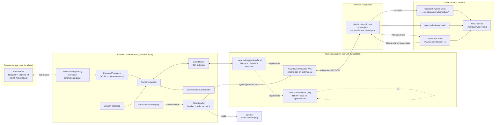

# agent-shell-mvp — Design Overview

> System map for the agent-shell MVP. Read this first; every other doc in
> `design/` is a deeper dive on one component named here.
>
> **Status update (2026-04-08, p1135).** Three corrections from
> [`findings-harness-protocols.md`](../findings-harness-protocols.md):
> Codex `app-server` is tier-1 V1-capable (not "TBD"); mid-turn steering is
> tier-1 V0 (not deferred); capability semantics surface as a semantic
> enum, not a boolean. The §5 architectural invariants and §6 V0/V1 scope
> fence have been updated. See `synthesis.md` for the user decisions.

## 1. What this is

**agent-shell-mvp** is a **domain-flexible local agent shell**. It runs entirely
on a single user's machine, wraps a coding-agent harness (Claude Code in V0,
opencode in V1) as the conductor, and presents a polished web UI for an end
user who has never opened a terminal.

The first validation customer is **Dad at the Yao Lab (University of Rochester,
musculoskeletal research)**. The validation pipeline is the lab's μCT analysis
workflow — DICOM ingest, segmentation, landmark detection, statistics,
publication figures — today done in Amira with a one-year learning curve. The
shell must let him do that pipeline on his real data without fighting the tool.

The product is the **amalgamation of three existing efforts**:

- **meridian-channel** (this repo) — agent profile system, skill loading, mars
  sync, harness adapter pattern, files-as-authority discipline, work-item
  lifecycle.
- **meridian-flow biomedical-mvp pivot** — WebSocket activity-stream contract,
  `ActivityBlock` model, file-based result capture protocol (`show_plotly`,
  `show_mesh`, etc.), persistent kernel design, 3D viewer model.
- **meridian-flow frontend-v2** — React 19 + Tailwind v4 frontend with the
  AG-UI activity stream reducer, WebSocket client, thread components, shadcn
  atom set, CodeMirror 6 editor.

The shell is **generic**. Domain specialization happens through **agent
profiles + skills + interactive tools** that the agent can call. Pivoting to a
non-biomedical domain is "swap the profile, swap the skills, swap the tools" —
not "rewrite the shell." Biomedical may not be the long-term domain; the
architecture must not assume it is.

## 2. System topology

The diagram is the system in one picture. Boxes that share a subgraph are
co-located. Arrows are runtime data flow, not import direction.

## 3. Component map

Each component below has its own design doc that goes deep on interface,
contracts, and edge cases. This section is the index — one paragraph each, plus
the link.

### Backend gateway and protocol — [frontend-protocol.md](./frontend-protocol.md), [event-flow.md](./event-flow.md)

A single FastAPI process. Hosts the WebSocket gateway that frontend-v2
connects to, plus the REST surface for non-streaming reads (thread list, work
item metadata). The gateway speaks the **frontend-v2 envelope** (`kind`, `op`,
`resource`, `subId`, `seq`, `epoch`, `payload`) and the **AG-UI activity-stream
event vocabulary** that the existing reducer already understands. The Python
backend reuses, not redesigns, the contract that biomedical-mvp had already
locked in: `RUN_STARTED`, `TEXT_MESSAGE_CONTENT`, `TOOL_CALL_START` /
`_ARGS` / `_END` / `_RESULT`, `TOOL_OUTPUT`, `DISPLAY_RESULT`, `RUN_FINISHED`.

### Harness abstraction — [harness-abstraction.md](./harness-abstraction.md)

The load-bearing piece. A SOLID-compliant interface that wraps a long-lived
agent subprocess. Split into three sub-interfaces — `HarnessLifecycle`
(start/stop/health), `HarnessSender` (user message, interrupt, approve tool),
`HarnessReceiver` (event stream out) — so consumers depend on only what they
need. The interface is designed against opencode's HTTP/ACP shape (the cleaner
one) and Claude Code is bent to fit, not the other way around. **Conceptually
descended from meridian-channel's existing single-shot adapters in
`src/meridian/lib/harness/` but not bound by them** — the existing adapters are
"one prompt → one process → one report"; the new ones are session-lived and
bidirectional.

### Agent loading — [agent-loading.md](./agent-loading.md)

Reuses meridian-channel's existing `.agents/` machinery (mars sync,
`catalog/agent.py`, `catalog/skill.py`, `launch/resolve.py`,
`launch/prompt.py`). The shell does **not** invent a parallel agent registry.
At session start the backend resolves the configured agent profile (e.g.
`data-analyst`), pulls its skill set, and feeds the result through the harness
adapter's existing prompt-policy lanes (Claude Code: profile body and skills
merged into `--append-system-prompt`, shell tools via `--mcp-config`; opencode:
agent + skills via the HTTP `system` field on session creation). This is the seam where the
biomedical persona and biomedical skills attach to a generic shell.

### Interactive tool protocol — [interactive-tool-protocol.md](./interactive-tool-protocol.md)

How the agent calls a **blocking interactive Python tool** (e.g. PyVista point
picker) and gets structured results back. The model is: agent invokes a
registered tool name with JSON args → tool launches a standalone window in the
local venv → user interacts → window closes → tool serializes result as JSON
→ agent continues. The shell does not know what PyVista is; it knows that
*some* tools are blocking-interactive and routes them through a registry. New
domains ship new tools without modifying the shell. This is **the** mechanism
for Decision 10's co-pilot model (Path B: human-in-the-loop correction).

### Frontend integration — [frontend-integration.md](./frontend-integration.md)

frontend-v2 is **copied into this repo** under `frontend/`, not symlinked. This
doc enumerates what stays (activity stream, threads, ws-client, ui atoms,
editor for figure/text drafting), what gets cut (writing-app document tree,
tabbed editor shell, paste-image stub, exporter stubs), and what gets newly
built (top-level layout, stores, API client pointed at the Python backend,
dataset browser). The `ActivityBlock` reducer stays as-is — its event
vocabulary IS the contract.

### Local execution runtime — [local-execution.md](./local-execution.md)

The agent's `python` and `bash` tools execute against a **separate local
uv-managed runtime venv** at `~/.meridian/venvs/biomedical/` with the
biomedical analysis stack pre-installed (SimpleITK, scipy, numpy, pandas,
scikit-image, plotly, matplotlib, pydicom, trimesh, PyVista).
Python runs in a **persistent kernel** so variables and imports survive across
tool calls — this matches the biomedical-mvp `result_helper` design and the
streaming-walkthrough sequencing (`TOOL_OUTPUT` while running, `DISPLAY_RESULT`
after capture). Results flow through the same file-based capture protocol the
biomedical-mvp pivot defined: helpers write to `.meridian/result.json` plus
binary mesh sidecars. **No Daytona, no cloud, no sandbox isolation in V0** —
this is single-user local code.

### Repository layout — [repository-layout.md](./repository-layout.md)

Where new code lives in meridian-channel, and how launching the shell relates
to the existing CLI. Shell start is a new meridian subcommand (`meridian shell
start`) that boots the FastAPI backend, opens the browser to the served
frontend, and orchestrates the harness lifecycle. Existing meridian dev CLI
commands keep working; the shell is purely additive. `uv sync` installs the
backend; `meridian shell init biomedical` provisions the analysis venv; `mars
sync` continues to maintain `.agents/`. This doc resolves Q3 from
requirements.md.

### Event flow end-to-end — [event-flow.md](./event-flow.md)

The choreography across all of the above. Takes one user message, walks it
through translator → router → adapter → harness → tool → result capture →
events back out. Includes the mid-turn injection design (even if V1) so the
abstraction does not get warped later. Companion's reverse-engineered
stream-json behavior is the primary reference for Claude-side mechanics.

## 4. Data flow: "Dad types a message → sees results"

Concrete walkthrough. Numbers cross-reference §3 components.

1. Dad opens `http://localhost:<port>` (started by `meridian shell start`).
   The frontend (§3 frontend-integration) loads, opens a WebSocket to the
   backend (§3 backend gateway), and subscribes to the active work item.
2. Dad types `"Run preprocessing on the femur DICOM stack I just uploaded"`
   into the chat composer and presses send. The frontend dispatches a
   `send_user_message` envelope on the WebSocket.
3. The backend's `FrontendTranslator` (§3 backend gateway) receives the
   envelope, looks up the active session, and calls
   `HarnessSender.send_user_message` on the bound `HarnessAdapter`
   (§3 harness abstraction).
4. `ClaudeCodeAdapter` writes a stream-json `user` message to its long-lived
   `claude --input-format stream-json` subprocess's stdin. The subprocess was
   started at session creation (§3 agent loading) with the data-analyst profile
   and biomedical skills merged into `--append-system-prompt`, plus shell-owned
   tools exposed via `--mcp-config`.
5. Claude Code emits stream-json events back on stdout — `message_start`,
   `content_block_start`, `content_block_delta` (assistant text), then
   `tool_use` blocks for `python` calls.
6. `HarnessReceiver` reads each NDJSON line, normalizes it to a Meridian-native
   event (e.g. `harness.text.delta`, `harness.tool_call.start`), and pushes
   onto the `EventRouter` queue.
7. The `EventRouter` calls into `FrontendTranslator` again, this time in the
   outbound direction: harness events become AG-UI events
   (`TEXT_MESSAGE_CONTENT`, `TOOL_CALL_START`, `TOOL_CALL_ARGS`,
   `TOOL_CALL_END`). The translator publishes them on the WebSocket subscription.
8. The frontend's activity stream reducer (unchanged from biomedical-mvp pivot)
   updates the `ActivityBlock` for the current turn. Dad sees streaming
   thinking text, then a `python` tool call appearing.
9. Claude's `python` tool call routes through the local execution runtime
   (§3 local-execution): the persistent kernel runs the code, the kernel
   wrapper streams `stdout` lines as `TOOL_OUTPUT` events, then on completion
   reads `.meridian/result.json` and emits a `DISPLAY_RESULT` event. If a mesh
   was produced, the binary mesh frame goes out on the same WebSocket using
   the existing `[subId]\0[meshId]\0[payload]` framing.
10. If the agent decides it cannot determine femur landmarks alone, it calls
    `pick_points_on_mesh(mesh_id="femur_seg_v1", n=4)` — a registered
    interactive tool (§3 interactive-tool-protocol). A standalone PyVista
    window opens on Dad's desktop. He clicks four landmarks. The window
    closes. The tool returns `{"points": [[x,y,z], ...]}`. The agent receives
    the result via the normal `tool_result` block path and continues.
11. When the turn finishes, Claude emits `result` / `RUN_FINISHED`. Files
    written by the run live under `.meridian/work/<work-item>/` — they are
    the scientific audit trail (Decision 9). The decision log doubles as a
    methods section.
12. Dad reads the assistant's narration in the chat, inspects the rendered
    plots and 3D mesh in the activity stream, and either says "next step" or
    course-corrects.

## 5. Invariants this design commits to

These are properties downstream design and implementation must preserve. They
are the load-bearing constraints, not aspirations.

- **Files as authority extends to scientific reproducibility.** Every analysis
  step's inputs, outputs, parameters, and decisions land as files under the
  work-item directory. The decision log doubles as a methods section. This is
  a feature inherited from meridian-channel and amplified, not bolted on.
- **Harness abstraction is SOLID-compliant and opencode-neutral.** SRP, OCP,
  ISP, LSP, DIP all apply. The interface is designed against opencode's
  HTTP/ACP shape and Claude Code is the awkward implementer, not the other
  way around. Adding opencode in V1 = one new adapter file + registration; no
  changes to translator, router, gateway, or frontend.
- **V0 ships exactly one harness adapter: Claude Code.** Codex `app-server`
  and OpenCode are both **tier-1 V1-capable** per
  `findings-harness-protocols.md` — codex's stable JSON-RPC stdio protocol
  (`thread/start`, `turn/start`, `turn/interrupt`) was earlier framed as
  "TBD" and that framing is now corrected. The V1 ordering between codex
  and opencode is a product decision (whichever validation customer or use
  case shows up next), not a protocol-risk decision. Codex `exec` mode is
  the single-shot transport that doesn't fit; codex `app-server` is the
  one we'd actually use.
- **V0 is single-user, local-only.** No auth, no Supabase, no Daytona, no
  Go backend, no cloud, no multi-tenancy, and no permission gating in V0. One
  human, one machine, one backend process per work item. Multiple tabs attach
  to the same live session.
- **Domain extension happens through profiles + skills + interactive tools,
  never through shell changes.** A new domain is "drop a new agent profile,
  drop new skills, drop new interactive tools, run mars sync." If a domain
  pivot would require editing the shell, the abstraction is wrong.
- **frontend-v2 is copied, not symlinked.** It lives at `frontend/` in this
  repo and evolves independently from any meridian-flow copy. Drift from the
  original is expected and acceptable; cross-repo coupling is not.
- **The biomedical-mvp WebSocket / ActivityBlock contract is adopted as-is.**
  The Python backend implements it; the frontend reducer is not modified. If
  the contract is wrong somewhere, fix it in one place and propagate, but the
  default position is "the contract already exists; honor it."
- **Persistent kernel is the default execution model.** Variables, imports,
  loaded volumes, segmentation results survive across tool calls within a
  session. This matches biomedical workflows where re-loading a 4 GB DICOM
  stack on every cell is unacceptable.
- **The shell is harness-agnostic at the abstraction layer even though V0
  only ships Claude.** Tests must exercise the abstraction with at least one
  fake adapter so the OCP commitment does not silently rot before V1.
- **Co-pilot, not autonomous.** The product is co-pilot with feedback loops.
  Path A (vision-based self-feedback) and Path B (human-in-the-loop via
  interactive tools) are both first-class. "Autonomous end-to-end" framing
  from earlier requirements is superseded.

## 6. Scope fence

### V0 (this design's target)

- `ClaudeCodeAdapter` only — long-lived `claude --input-format stream-json
  --output-format stream-json` subprocess wrapped by the harness abstraction
- FastAPI + WebSocket backend, local-only, single user
- frontend-v2 copied into `frontend/`, missing pieces filled in (top-level
  layout, API client, dataset browser), writing-app legacy cut
- AG-UI activity-stream WebSocket protocol from biomedical-mvp, with
  `SESSION_HELLO` and `SESSION_RESYNC`
- Separate biomedical runtime venv at `~/.meridian/venvs/biomedical/`
- Persistent Python kernel matching biomedical-mvp's result_helper design
- File-based result capture (`.meridian/result.json`, mesh sidecars, binary
  WS frames)
- Biomedical V0 deliverables: `data-analyst` agent profile + biomedical skills
  + at least one PyVista interactive tool (point picker)
- Reuse of `.agents/` loading via existing mars sync flow
- New `meridian shell start` subcommand to boot backend + browser + harness
- Decision log + work-item file layout = scientific audit trail
- Path A vision-based self-feedback using normal `python` + image result flow

### V0 — additionally added by p1135 correction pass

- **Mid-turn injection is V0, tier-1.** All three primary harness adapters
  (Claude V0, Codex V1, OpenCode V1) implement
  `HarnessSender.inject_user_message()` from day one. ClaudeCodeAdapter's
  V0 mode is `queue` (write `user` NDJSON to stream-json stdin → Claude
  delivers at next turn boundary). The frontend composer is enabled
  mid-turn from V0; `meridian spawn inject <spawn_id>` ships as a V0 CLI
  command.

### V1

- `CodexAppServerAdapter` (JSON-RPC stdio), riding the same harness abstraction
- `OpenCodeAdapter` (HTTP + SSE), riding the same harness abstraction
- Permission gating with UI approval flow (companion-style)
- Session persistence and resume across server restarts
- More interactive tools (box picker, region picker, multi-mesh scenes)

### Deferred indefinitely

- Codex `exec` headless mode (single-shot transport; doesn't fit). Note:
  this is **not** the same as codex `app-server`, which is tier-1 V1-capable.
- Daytona / remote sandbox execution
- Supabase / cloud persistence
- Auth, multi-user, billing
- Go backend from meridian-flow
- Rewriting meridian-channel out of Python (Decision 8 — explicitly parked)
- Cross-machine sync, deployment, hosting

## 7. Open questions (NOT resolved by this overview)

These are the orchestrator's job to surface to the user. Each is summarized;
the canonical statements are in `requirements.md` §"Open questions for the
design phase to resolve".

- **Q1 — Replace, coexist, or replace-eventually for meridian-flow?** User
  leans (c) "replace eventually" but has not committed. Affects how much
  design quality this V0 deserves.
- **Q2 — V0 scope on three optional features.** **Updated by p1135.**
  Mid-turn injection is now **tier-1 V0**, not deferred. See `synthesis.md`
  Q6 for the user decision. Permission gating and session persistence
  remain V1.
- **Q3 — Repository layout details.** This overview commits to "new code
  lives in this repo, shell is a new `meridian shell` subcommand", but the
  exact directory split (`backend/` vs `src/meridian/shell/`,
  `frontend/` placement, `uv sync` extras) is the job of repository-layout.md.
- **Q4 — frontend-v2 stays vs cuts.** This overview names the broad strokes
  (cut document tree, keep activity stream/threads/ws-client/atoms, keep
  editor for paper drafting) but the line-item enumeration belongs in
  frontend-integration.md.
- **Q5 — Mid-turn injection priority for opencode vs Claude Code.** Even if
  injection is V1, the abstraction must accommodate it. The harness
  abstraction must be designed against opencode's simpler shape and not
  warped by Claude Code's harder one.

These are inputs to design, not outputs. Resolve Q1 and Q2 with the user
before final design lock-in; Q3, Q4, Q5 are design-internal and will be
resolved in their respective deep-dive docs.

## 8. Cross-references

Use this map to jump from "I need to know X" to the right doc.

- **"What does the harness interface look like? How is it SOLID?"** →
  [harness-abstraction.md](./harness-abstraction.md)
- **"What events flow over the WebSocket? What's the envelope shape?"** →
  [frontend-protocol.md](./frontend-protocol.md)
- **"How does one user message become rendered output, end to end?"** →
  [event-flow.md](./event-flow.md)
- **"How does the backend pick up the data-analyst agent and biomedical
  skills?"** → [agent-loading.md](./agent-loading.md)
- **"How does the agent open a PyVista picker and get points back?"** →
  [interactive-tool-protocol.md](./interactive-tool-protocol.md)
- **"What from frontend-v2 stays, cuts, or gets rebuilt?"** →
  [frontend-integration.md](./frontend-integration.md)
- **"Where does the venv live, how does the persistent kernel work, how do
  bash and python share state?"** → [local-execution.md](./local-execution.md)
- **"Where does new code live in the repo? How do I launch the shell?"** →
  [repository-layout.md](./repository-layout.md)
- **"What's the contract for `DISPLAY_RESULT` and binary mesh frames?"** →
  [frontend-protocol.md](./frontend-protocol.md) and
  [event-flow.md](./event-flow.md)
- **"What does the existing meridian-channel harness layer give me for
  free?"** → see `exploration/meridian-channel-harness-grounding.md` (and the
  reuse-candidates list) before designing
  [harness-abstraction.md](./harness-abstraction.md)

Grounding sources every deep-dive author should read before writing:

- `requirements.md` — the contract; Decisions 1–10 are inputs, not debate
- `exploration/biomedical-mvp-grounding.md` — the existing AG-UI and
  result-capture protocol
- `exploration/frontend-v2-grounding.md` — the frontend's current state
- `exploration/meridian-channel-harness-grounding.md` — what the existing
  single-shot adapters give us (and where they stop)
- `exploration/external-protocols-research.md` — Companion + opencode + codex
  protocol comparison

## 9. Customer reminder

This is for **Dad** at the Yao Lab. He is a real human, the first user, the
validation customer. He uses Amira today and it has a one-year learning curve.
The MVP is "good enough to do his actual μCT pipeline on his actual data
without fighting the tool." V0 is honest about one remaining gap: **use is
Dad-friendly, but install + launch is developer-mediated**. Jim runs
`meridian shell start` on Dad's machine, bookmarks the localhost URL, and a
real launcher is deferred to V1. Every decision in every deep-dive should be
checkable against "would this make Dad's life better."
