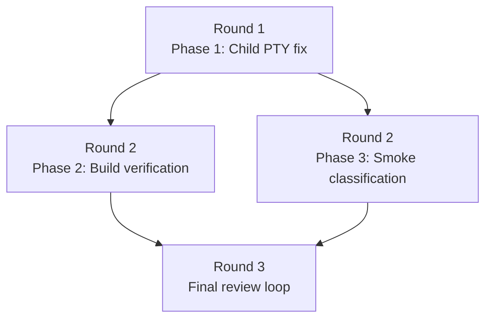

# Implementation Plan: PTY Terminal Passthrough Fix

## Summary

Land the minimal child-side PTY fix in `src/meridian/lib/launch/process.py`, verify repository build health with `ruff` and `pyright`, then execute the approved smoke matrix with baseline-first classification so Meridian-caused failures are separated from upstream harness behavior.

## Parallelism Posture

**Posture:** limited

**Cause:** the code change is a single shared dependency in one launch file, so implementation must land first. After that, build verification and smoke execution can proceed in parallel because they do not share write scope and produce different evidence types.

## Round Plan

### Round 1

- Phase 1: `phase-1-child-pty-login-tty-fix`

**Justification:** `src/meridian/lib/launch/process.py` is the only intended code-change surface, and every later lane depends on the patched PTY child path existing first.

### Round 2

- Phase 2: `phase-2-build-health`
- Phase 3: `phase-3-smoke-classification-and-fallbacks`

**Justification:** once the PTY fix lands, build health and runtime smoke evidence can be gathered concurrently. Phase 2 proves the repo still passes `ruff` and `pyright`; Phase 3 proves the launch behavior surface meets the EARS contract and applies the `--harness` correction operationally when running T-09 through T-11.

### Round 3

- Final review loop

**Justification:** reviewers need the complete change plus verification evidence from Phases 2 and 3 before they can judge design alignment, cross-platform risk, and structural discipline.

## Decision Coverage

| Decision | Planned owner | How it is carried |
|---|---|---|
| `D-01` use `os.login_tty(slave_fd)` | Phase 1 | direct code change in `process.py` |
| `D-02` preserve parent-side winsize forwarding | Phase 1 | explicit boundary: no parent-side PTY refactor |
| `D-03` no refactor agenda required | Overview + Phase 1 | refactor table shows none; phase boundary forbids widening |
| `D-04` baseline-first failure classification | Phase 3 | smoke execution procedure and exit criteria |
| `D-05` issue is signal delivery, not winsize propagation | Phase 1 + Phase 3 | child-side fix only; smoke focuses on resize/interrupt parity |
| `D-06` spec stays behavioral, architecture stays mechanistic | Phase 3 + final review | evidence is tied back to EARS behavior, not reimplementation detail |

## Refactor Handling

| Refactor ID | Disposition | Reason |
|---|---|---|
| none | no refactor work scheduled | `design/refactors.md` is absent and `D-03` explicitly classifies this work as a minimal bug fix, not a structural change |

## Staffing Contract

### Per-Phase Teams

| Phase | Primary implementer | Tester lanes | Intermediate escalation policy |
|---|---|---|---|
| Phase 1 | `@coder` on profile default model | none in-phase; follow-on verification is owned by Phase 2 and Phase 3 | escalate to a scoped `@reviewer` only if the fix appears to require widening beyond `src/meridian/lib/launch/process.py` or changes POSIX/Windows fallback boundaries |
| Phase 2 | `@coder` only if Phase 1 fallout must be corrected | `@verifier` mandatory | if `ruff` or `pyright` failures cannot be resolved as direct fallout from the PTY fix, stop and request scoped reviewer guidance instead of broad cleanup |
| Phase 3 | `@coder` only if smoke evidence reopens implementation | `@smoke-tester` mandatory | if smoke evidence is ambiguous after baseline comparison and `spawn log` / session evidence review, use a scoped `@reviewer` on launch semantics before changing code |

### Final Review Loop

- Run one default-model `@reviewer` lane for design alignment and evidence completeness.
- Run one alternate-model-family `@reviewer` lane chosen from `meridian models list` for independent launch/cross-platform risk review.
- Run one default-model `@refactor-reviewer` lane to confirm the fix stayed minimal and did not introduce structural drift.
- Re-run coder plus the affected tester lane(s) until reviewers converge on no new substantive findings.

### Escalation Policy

- Tester findings that point to a direct bug in `process.py` route back to the Phase 1 coder with the failing test IDs and baseline comparison evidence.
- Tester findings that remain ambiguous after baseline and log review escalate to a scoped reviewer; do not let the coder guess at root cause.
- Upstream-only failures are documented as such and do not reopen implementation unless Meridian behavior diverges from the same upstream failure mode.

## Mermaid Fanout

