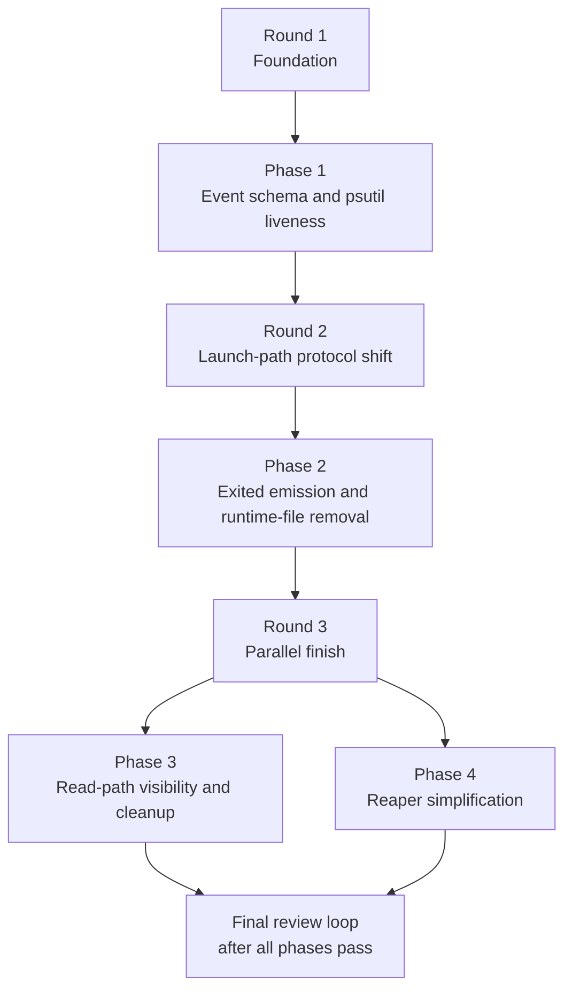

# Implementation Plan: Spawn Lifecycle Rearchitecture

## Parallelism Posture

**Posture:** limited

**Cause:** The work has one hard serial chain up front: Phase 1 owns the event-schema and `psutil` foundation, and Phase 2 depends on that schema to emit `runner_pid` and `exited` correctly from every launch path. After that, the remaining work splits cleanly into two disjoint write sets: Phase 3 owns read-path visibility and cleanup in `spawn_store.py`, `ops/spawn/*`, and doctor/help copy, while Phase 4 owns the reaper rewrite in `src/meridian/lib/state/reaper.py`. That gives one safe parallel round without forcing overlapping edits to launch code or event projection.

## Execution Rounds

| Round | Phases | Justification |
|---|---|---|
| 1 | Phase 1 | `psutil`, `runner_pid`, `SpawnExitedEvent`, and `SpawnRecord` projection are shared prerequisites for every later phase. Until those types and fields exist, later phases would be coding against assumptions. |
| 2 | Phase 2 | All four launch paths must move to the new protocol together because they share the same lifecycle contract and artifact rules. Splitting them earlier would create temporary parity gaps across `runner.py`, `process.py`, `streaming_runner.py`, and background wrapper launch. |
| 3 | Phase 3, Phase 4 | After Phase 2 lands, read-path cleanup/visibility and reaper simplification can proceed independently. Phase 3 touches `spawn_store.py`, `ops/spawn/*`, and doctor copy; Phase 4 touches only `reaper.py` plus its tests. Both depend on emitted `exited`/`runner_pid` behavior from Phase 2, but not on each other. |

## Refactor Handling

| Refactor | Phase | Handling | Why this sequence |
|---|---|---|---|
| RF-1 | Phase 1 | Add `psutil`, create `src/meridian/lib/state/liveness.py`, and make it the only liveness helper API future phases depend on. | Every later phase relies on the new cross-platform PID contract; this is the foundational prep entry. |
| RF-2 | Phase 1 | Add `SpawnExitedEvent`, `runner_pid`, `exited_at`, `process_exit_code`, and `record_spawn_exited()` in `spawn_store.py`. | Launch, display, and reaper work all need the same event schema and projection before they can move safely. |
| RF-3 | Phase 2 | Remove launch-side heartbeat usage and delete `src/meridian/lib/launch/heartbeat.py` once no launch path imports it. | The module can only disappear after foreground, background, primary, and streaming flows stop depending on it. |
| RF-4 | Phase 2 | Remove `harness.pid` and `background.pid` writes from every launch path while preserving PID recording in the event stream. | PID file deletion is safe only after `runner_pid`, `worker_pid`, and `wrapper_pid` are authoritative on events. |
| RF-5 | Phase 3 | Remove `_TERMINAL_RUNTIME_ARTIFACTS`, `cleanup_terminal_spawn_runtime_artifacts()`, and all call sites; update read-path copy and visibility behavior. | Read-path cleanup must follow the launch changes so it deletes dead abstractions rather than temporarily masking still-live runtime files. |
| RF-6 | Phase 4 | Replace the current reaper state machine with the post-`exited`/pre-`exited` branching model. | The reaper rewrite is the payoff step and depends on the new event contract actually being emitted by launch code. |

## Phase Dependency Map

## Staffing

| Phase | Builder | Tester lanes | Intermediate escalation reviewer policy |
|---|---|---|---|
| Phase 1 | `@coder` on `gpt-5.3-codex` | `@verifier` on `gpt-5.4-mini`; `@unit-tester` on `gpt-5.2` | Escalate to `@reviewer` on `gpt-5.4` only if testers find projection drift between `exited` and `finalize`, field-precedence ambiguity, or `psutil` liveness semantics that do not match the spec. |
| Phase 2 | `@coder` on `gpt-5.3-codex` | `@verifier` on `gpt-5.4-mini`; `@unit-tester` on `gpt-5.2`; `@smoke-tester` on `gpt-5.4` | Because this phase crosses real launch boundaries, escalate to `@reviewer` on `gpt-5.4` for runner/wrapper protocol issues and to `@reviewer` on `gpt-5.2` for parity gaps between foreground, background, primary, and streaming paths. |
| Phase 3 | `@coder` on `gpt-5.3-codex` | `@verifier` on `gpt-5.4-mini`; `@unit-tester` on `gpt-5.2`; `@smoke-tester` on `claude-sonnet-4-6` | Escalate to `@reviewer` on `claude-opus-4-6` if testers find CLI wording drift, ambiguous exited-state rendering, or wait/show/list behavior that no longer matches the lifecycle contract. |
| Phase 4 | `@coder` on `gpt-5.3-codex` | `@verifier` on `gpt-5.4-mini`; `@unit-tester` on `gpt-5.2`; `@smoke-tester` on `gpt-5.4` | Escalate to `@reviewer` on `gpt-5.4` for orphan classification errors or state-machine regressions, and to `@reviewer` on `gpt-5.2` if the implementation exceeds the intended trivial branch shape or leaks legacy fallback behavior. |

## Final Review Loop

- `@reviewer` on `gpt-5.4`: design alignment, lifecycle invariants, and cross-phase consistency between event projection, launch behavior, and reconciliation.
- `@reviewer` on `gpt-5.2`: race conditions, error taxonomy, and edge cases around pre-exit vs post-exit crashes.
- `@reviewer` on `claude-opus-4-6`: CLI-visible behavior, operator clarity, and help-text/documentation alignment.
- `@refactor-reviewer` on `claude-sonnet-4-6`: reaper size discipline, deletion of dead runtime-artifact abstractions, and module-boundary cleanliness.
- After each review round, hand fixes to `@coder` on `gpt-5.3-codex`, rerun only the affected tester lanes, then rerun the full reviewer fan-out until convergence.

## Escalation Policy

- Intermediate phases remain tester-led by default.
- Use scoped reviewer escalation only when a tester finds a behavioral mismatch that the coder cannot close with a direct fix and retest.
- Prefer `gpt-5.4` for lifecycle protocol and orphan-classification questions, `gpt-5.2` for edge-case and race analysis, and `claude-opus-4-6` for CLI/operator-facing wording and output-shape questions.
