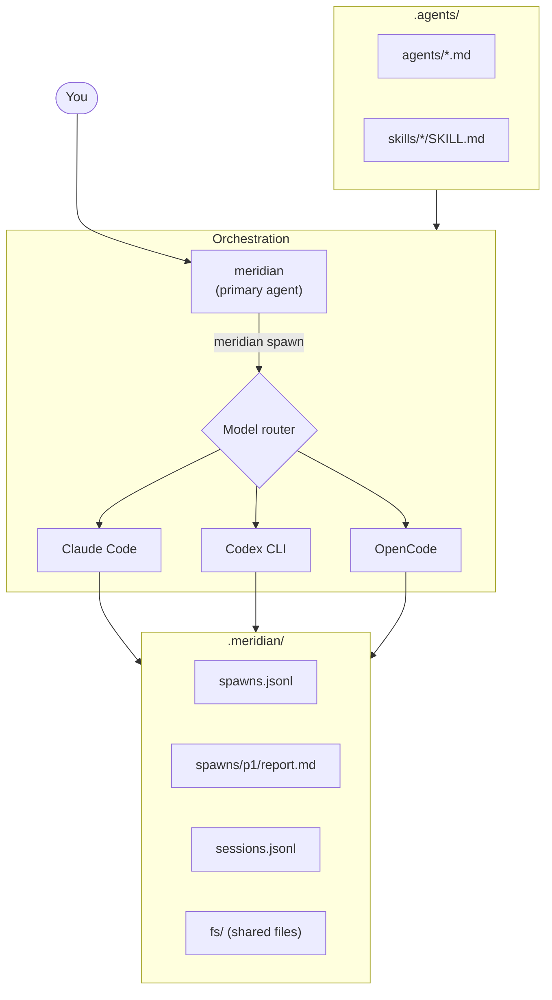

# meridian

[](https://pypi.org/project/meridian-channel/)
[](https://pypi.org/project/meridian-channel/)
[](LICENSE)
[](https://github.com/haowjy/meridian-channel/actions)

> **Alpha** — API may change between releases.

A coordination layer for AI agents. One agent spawns others, routes them to the
right model, and reads their results — across Claude, Codex, and OpenCode.

You talk to one agent. It delegates the rest.

## What This Looks Like

You say: *"Refactor the auth module to use JWT tokens."*

The orchestrator agent — running inside Claude, Codex, or any supported
harness — autonomously runs commands like these:

```bash
# Spawn a researcher on a fast model to explore the codebase
meridian spawn -a researcher -p "Map the auth module — token handling, session management, middleware"
# → {"spawn_id": "p1", "status": "running", "model": "gpt-5.3-codex"}

# Wait for it, then read what it found
meridian spawn wait p1
meridian spawn show p1 --report

# Spawn coders in parallel on Codex, passing the researcher's findings
meridian spawn -a coder --from p1 -p "Phase 1: Replace session tokens with JWT" -f src/auth/tokens.py
# → {"spawn_id": "p2", "model": "gpt-5.3-codex"}
meridian spawn -a coder --from p1 -p "Phase 2: Update middleware validation" -f src/auth/middleware.py
# → {"spawn_id": "p3", "model": "gpt-5.3-codex"}
meridian spawn wait p2 p3

# Fan out reviewers on a different model family
meridian spawn -a reviewer --from p2 -p "Review phase 1 — focus on token expiry edge cases"
# → {"spawn_id": "p4", "model": "gpt-5.4"}
meridian spawn show p4 --report

# Pick up context from a prior session
meridian session search "auth refactor"
meridian report search "JWT decision"
```

Every spawn writes logs, reports, and metadata to shared state under `.meridian/`.
The orchestrator reads those reports, decides what to do next, and keeps going.
If the session gets compacted or resumed later, the state is still there.

**The human doesn't run these commands.** The agent does — meridian is the CLI
that agents use to coordinate other agents.

## Install

```bash
uv tool install meridian-channel
```

Verify:

```bash
meridian --version
meridian doctor
```

<details>
<summary>Alternative install methods</summary>

```bash
pipx install meridian-channel    # if you prefer pipx
pip install meridian-channel     # into a Python environment
```

From source:

```bash
git clone https://github.com/haowjy/meridian-channel.git
cd meridian-channel
uv sync --extra dev
uv run meridian --help
```

If `meridian` is not on your PATH: `uv tool update-shell`

</details>

### Prerequisites

You need at least one harness CLI installed and authenticated:

| Harness | Model prefixes | Install |
|---|---|---|
| Claude Code | `claude-*`, `sonnet*`, `opus*` | [docs.anthropic.com](https://docs.anthropic.com/en/docs/claude-code) |
| Codex CLI | `gpt-*`, `codex*`, `o3*`, `o4*` | [github.com/openai/codex](https://github.com/openai/codex) |
| OpenCode | `gemini-*`, `opencode-*` | [opencode.ai](https://opencode.ai) |

Claude and Codex are the most exercised paths today. OpenCode has adapter
support but lighter day-to-day coverage.

**Primary session:** Only Claude Code supports system prompt injection
(`--append-system-prompt`), which is how Meridian loads agent skills into the
primary session. Codex and OpenCode work well as **spawn targets** but aren't
suited as the primary harness.

### Claude Code integration

Meridian installs agents and skills into `.agents/`. Claude Code discovers
them from `.claude/`. Symlink them so Claude Code sees everything meridian
installs:

```bash
mkdir -p .claude
ln -sf ../.agents/agents .claude/agents
ln -sf ../.agents/skills .claude/skills
```

Add these to `.gitignore` if they aren't already:

```
.claude/agents
.claude/skills
```

Without these symlinks, `meridian spawn` still works (it injects context
directly), but interactive Claude Code sessions won't auto-discover your
installed agents and skills.

## Quick Start

```bash
meridian                  # Launch a primary agent session
```

That's it. The agent gets meridian's coordination skills injected automatically
and can start spawning work. In a separate shell, you can also drive spawns
directly:

```bash
meridian spawn -m codex -p "Fix the flaky test in tests/auth/"
meridian spawn list
meridian spawn wait p1
meridian spawn show p1 --report
```

## How It Works

1. `meridian` launches a primary agent with coordination skills injected.
2. The agent delegates work via `meridian spawn`, picking the right model for
   each task. Meridian routes model names to the right harness CLI.
3. Spawns run in parallel, writing logs, reports, and metadata to `.meridian/`.
4. The orchestrator reads spawn reports, checks results, and iterates —
   spawning follow-ups, fanning out reviewers, or continuing prior work.
5. State persists across sessions. A future agent (or the same one after
   compaction) can search past reports, read session history, and resume.

## Agent & Skill Sources

Meridian discovers agent profiles from `.agents/agents/` and skills from
`.agents/skills/`. Write your own, or install from external sources:

### [meridian-base](https://github.com/haowjy/meridian-base) — Core coordination

The orchestrator and subagent profiles, plus skills for spawning, work
coordination, session context, install management, and troubleshooting.
Meridian auto-bootstraps the essential agents from here; install explicitly
to get everything:

```bash
meridian sources add @haowjy/meridian-base
meridian sources install
```

### [meridian-dev-workflow](https://github.com/haowjy/meridian-dev-workflow) — Dev team

An opinionated SDLC methodology: coder, reviewers, testers, investigator,
researcher, documenter — plus workflow skills for design, planning,
implementation, review, testing, and documentation:

```bash
meridian sources add @haowjy/meridian-base
meridian sources add @haowjy/meridian-dev-workflow
meridian sources install
```

Browse their READMEs for full agent/skill catalogs.

```bash
meridian sources list      # What's installed and where it came from
```

## Architecture



## Commands

**Spawning & monitoring:**

| Command | Description |
|---|---|
| `meridian` | Launch the primary agent session |
| `meridian spawn -a AGENT -p "task"` | Delegate work to a routed model |
| `meridian spawn list` | See running and recent spawns |
| `meridian spawn wait ID` | Block until a spawn completes |
| `meridian spawn show ID --report` | Read a spawn's report |
| `meridian spawn --continue ID -p "more"` | Continue a prior spawn |
| `meridian spawn --from ID -p "next"` | Start new spawn with prior context |

**Reports & sessions:**

| Command | Description |
|---|---|
| `meridian report search "query"` | Search across all spawn reports |
| `meridian session search "query"` | Search session transcripts |

**Configuration & diagnostics:**

| Command | Description |
|---|---|
| `meridian config init` | Initialize repo config |
| `meridian config set KEY VALUE` | Set a config value |
| `meridian models list` | Inspect the model catalog |
| `meridian sources list` | Show installed agents, skills, and their sources |
| `meridian doctor` | Run diagnostics |
| `meridian serve` | Start the MCP server |

## State Layout

All state is files under `.meridian/` — no databases, no services. If it's not
on disk, it doesn't exist.

```
.meridian/
  spawns.jsonl          # Spawn event log
  sessions.jsonl        # Session event log
  spawns/
    p1/
      output.jsonl      # Spawn output
      stderr.log        # Stderr capture
      report.md         # Agent's report
  fs/                   # Shared filesystem between spawns
  work/                 # Work item directories
  config.toml           # Repo configuration
  models.toml           # Model overrides
```

Writes use `fcntl.flock` plus atomic tmp+rename. If meridian is killed
mid-spawn, the next read detects and reports the orphaned state.

## Troubleshooting

**`meridian` not found** — Run `uv tool update-shell` and restart your shell.

**`meridian doctor` reports missing harnesses** — Install and authenticate at
least one harness CLI (see Prerequisites).

**Model routes to wrong harness** — Check `meridian models list` and
`meridian config show`.

**Spawn feels disconnected from earlier work** — Use `--continue ID` for
session continuity, `--from ID` for context injection, or search past work
with `meridian report search`.

## Documentation

- [Configuration](docs/configuration.md) — config keys, overrides, environment variables
- [MCP Tools](docs/mcp-tools.md) — FastMCP tool surface and payload examples
- [INSTALL.md](INSTALL.md) — agent-friendly install guide (give this URL to your LLM)

## Development

```bash
uv sync --extra dev
uv run ruff check .
uv run pytest-llm
uv run pyright
```

See [DEVELOPMENT.md](DEVELOPMENT.md) for full dev setup.

## License

[MIT](LICENSE)
