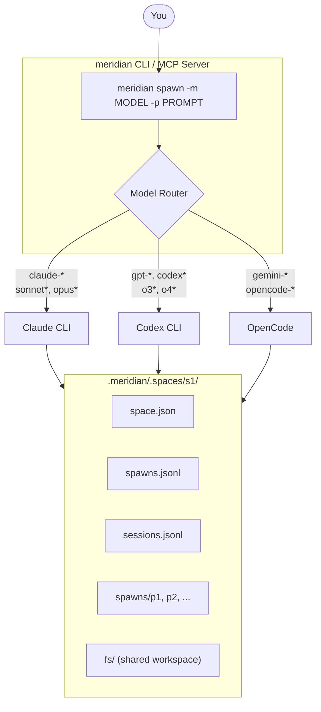

# meridian-channel

[](https://pypi.org/project/meridian-channel/)
[](https://pypi.org/project/meridian-channel/)
[](LICENSE)
[](https://github.com/haowjy/meridian-channel/actions)

> **Alpha** - API may change between releases.

Multi-model agent orchestration CLI and MCP server.

One interface across Claude, Codex, and OpenCode.

## Why Meridian?

AI agent CLIs are useful, but each harness comes with its own command surface,
session model, and operational workflow. `meridian` provides one coordination
layer across them:

- **Harness-agnostic**: choose a model and let Meridian route to the right harness.
- **File-backed state**: inspectable state lives under `.meridian/`, not in a database.
- **Spaces for coordination**: shared per-space history, sessions, and filesystem context.
- **MCP-native**: the same system can be exposed over `meridian serve`.

## Architecture



## Install

### One-line installer

```bash
curl -LsSf https://raw.githubusercontent.com/haowjy/meridian-channel/main/install.sh | sh
```

This installs `uv` if needed, installs `meridian-channel`, and prints the next
steps.

### Manual install

```bash
uv tool install meridian-channel
# or: pipx install meridian-channel
# or: pip install meridian-channel
```

### From source

```bash
git clone https://github.com/haowjy/meridian-channel.git
cd meridian-channel
uv sync --extra dev
uv run meridian --help
```

### Prerequisites

You need at least one harness CLI installed:

| Harness | Typical model prefixes | Install |
|---|---|---|
| Claude CLI | `claude-*`, `sonnet*`, `opus*` | https://docs.anthropic.com/en/docs/claude-code |
| Codex CLI | `gpt-*`, `codex*`, `o3*`, `o4*` | https://github.com/openai/codex |
| OpenCode | `gemini-*`, `opencode-*` | https://opencode.ai |

After installation, run:

```bash
meridian doctor
```

## Quick Start

```bash
meridian config init
meridian --new

# In another shell, use the space id reported by Meridian.
export MERIDIAN_SPACE_ID=s1

meridian spawn -m gpt-5.3-codex -p "Refactor auth flow"
meridian spawn wait p1
meridian spawn show p1 --report
```

## Usage Examples

### Spawn background work

```bash
meridian spawn -m gpt-5.3-codex -p "Fix the auth regression"
meridian spawn wait p1
```

### Run in foreground

```bash
meridian spawn --foreground -m claude-sonnet-4-6 -p "Debug the flaky test"
```

### Include reference files

```bash
meridian spawn -m claude-opus-4-6 -p "Review this code" -f src/main.py
```

### Continue a spawn

```bash
meridian spawn --continue p1 -p "Also add regression coverage"
```

### Work in a named space

```bash
meridian space start --name auth-refactor
export MERIDIAN_SPACE_ID=s1
meridian spawn -p "Research the current implementation"
meridian spawn -m gpt-5.3-codex -p "Implement the refactor"
meridian space show s1
```

### Start the MCP server

```bash
meridian serve
```

Minimal MCP config:

```json
{
  "mcpServers": {
    "meridian": {
      "command": "meridian",
      "args": ["serve"]
    }
  }
}
```

### Configure defaults

```bash
meridian config init
meridian config set defaults.max_retries 5
meridian config show
```

### Run diagnostics

```bash
meridian doctor
```

## Commands

| Command | Description |
|---|---|
| `meridian` | Launch the primary agent session |
| `meridian spawn` | Create or continue a delegated spawn |
| `meridian spawn list`, `show`, `wait`, `cancel`, `stats` | Manage spawns |
| `meridian space start`, `resume`, `list`, `show` | Manage spaces |
| `meridian report create`, `show`, `search` | Manage spawn reports |
| `meridian models list`, `show` | Inspect the model catalog |
| `meridian skills list`, `show` | Inspect the skills catalog |
| `meridian config init`, `set`, `get`, `show`, `reset` | Configure the repo |
| `meridian serve` | Start the FastMCP server |
| `meridian doctor` | Run diagnostics checks |

## State Layout

Authoritative state is file-backed:

```text
.meridian/
  .spaces/
    <space-id>/
      space.json
      spawns.jsonl
      sessions.jsonl
      spawns/
        <spawn-id>/
          output.jsonl
          stderr.log
          report.md
      sessions/
        <chat-id>.lock
      fs/
  active-spaces/<space-id>.lock
  config.toml
  models.toml
```

Writes use lock files plus atomic tmp+rename semantics in the state layer.

## Documentation

- [Development Install](docs/development-install.md) - install from source and run local checks.
- [Developer Terminology](docs/developer-terminology.md) - canonical `spawn` terminology.
- [Spaces](docs/spaces.md) - space lifecycle, continuation rules, and state layout.
- [Configuration](docs/configuration.md) - config keys, overrides, and environment variables.
- [Safety](docs/safety.md) - permission tiers and operational safety model.
- [MCP Tools](docs/mcp-tools.md) - FastMCP tool surface and payload examples.
- [Harness Adapters](docs/harness-adapters.md) - how Meridian maps models and sessions to harness CLIs.

## Development

```bash
uv sync --extra dev
uv run pytest-llm
uv run pyright
```

See [CONTRIBUTING.md](CONTRIBUTING.md) for contribution guidelines.

## License

[MIT](LICENSE)
