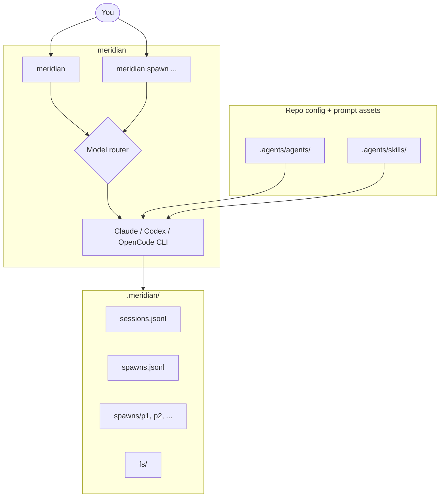

# meridian-channel

[](https://pypi.org/project/meridian-channel/)
[](https://pypi.org/project/meridian-channel/)
[](LICENSE)
[](https://github.com/haowjy/meridian-channel/actions)

> **Alpha** - API may change between releases.

Multi-model agent orchestration CLI and MCP server.

One interface across Claude, Codex, and OpenCode, with `uv` as the recommended
install path.

## Installation

Tell your LLM agent:

> Fetch and follow instructions from `https://raw.githubusercontent.com/haowjy/meridian-channel/refs/heads/main/INSTALL.md`

This works with any agent that can fetch URLs. The install guide walks the agent through setup interactively.

## Why Meridian?

AI agent CLIs are useful, but each harness comes with its own command surface,
session model, and operational workflow. `meridian` provides one coordination
layer across them:

- **Harness-agnostic**: choose a model and let Meridian route to the right harness.
- **File-backed state**: inspectable state lives under `.meridian/`, not in a database.
- **Shared coordination state**: spawn history, sessions, and filesystem context live under `.meridian/`.
- **MCP-native**: the same system can be exposed over `meridian serve`.

## Start Here

If you just want to see the command surface:

```bash
meridian -h
meridian spawn -h
meridian skills list
```

If you want to start using it, the main entry point is just:

```bash
meridian
```

That launches a primary agent session with Meridian-managed state under `.meridian/`.

## Architecture



## How It Works

1. `meridian` launches a primary agent session.
2. Meridian creates or resumes state under `.meridian/`.
3. Model names are routed to the right harness CLI:
   Claude, Codex, or OpenCode.
4. Agent profiles and skills are loaded from local search paths such as
   `.agents/agents/` and `.agents/skills/`, plus Meridian's bundled defaults.
5. The primary agent can delegate background work with `meridian spawn ...`,
   and those spawns write logs, reports, and metadata back into the same
   shared state root.

## Agent & Skill Sources

Meridian discovers agent profiles and skills from `.agents/agents/` and
`.agents/skills/` in your repo. You can write these directly, or install them
from external sources using `meridian sources install`.

### Core: [meridian-base](https://github.com/haowjy/meridian-base)

Non-opinionated coordination primitives — the orchestrator and subagent profiles,
plus skills for spawning, work coordination, session context, install management,
and troubleshooting. Meridian auto-bootstraps the minimum needed runtime agents
from this repo; install it explicitly to get everything:

```bash
meridian sources add @haowjy/meridian-base
meridian sources install
```

### Dev Workflow: [meridian-dev-workflow](https://github.com/haowjy/meridian-dev-workflow)

Opinionated SDLC methodology built on top of meridian-base. A complete dev team
(coder, reviewers, testers, investigator, researcher, documenter) plus structured
workflow skills for design, planning, implementation, review, testing, and
documentation. Requires meridian-base:

```bash
meridian sources add @haowjy/meridian-base
meridian sources add @haowjy/meridian-dev-workflow
meridian sources install
```

These two repos are the primary examples of how Meridian's managed install system
works end-to-end — browse their READMEs for the full agent/skill catalogs.

### Inspecting what's installed

```bash
meridian skills list
meridian skills show orchestrate
meridian sources list
```

## Install

### 1. Install `uv`

Follow the official instructions:

https://docs.astral.sh/uv/getting-started/installation/

### 2. Install `meridian-channel`

```bash
uv tool install meridian-channel
# or: pipx install meridian-channel
# or: pip install meridian-channel
```

Recommended:
- use `uv tool install` for the cleanest CLI-tool workflow
- use `pipx` if that is already your standard tool runner
- use `pip` only if you intentionally want it in a Python environment

### 3. Verify the install

```bash
meridian --version
meridian doctor
```

If `meridian` is not on your `PATH`, run:

```bash
uv tool update-shell
```

### Optional: shell completion

Meridian exposes shell completion helpers via:

```bash
meridian completion -h
```

Completion is not automatically enabled by install. Set it up explicitly if you
want tab completion in your shell.

### From source

```bash
git clone https://github.com/haowjy/meridian-channel.git
cd meridian-channel
uv sync --extra dev
uv run meridian --help
```

### Prerequisites

You need at least one harness CLI installed:

| Harness | Typical model prefixes | Install |
|---|---|---|
| Claude CLI | `claude-*`, `sonnet*`, `opus*` | https://docs.anthropic.com/en/docs/claude-code |
| Codex CLI | `gpt-*`, `codex*`, `o3*`, `o4*` | https://github.com/openai/codex |
| OpenCode | `gemini-*`, `opencode-*` | https://opencode.ai |

Installing the harness binary is not always sufficient by itself. In practice
you may also need to authenticate or finish provider-specific setup for that
harness before `meridian doctor` and real runs succeed.

Practical recommendation:
- Claude and Codex are the most exercised paths in this repo today
- OpenCode has adapter support and routing, but day-to-day Meridian guidance and
  examples are lighter there right now

**Primary session harness:** Only Claude Code supports `--append-system-prompt`,
which is how Meridian injects agent profile skills (like `orchestrate` and
`meridian-spawn-agent`) into the primary session. Codex and OpenCode lack a
system prompt channel, so they work well as **spawn targets** (`meridian spawn
-m gpt-5.3-codex ...`) but are not suited as the primary harness for
`meridian` sessions that rely on skill injection.

### Platform support

- macOS: supported
- Linux: supported
- Windows: not documented as a primary workflow in this repo yet

### Upgrade

```bash
uv tool upgrade meridian-channel
# or: pipx upgrade meridian-channel
# or: pip install -U meridian-channel
```

### Uninstall

```bash
uv tool uninstall meridian-channel
# or: pipx uninstall meridian-channel
```

## Quick Start

```bash
meridian -h
meridian config init
meridian

# In another shell, delegate follow-up work.
meridian spawn -m gpt-5.3-codex -p "Refactor auth flow"
meridian spawn wait p1
meridian spawn show p1 --report
```

What this does:
- `meridian` launches the primary agent and records shared state under `.meridian/`
- `meridian spawn ...` delegates a subtask to a routed harness/model

## Usage Examples

### Spawn background work

```bash
meridian spawn -m gpt-5.3-codex -p "Fix the auth regression"
meridian spawn wait p1
```

### Run in foreground

```bash
meridian spawn --foreground -m claude-sonnet-4-6 -p "Debug the flaky test"
```

### Include reference files

```bash
meridian spawn -m claude-opus-4-6 -p "Review this code" -f src/main.py
```

### Continue a spawn

```bash
meridian spawn --continue p1 -p "Also add regression coverage"
```

### Share files between spawns

```bash
mkdir -p .meridian/fs
printf 'auth notes\n' > .meridian/fs/research.txt
meridian spawn -p "Review .meridian/fs/research.txt and implement the refactor"
```

### Start the MCP server

```bash
meridian serve
```

Minimal MCP config:

```json
{
  "mcpServers": {
    "meridian": {
      "command": "meridian",
      "args": ["serve"]
    }
  }
}
```

### Configure defaults

```bash
meridian config init
meridian config set defaults.max_retries 5
meridian config show
```

### Run diagnostics

```bash
meridian doctor
```

## Troubleshooting

### `meridian` command not found

Run:

```bash
uv tool update-shell
```

Then restart your shell and re-check:

```bash
meridian --version
```

### `meridian doctor` reports missing harnesses

Install at least one supported harness CLI, then rerun:

```bash
meridian doctor
```

### A model routes to the wrong harness

Check the configured model catalog and active defaults:

```bash
meridian models list
meridian config show
```

See [Configuration](docs/configuration.md) for override details.

### Spawn commands feel disconnected from earlier work

Use shared state under `.meridian/`:

```bash
meridian spawn --continue p1 -p "Continue this task"
cat .meridian/fs/shared-notes.md
```

Use `--continue` when you want harness/session continuity, and `.meridian/fs/`
when you want file-based handoff between spawns.

## Commands

| Command | Description |
|---|---|
| `meridian` | Launch the primary agent session |
| `meridian spawn` | Create or continue a delegated spawn |
| `meridian spawn list`, `show`, `wait`, `cancel`, `stats` | Manage spawns |
| `meridian report create`, `show`, `search` | Manage spawn reports |
| `meridian models list`, `show` | Inspect the model catalog |
| `meridian skills list`, `show` | Inspect the skills catalog |
| `meridian config init`, `set`, `get`, `show`, `reset` | Configure the repo |
| `meridian serve` | Start the FastMCP server |
| `meridian doctor` | Run diagnostics checks |

## State Layout

Authoritative state is file-backed:

```text
.meridian/
  fs/
  work/
  spawns/
    <spawn-id>/
      output.jsonl
      stderr.log
      report.md
  spawns.jsonl
  sessions.jsonl
  config.toml
  models.toml
```

Writes use lock files plus atomic tmp+rename semantics in the state layer.

## Documentation

- [Configuration](docs/configuration.md) - config keys, overrides, and environment variables.
- [MCP Tools](docs/mcp-tools.md) - FastMCP tool surface and payload examples.

## Development

```bash
uv sync --extra dev
uv run ruff check .
uv run pytest-llm
uv run pyright
```

See [DEVELOPMENT.md](DEVELOPMENT.md) for dev setup.

## License

[MIT](LICENSE)
