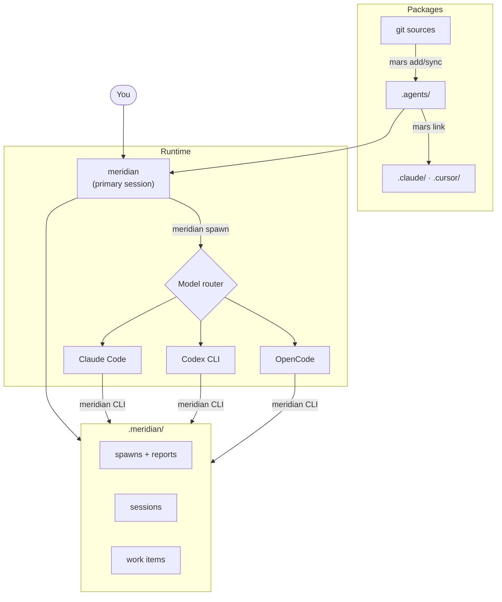

# meridian

Orchestrate AI coding agents across Claude Code, Codex, and OpenCode. Each model runs through its native harness — meridian coordinates between them.

> **Early development.** Meridian is not stable. Expect breaking changes in any release. If you need a stable workflow, this project is not ready for you yet.

## Why

Claude Code is the best way to run Claude. Codex CLI is the best way to run GPT. Each provider's harness is optimized for their models — sandboxing, tool use, context handling, everything.

But you can only use one at a time.

Meridian lets agents spawn other agents across harnesses. The right model for each task, through the right runtime, with clean context per spawn.

## Install

```bash
uv tool install meridian-cli
```

<details>
<summary>Other methods</summary>

```bash
pipx install meridian-cli
pip install meridian-cli
```

From source:

```bash
git clone https://github.com/meridian-flow/meridian-cli.git
cd meridian-cli
uv tool install --force . --no-cache --reinstall
```

</details>

You need at least one harness installed: [Claude Code](https://docs.anthropic.com/en/docs/claude-code), [Codex CLI](https://github.com/openai/codex), or [OpenCode](https://opencode.ai).

## Set Up a Project

```bash
meridian init --link .claude
meridian mars add meridian-flow/meridian-dev-workflow
```

This installs a full dev team — architects, coders, reviewers, testers — and links them into Claude Code. Agent packages are managed by [mars](https://github.com/meridian-flow/mars-agents).

## Usage

Launch an interactive session:

```bash
meridian
```

Or spawn agents directly:

```bash
# Code on Codex, review on Claude
meridian spawn -a coder -p "Add rate limiting to the API endpoints"
meridian spawn -a reviewer --from p1 -p "Review the rate limiting implementation"

# Check on work
meridian spawn list
meridian spawn show p1
```

Agents route to their configured model and harness automatically. Each spawn gets a fresh context window with only the context it needs.

## Architecture



## Agent Packages

**[meridian-dev-workflow](https://github.com/meridian-flow/meridian-dev-workflow)** — A dev team: architects, coders, reviewers, testers, researchers, documenters, and the orchestrators that coordinate them.

**[meridian-base](https://github.com/meridian-flow/meridian-base)** — Core coordination primitives. Included as a dependency of meridian-dev-workflow.

## Docs

- [Getting Started](docs/getting-started.md) — prerequisites, harness setup, tool integration
- [Commands](docs/commands.md) — full CLI reference
- [Configuration](docs/configuration.md) — config keys, state layout, environment variables
- [MCP Tools](docs/mcp-tools.md) — tool surface and payload examples
- [Troubleshooting](docs/troubleshooting.md) — common issues and diagnostics
- [INSTALL.md](INSTALL.md) — agent-friendly install guide

## Development

```bash
uv sync --extra dev
uv run ruff check .
uv run pytest-llm
uv run pyright
```

See [DEVELOPMENT.md](DEVELOPMENT.md) for full dev setup.

## Contributing

This project is not accepting external contributions at this time. The maintainer is keeping it closed to outside contributions until the codebase is stable enough to support them well. Bug reports and feedback are welcome as GitHub issues.

## License

[Apache 2.0](LICENSE)
