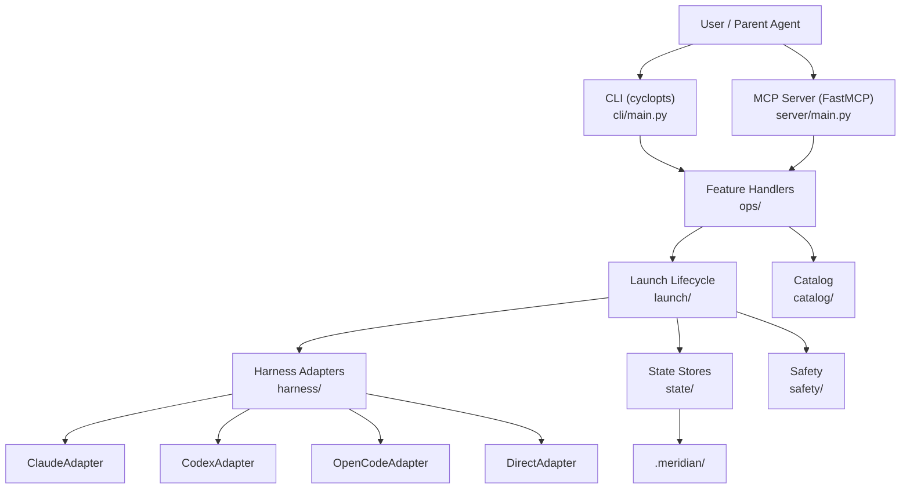
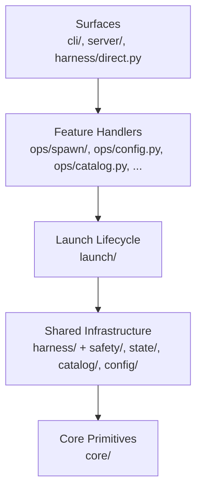
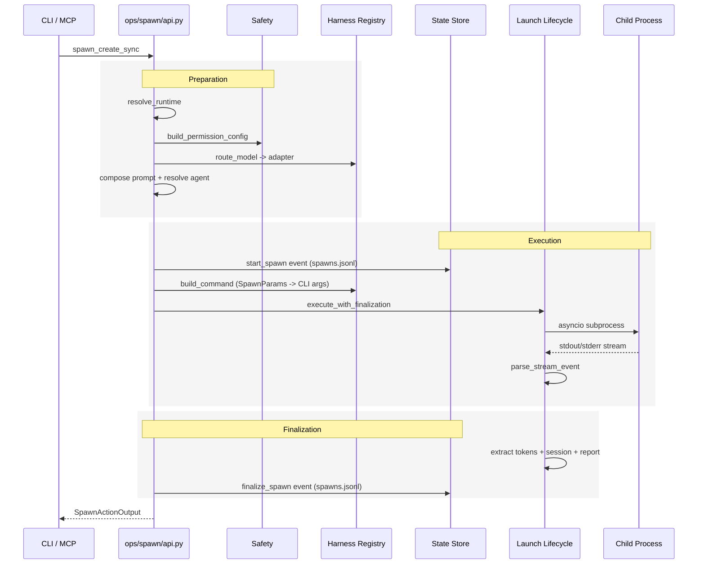
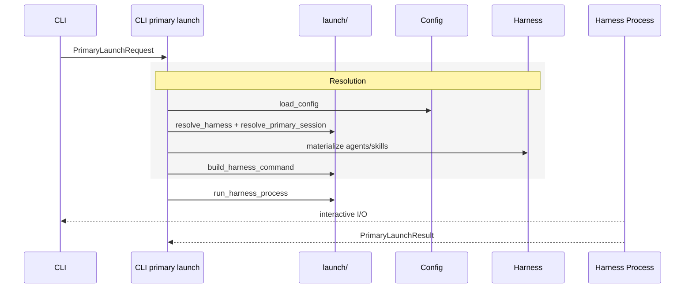
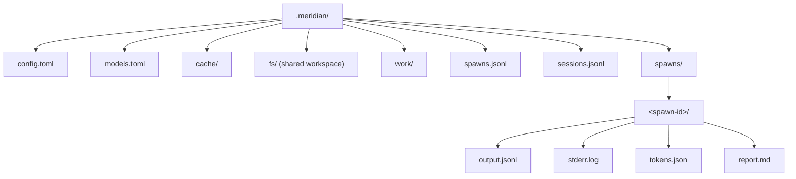
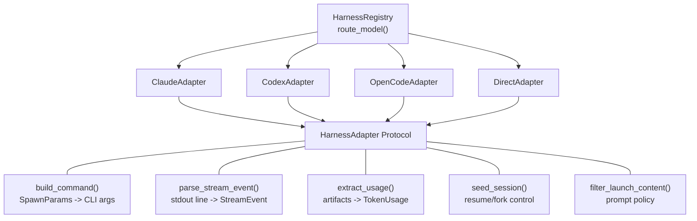
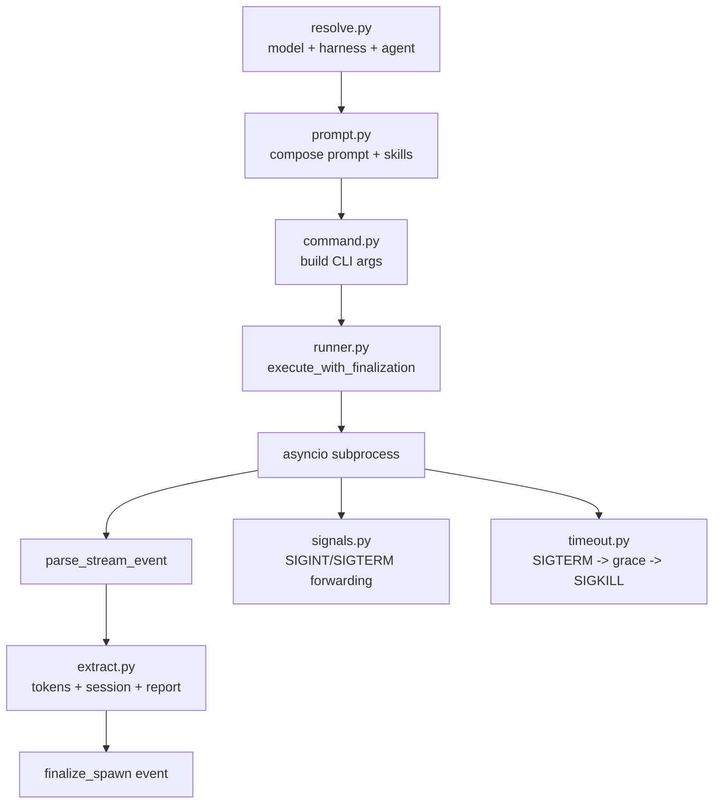
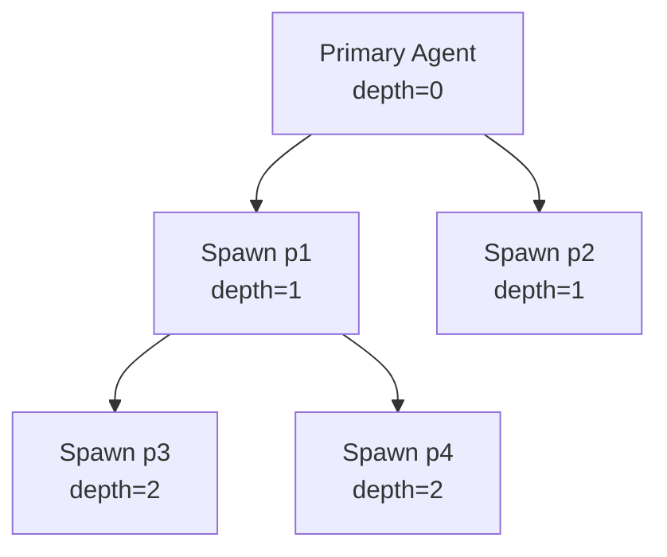

# Architecture

Meridian is a coordination layer for multi-agent systems. It launches, tracks, and inspects AI agent spawns across multiple harnesses (Claude, Codex, OpenCode, direct API). It is not a filesystem, execution engine, or data warehouse.

## System Overview



## Dependency Model



Rules:
- **Surfaces** depend on ops and core. They contain no business logic.
- **Feature handlers** depend on launch, infrastructure, and core.
- **Launch** depends on harness adapters, state stores, safety, and core.
- **Infrastructure** packages (including safety) do not import surfaces or ops.
- **Core** imports nothing from the rest of the codebase.

---

## Core Concepts

### State Root

A repo-local coordination root under `.meridian/`. It contains shared filesystem state, spawn history, session history, and per-spawn artifacts for one Meridian-managed workspace.

### Spawn

A single agent execution within the repo's `.meridian/` state root. Spawns are launched via `meridian spawn`, tracked via JSONL events, and can be nested (a spawn can create child spawns).

### Harness

An AI backend adapter. The same `meridian spawn` command works across Claude, Codex, and OpenCode. Each harness translates spawn parameters into the native CLI invocation for that backend.

### Agent Profile

A YAML-frontmatter markdown file (`.agents/agents/NAME.md`) defining an agent's capabilities: model, skills, sandbox permissions, MCP tools, and system prompt body.

### Skill

Domain knowledge loaded into an agent at launch time. Skills survive context compaction because they are injected fresh on every launch/resume. Defined as `SKILL.md` files under `.agents/skills/SKILLNAME/`.

---

## Directory Layout

```
src/meridian/
  cli/                         # Cyclopts surface -- thin dispatch, no business logic
    main.py                    # Entry point, global options, command dispatch
    spawn.py                   # Spawn subcommand handlers
    output.py                  # Output sink implementations (text/JSON/agent)
    format_helpers.py          # Tabular display formatting
    config_cmd.py              # Config subcommands
    report_cmd.py              # Report subcommands
    skills_cmd.py              # Skills subcommands
    models_cmd.py              # Models subcommands
    doctor_cmd.py              # Doctor subcommand
    sync_cmd.py                # Sync subcommand

  server/
    main.py                    # FastMCP server on stdio

  lib/
    core/                      # Lightweight shared primitives (imports nothing else)
      types.py                 # NewType identifiers (SpawnId, HarnessId, ModelId, ArtifactKey)
      domain.py                # Frozen Pydantic domain models (Spawn, TokenUsage, SkillManifest, ...)
      context.py               # RuntimeContext (MERIDIAN_* env vars)
      sink.py                  # OutputSink protocol
      codec.py                 # Type schema serialization
      util.py                  # Serialization + formatting helpers
      logging.py               # Structlog configuration

    config/                    # Application settings only
      settings.py              # MeridianConfig (pydantic-settings, TOML + env)

    catalog/                   # "What's available?" -- discovery and parsing
      agent.py                 # Agent profile parsing (YAML frontmatter markdown)
      skill.py                 # Skill parsing + registry
      models.py                # Model aliases, discovery, routing, catalog

    harness/                   # Adapter protocol + implementations
      adapter.py               # HarnessAdapter protocol, SpawnParams, SpawnResult, HarnessCapabilities
      registry.py              # HarnessRegistry (model-to-adapter routing)
      claude.py                # Claude CLI adapter
      codex.py                 # Codex CLI adapter
      opencode.py              # OpenCode CLI adapter
      direct.py                # Direct Anthropic Messages API adapter
      common.py                # Shared adapter utilities + strategies
      materialize.py           # Agent/skill materialization into harness dirs
      launch_types.py          # PromptPolicy, SessionSeed (shared between harness + launch)
      session_detection.py     # Harness-specific session ID extraction

    state/                     # ALL file-backed stores
      paths.py                 # State path resolution + compatibility helpers
      spawn_store.py           # Spawn event store (JSONL) + ID generation
      session_store.py         # Session tracking (sessions.jsonl)
      artifact_store.py        # Artifact storage and retrieval

    safety/                    # Harness-facing safety translation (adapts + passes through)
      permissions.py           # PermissionTier -> harness CLI flags translation
      budget.py                # Cost tracking from harness JSONL output
      guardrails.py            # Post-run script hooks
      redaction.py             # Secret env var injection + output redaction

    launch/                    # Unified harness launch lifecycle
      __init__.py              # launch_primary() facade
      resolve.py               # Model/agent/harness resolution
      command.py               # Build harness CLI command
      process.py               # Run harness process (fork/exec + stream)
      types.py                 # Primary launch request/result models
      prompt.py                # Prompt assembly pipeline
      reference.py             # Reference file handling
      runner.py                # execute_with_finalization (spawn subprocess orchestration)
      extract.py               # Post-run token/session/report extraction
      report.py                # Report extraction logic
      written_files.py         # Explicit written-file metadata extraction
      artifact_io.py           # Artifact I/O helpers
      signals.py               # Signal forwarding (SIGINT/SIGTERM) + process groups
      env.py                   # Child process environment (MERIDIAN_* vars)
      errors.py                # Error classification + retry logic
      timeout.py               # Spawn timeout management (SIGTERM -> grace -> SIGKILL)
      terminal.py              # TTY detection

    ops/                       # Feature handlers -- business logic
      manifest.py              # Explicit operation manifest (replaces old registry)
      runtime.py               # OperationRuntime, resolve_runtime
      spawn/                   # Spawn feature package
        api.py                 # spawn_create, spawn_list, spawn_show, spawn_wait, spawn_cancel, spawn_continue, spawn_stats
        models.py              # Request/response models (SpawnCreateInput, SpawnActionOutput, ...)
        prepare.py             # Payload validation + launch prep
        execute.py             # Blocking/background execution
        query.py               # Show/list/reference resolution
      config.py                # Config TOML handlers (get, set, show, init, reset)
      catalog.py               # Models + skills query handlers
      report.py                # Report CRUD handlers (create, show, search)
      diag.py                  # Doctor diagnostics
```

---

## Data Flow: `meridian spawn create`



## Data Flow: `meridian`



---

## State Model

All state lives in files. No database. Append-only JSONL for event streams and per-spawn directories for artifacts. Atomic writes via `tmp` + `os.replace()`, concurrency via `fcntl.flock`.



### Event Sourcing

Spawn lifecycle is tracked as append-only JSONL events in `spawns.jsonl`:

```json
{"v":1,"event":"start","id":"p1","chat_id":"c1","model":"claude-opus-4-6","harness":"claude","kind":"primary","status":"running","prompt":"...","started_at":"..."}
{"v":1,"event":"finalize","id":"p1","status":"succeeded","exit_code":0,"finished_at":"...","duration_secs":42.5}
```

Session lifecycle follows the same pattern in `sessions.jsonl` with `start`, `stop`, and `update` events. Both use Pydantic event models for typed serialization at I/O boundaries.

### ID Generation

- Spawn IDs: `p1, p2, ...` (counter from `spawns.jsonl`)
- Chat/Session IDs: `c1, c2, ...` (counter from `sessions.jsonl`)

---

## Harness System

The harness layer abstracts AI backend differences behind a common protocol.



Each adapter translates `SpawnParams` into native CLI args:
- **Claude**: `claude eval --json --model X --prompt Y`
- **Codex**: `codex exec --model X --prompt Y`
- **OpenCode**: `opencode --provider google --model X`
- **Direct**: In-process Anthropic Messages API (programmatic tools, no subprocess)

Routing rules (in `catalog/models.py`): `claude-*|sonnet*|opus*` to Claude, `gpt-*|codex*|o3*|o4*` to Codex, `gemini-*|opencode-*|/*` to OpenCode.

---

## Operation Manifest

All operations are defined in an explicit manifest (`ops/manifest.py`). Each entry declares metadata consumed by both CLI and MCP surfaces -- no import-time registration or global mutation.

```python
class OperationSpec:
    name: str                           # e.g. "spawn.create"
    description: str
    handler: async callable             # MCP / async callers
    sync_handler: sync callable | None  # CLI / sync callers
    input_type: type                    # Pydantic model
    output_type: type                   # Pydantic model
    cli_group: str | None               # e.g. "spawn"
    cli_name: str | None                # e.g. "create"
    mcp_name: str | None                # e.g. "spawn_create"
    surfaces: frozenset["cli","mcp"]    # which surfaces expose it
```

Surfaces consume the manifest via `get_operations_for_surface("cli"|"mcp")`. Some operations are surface-restricted (e.g., `spawn.create` is MCP-only, `config.*` is CLI-only).

---

## Configuration

Configuration uses pydantic-settings `BaseSettings` with layered precedence:

```
Defaults -> Project TOML (.meridian/config.toml) -> User TOML (~/.meridian/config.toml) -> Env Vars (MERIDIAN_*) -> CLI Flags
```

Key env vars:

| Variable | Purpose |
|----------|---------|
| `MERIDIAN_MODEL` | Default model |
| `MERIDIAN_HARNESS` | Default harness |
| `MERIDIAN_FS_DIR` | Shared filesystem path (`.meridian/fs`) |
| `MERIDIAN_SPAWN_ID` | Current spawn ID |
| `MERIDIAN_PARENT_SPAWN_ID` | Parent spawn ID |
| `MERIDIAN_DEPTH` | Nesting depth (0 = primary) |
| `MERIDIAN_REPO_ROOT` | Repository root path |
| `MERIDIAN_CHAT_ID` | Current session chat ID |

---

## Safety

Safety enforcement is delegated to the harnesses. Meridian's `safety/` package is harness adapter support code — it translates Meridian's abstractions into harness-native flags and passes them through.

- **permissions.py** — Translates three permission tiers (`read-only`, `workspace-write`, `full-access`) into harness-specific CLI flags (`--allowedTools` for Claude, `--sandbox` for Codex). The harness does the actual enforcement.
- **budget.py** — Parses cost fields from harness JSONL output during streaming. Terminates spawns that exceed configured USD limits. The only Meridian-side enforcement.
- **redaction.py** — Injects `--secret KEY=VALUE` as `MERIDIAN_SECRET_*` env vars into the harness child process and redacts values from streamed output.
- **guardrails.py** — Post-run script hooks (the one piece that isn't strictly harness adapter code).

---

## Launch Lifecycle

The `launch/` package owns the entire harness process lifecycle, unifying what was previously split across four separate packages:

```
resolve -> build prompt -> build command -> fork process -> stream output -> extract results -> finalize
```



Both primary agent launch (`meridian`) and spawn execution (`meridian spawn create`) use the same lifecycle.

---

## Spawn Nesting

Spawns can create child spawns. Each child inherits the shared `.meridian/fs/` context and receives incremented depth tracking.



Context propagation per child: `MERIDIAN_FS_DIR`, `MERIDIAN_SPAWN_ID`, `MERIDIAN_PARENT_SPAWN_ID`, `MERIDIAN_DEPTH` (parent + 1). The shared filesystem at `fs/` enables data passing between siblings and across depths. `max_depth` config prevents runaway recursion.

---

## Conventions

- All identifiers are `NewType` wrappers (`SpawnId`, `ModelId`, `HarnessId`, `ArtifactKey`) for compile-time safety
- All domain and I/O types are frozen Pydantic `BaseModel` instances
- State persistence uses `model_validate()` / `model_dump()` at I/O boundaries
