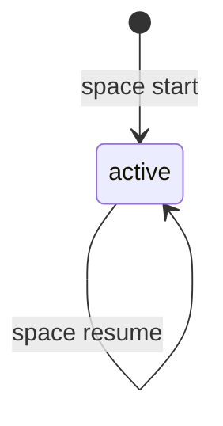

# Spaces

Spaces are the top-level coordination unit. A space owns spawn history, harness-session history, and a shared `fs/` working tree.

## Lifecycle



Commands:

```bash
meridian space start [--name NAME] [--model MODEL]
meridian space resume [--space sN] [--fresh]
meridian space list [--limit N]
meridian space show sN
```

Top-level shortcut:

```bash
meridian [--new] [--space sN] [--continue SESSION_REF]
```

`meridian` without subcommands launches primary work in a space.

Default selection without `--space`:
- latest `active` space if one exists
- otherwise a newly created space

## Continue Semantics

`--continue <SESSION_REF>` accepts:
- tracked chat alias (`cN`)
- tracked harness session id
- unknown non-alias ref (treated as external harness session id and bound on use)

Behavior:
- known ref + no `--space`: resolve owning space automatically
- known ref + mismatched `--space`: warn and use the owning space
- unknown non-alias ref + `--space`: bind to that space for the run
- unknown non-alias ref + no `--space`: bind to default-selected space
- unknown chat alias (`cN`): error

When a continue ref is available, output includes:

```text
Continue via meridian:
  meridian --continue <continue_ref>
```

## Claude `/clear` Caveat (Current)

For primary sessions, Meridian does not automatically observe in-session `/clear` transitions yet.

Practical impact:
- after `/clear`, Claude may move to a new session id
- Meridian will use the previous id until you continue once with the new id
- running `meridian --continue <new-claude-session-id>` binds/registers the new id for future runs

## Gap-Closing TODOs

1. Claude hooks integration
- Use Claude Code hooks (`SessionStart`, `SessionEnd`) to detect clear boundaries and session-id rotation automatically.
- Persist transitions in `sessions.jsonl` so both pre-clear and post-clear session ids remain resumable.

2. OpenCode lifecycle tracking
- Capture `sessionID` from OpenCode JSON stream events during primary runs.
- Append/update session mapping when OpenCode rotates to a new session id.

3. Codex limitation (current)
- Codex CLI does not currently expose equivalent lifecycle hooks for interactive session transitions.
- Keep manual fallback behavior: accept `meridian --continue <thread-id>` and bind on use.

## State Model (Files-as-Authority)

```text
.meridian/
  .spaces/
    <space-id>/
      space.json            # space metadata (id/name/status/timestamps)
      spawns.jsonl          # append-only spawn start/finalize events
      sessions.jsonl        # append-only harness launch/stop/update events
      spawns/
        <spawn-id>/
          output.jsonl
          stderr.log
          report.md
      sessions/
        <chat-id>.lock      # live session lock while harness process spawns
      fs/
        space-summary.md    # generated summary artifact
```

- No SQLite authority.
- Space metadata lives in `space.json`.
- Spawn state is derived from `spawns.jsonl`.
- Session recording is derived from `sessions.jsonl`.
- State writes use lock files and atomic tmp+rename.

## Environment and Scoping

`MERIDIAN_SPACE_ID` scopes spawn commands to one space.

```bash
export MERIDIAN_SPACE_ID=s12
meridian spawn -p "Implement the parser"
meridian spawn list
```
Set `MERIDIAN_SPACE_ID` to scope spawns to an existing space. Without it, spawn auto-creates a new space.

## Locking

Primary-space launch writes an active-space lock at:

- Default state root: `.meridian/active-spaces/<space-id>.lock`
- If `MERIDIAN_STATE_ROOT=.meridian/state`: `.meridian/state/active-spaces/<space-id>.lock`

Session lifetime locks live at `.meridian/.spaces/<space-id>/sessions/<chat-id>.lock`.

## Removed Workspace-Era Concepts

Not part of the current model:

- `workspace-summary.md`
- context pin/unpin commands
- workspace export commands
- workspace-era environment-variable scoping
