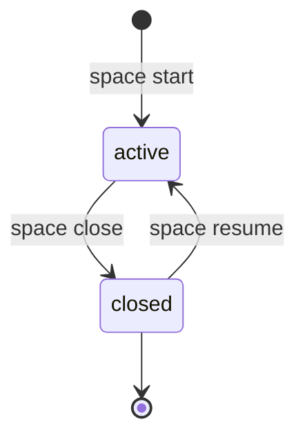

# Spaces

Spaces are the top-level coordination unit. A space owns spawn history (currently stored as `run` records), harness-session history, and a shared `fs/` working tree.

Developer note:
- Canonical domain term is `spawn` (see [Developer Terminology](developer-terminology.md)).
- Current filenames and commands may still use `run` during migration.

## Lifecycle



Commands:

```bash
meridian space start [--name NAME] [--model MODEL]
meridian space resume [--space sN] [--fresh]
meridian space list [--limit N]
meridian space show sN
meridian space close sN
```

Top-level shortcut:

```bash
meridian start [--new] [--space sN]
```

## State Model (Files-as-Authority)

```text
.meridian/
  .spaces/
    <space-id>/
      space.json            # space metadata (id/name/status/timestamps)
      spawns.jsonl            # append-only run start/finalize events
      sessions.jsonl        # append-only harness launch/stop/update events
      spawns/
        <run-id>/
          output.jsonl
          stderr.log
          report.md
      sessions/
        <chat-id>.lock      # live session lock while harness process spawns
      fs/
        space-summary.md    # generated summary artifact
```

- No SQLite authority.
- Space metadata lives in `space.json`.
- Spawn state is derived from `spawns.jsonl`.
- Session recording is derived from `sessions.jsonl`.
- State writes use lock files and atomic tmp+rename.

## Environment and Scoping

`MERIDIAN_SPACE_ID` scopes run/spawn commands to one space.

```bash
export MERIDIAN_SPACE_ID=s12
meridian spawn spawn -p "Implement the parser"
meridian spawn list
```

Current behavior: if `MERIDIAN_SPACE_ID` is unset, `meridian spawn spawn` auto-creates a new space and returns a warning with the new `sN` ID.

Target behavior: spawn creation requires explicit space context (`MERIDIAN_SPACE_ID` or `--space`), with no auto-create fallback.

## Locking

Primary-space launch writes an active-space lock at:

- Default state root: `.meridian/active-spaces/<space-id>.lock`
- If `MERIDIAN_STATE_ROOT=.meridian/state`: `.meridian/state/active-spaces/<space-id>.lock`

Session lifetime locks live at `.meridian/.spaces/<space-id>/sessions/<chat-id>.lock`.

## Removed Workspace-Era Concepts

Not part of the current model:

- `workspace-summary.md`
- context pin/unpin commands
- workspace export commands
- workspace-era environment-variable scoping
