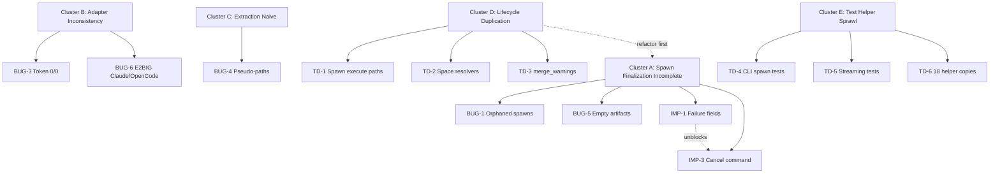

# Backlog Execution Plan

**Status:** draft

## Context

17 open backlog items across bugs, improvements, and tech debt. Items cluster around shared root causes — fixing them in the right order avoids rework.

Key insight: the spawn lifecycle code is duplicated (TD-1), so patching bugs across two paths then refactoring means doing the work twice. Refactor first, then fix bugs in one place.

## Root Cause Clusters

## Phase 1: Refactor Spawn Lifecycle

**Goal:** Eliminate duplication so all subsequent fixes touch one path, not two.

### Step 1.1: Canonical space resolver (TD-2)

**Scope:** Small. ~30 lines changed.

- Consolidate three `resolve_space_id` copies into one canonical `require_space_id(space: str | None) -> SpaceId` in `lib/ops/_runtime.py`
- Delete `_spawn_query.py:_resolve_space_id` — replace callers with canonical version
- Fix `lib/prompt/reference.py:112-118` — accept explicit `space_id` param instead of `os.getenv("MERIDIAN_SPACE_ID")`
- Fix type inconsistency (`SpaceId | None` vs `str` return types)

**Tests:** Existing tests cover space resolution. Run full suite.

### Step 1.2: Unify merge_warnings (TD-3)

**Scope:** Small. ~15 lines changed. Fixes latent divergent-semantics bug.

- Keep the variadic+stripping version from `spawn.py:63-67`
- Move to a shared internal utility (e.g., `lib/ops/_utils.py`)
- Delete `_spawn_prepare.py:188-191` version
- Update callers in `_spawn_prepare.py:315-317`

**Tests:** Run full suite — the divergent behavior means this could surface subtle warning-text differences.

### Step 1.3: Unify spawn execution lifecycle (TD-1)

**Scope:** Large. ~80 lines eliminated. Behavior-preserving.

- Extract shared `_init_spawn(payload, prepared, runtime) -> SpawnContext` helper covering:
  - Space resolution (now uses Step 1.1 canonical resolver)
  - `spawn_store.start_spawn()`
  - `Spawn(...)` object construction
  - `_emit_subrun_event({...})` start event
- Extract session lifecycle context manager covering:
  - Session start / materialize / stop / cleanup
- Reduce `_execute_spawn_background` and `_execute_spawn_blocking` to thin transport wrappers

**Tests:** 350 tests. No behavior change expected. Watch for spawn state transitions and subrun event assertions.

---

## Phase 2: Finalization Fixes

**Goal:** Fix the bugs we hit live. Now touching ONE unified path.

### Step 2.1: Timeout/cancel failure markers (IMP-1)

**Scope:** Tiny. ~5 lines in the error classification block.

- In `lib/exec/spawn.py` (~line 728-750), add:
  - `failure_reason = "timeout"` when `spawn_result.timed_out`
  - `failure_reason = "cancelled"` on cancellation path
- These markers propagate through existing `finalize_spawn(error=failure_reason)` → `SpawnRecord.error` → `spawn show`

**Tests:** Add unit tests for timeout and cancel failure_reason values.

### Step 2.2: Structured failure artifact on timeout/crash (BUG-5)

**Scope:** Small. ~20 lines.

- In finalization path, when harness emits nothing (0-byte output/stderr), write minimal JSON artifact with `error_code`, `failure_reason`, `exit_code`, timeout marker
- Extend empty-output check to also fire for non-zero exit codes (currently only `exit_code == 0` at `spawn.py:674`)

**Tests:** Mock a timeout/crash scenario, assert structured artifact exists.

### Step 2.3: PID-based orphan detection (BUG-1)

**Scope:** Medium. ~30 lines.

- In `lib/ops/diag.py:_repair_orphan_runs`, check `background.pid` file for each "running" spawn
- If PID exists and process is dead (`os.kill(pid, 0)` → `ProcessLookupError`), mark as `failed: orphan_run`
- If PID exists and process is alive, skip (it's still running, not orphaned)
- Consider running orphan check automatically on `spawn list` or `spawn create`

**Tests:** Mock dead-PID scenario, assert spawn marked failed.

### Step 2.4: Spawn cancel command (IMP-3)

**Scope:** Medium. ~60 lines across CLI + ops + store.

- New `spawn cancel` CLI handler in `cli/spawn.py`
- New `spawn_cancel_sync` in `lib/ops/spawn.py`: read `background.pid`, send SIGTERM, write finalize event with `status="cancelled"`, `error="cancelled"` (uses Step 2.1 marker)
- Register in operation registry

**Tests:** Mock background PID, assert SIGTERM sent and status written.

---

## Phase 3: Adapter Parity

### Step 3.1: Stdin prompt for Claude/OpenCode (BUG-6)

**Scope:** Small per adapter. ~10 lines each.

- Add `supports_stdin_prompt = True` to `ClaudeAdapter` capabilities
- Update `claude.py` `build_command` to use `"-"` placeholder like Codex
- Same for OpenCode adapter
- The stdin routing in `spawn.py:524` already handles this generically

**Tests:** Unit test build_command output. Integration test with `--dry-run`.

### Step 3.2: Fix token usage reporting (BUG-3)

**Scope:** Small. ~15 lines.

- Change `TokenUsage` defaults from `0` to `None` for `input_tokens`/`output_tokens`
- Update `finalize_spawn` to only write token fields when not `None`
- Verify harness adapters — check if Claude/Codex CLIs emit token data in any format the extractor recognizes
- If not, add token extraction from harness-specific output formats

**Tests:** Assert `None` tokens don't appear in JSONL. Assert actual tokens do.

---

## Phase 4: Test Cleanup

### Step 4.1: Create tests/helpers/ (TD-6)

**Scope:** Medium. ~142 lines consolidated.

- Create `tests/helpers/__init__.py`, `fixtures.py`, `cli.py`
- Move canonical `write_skill`, `write_config`, `write_agent` to `fixtures.py`
- Move canonical `spawn_cli` to `cli.py`
- Update 11 test files to import from helpers

**Tests:** Run full suite — pure refactor.

### Step 4.2: Consolidate CLI spawn plumbing tests (TD-4)

**Scope:** Small. Merge 4 files into 1.

- Create `tests/test_cli_spawn_plumbing.py` with shared `_detail()` factory
- Parameterize the monkeypatch-capture-assert pattern
- Delete 4 individual files

### Step 4.3: Merge streaming tests (TD-5)

**Scope:** Small.

- Merge `_emit_subrun_event` tests into `test_spawn_output_streaming.py`
- Keep both `parse_json_stream_event` variants (different event type formats)
- Move `_spawn_child_env` test to canonical file
- Delete `test_streaming_s5_subspawn_enrichment.py`

---

## Phase 5: UX Polish

Can be done in any order. Low risk.

### Step 5.1: Path regex validation (BUG-4)
- Tighten `_PATH_PATTERN` in `files_touched.py:32` — require file extension or known directory prefix
- Add negative test cases for pseudo-paths

### Step 5.2: Stderr verbosity tiers (IMP-2)
- Add stderr classification layer in `lib/exec/terminal.py`
- Default: concise summary. `--verbose`: full harness output
- Wire into `spawn create` existing `--verbose`/`--quiet` flags

### Step 5.3: Space-state validation (IMP-5)
- In `spawn_create_sync` after resolving space_id, check state
- Reject or warn on closed space

### Step 5.4: Heartbeat during spawn wait (IMP-4)
- Add periodic status output in `spawn_wait_sync` polling loop
- Respect verbosity tiers (Step 5.2)

### Step 5.5: Terminology cleanup (IMP-6)
- Bulk replace "run" → "spawn" in user-facing strings
- ~20 strings in cli/spawn.py, cli/main.py, domain.py
- **Do last** to avoid merge conflicts

---

## Execution Notes

- **Phases 1-2** are the core — refactor then fix. ~5 steps, each independently testable.
- **Phase 3** is independent of 1-2 but benefits from the unified lifecycle.
- **Phase 4** is pure test cleanup, safe to parallelize with Phase 3.
- **Phase 5** items are independent leaf tasks, safe to sprinkle in anytime.
- Each step should be committed independently after tests pass.
- Multi-step phases should use `/orchestrate` for delegation.
