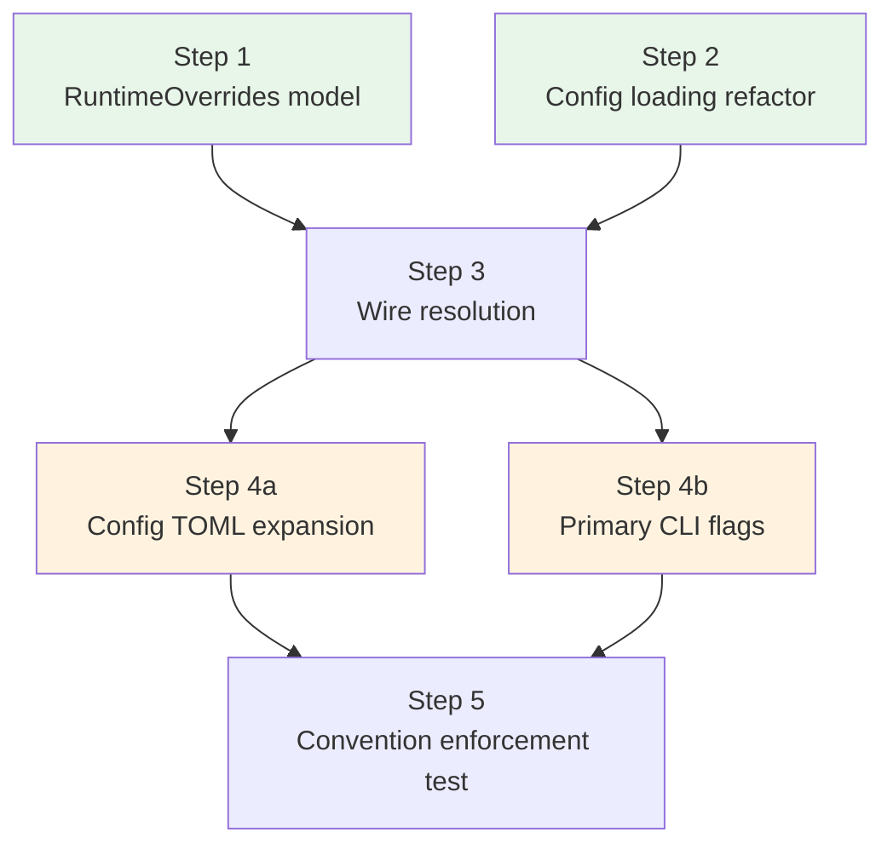

# Config Layer Unification — Implementation Plan

## Design Reference

`backlog/config-layer-unification.md`

## Phase Decomposition

6 steps, 4 execution rounds.

## Execution Rounds

| Round | Steps | Parallel? | Rationale |
|-------|-------|-----------|-----------|
| 1 | Step 1, Step 2 | Yes | Different files — new `overrides.py` vs existing `settings.py` |
| 2 | Step 3 | No | Touches `resolve.py`, `prepare.py`, `plan.py` — depends on both Step 1 and Step 2 |
| 3 | Step 4a, Step 4b | Yes | Different files — `settings.py` vs `main.py` + `types.py` |
| 4 | Step 5 | No | Structural test — needs all layers complete |

## Key Decisions

1. **4-layer resolve, not 5.** Config loading already merges project > user TOML (fixed in Step 2). Separate project/user RuntimeOverrides in `resolve()` is mathematically equivalent when project > user is enforced at load time. Keep `resolve(cli, env, profile, config)`.

2. **`from_*` classmethods on RuntimeOverrides** for each source layer. Each knows how to extract from its native model (SpawnCreateInput, LaunchRequest, AgentProfile, MeridianConfig). Keeps extraction logic co-located with the shared model.

3. **resolve_policies keeps routing logic.** `resolve()` picks the winning field values via first-non-none. `resolve_policies` keeps semantic model-to-harness routing, adapter lookup, and profile resolution. It receives the resolved model/harness instead of doing its own precedence.

4. **Don't bless dead fields** (per reviewer feedback). `budget` and `max_turns` get RuntimeOverrides fields, ENV vars, and config keys — but NO CLI flags until they have real consumers in the pipeline.

5. **autocompact_pct rename is Phase 4, not Phase 2.** Phase 2 focuses purely on loading mechanics. The rename touches TOML parsing, PrimaryConfig, and AgentProfile — that's schema expansion work.

## Agent Staffing Summary

| Step | Implementer | Reviewers | Testers |
|------|-------------|-----------|---------|
| 1 | coder | correctness, design alignment | verifier |
| 2 | coder | correctness (precedence logic) | verifier |
| 3 | coder (stronger model) | design alignment, correctness | verifier |
| 4a | coder | correctness | verifier |
| 4b | coder | correctness | verifier |
| 5 | coder | design alignment | verifier |
